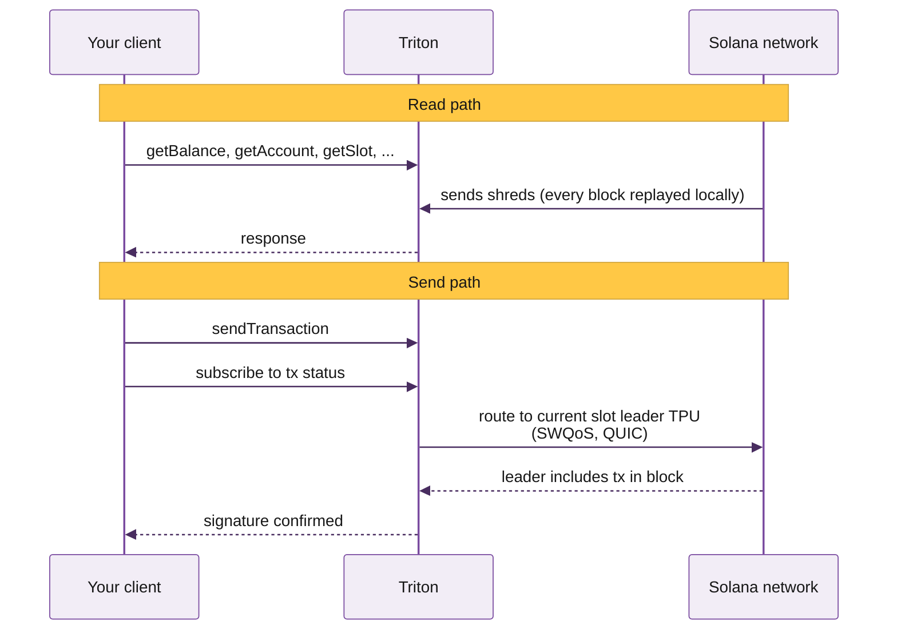
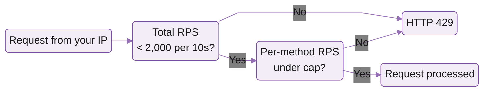

# Mermaid base theme — Triton canonical

Paste-ready init directive + working examples. Use this as the starting point for **every** mermaid block in Triton docs.

`drafts/` is in `.mintignore` so this file doesn't render on the live site. It exists only as a reference for the editor.

## The init directive (paste at the top of every mermaid block)

```
%%{init: {'theme':'base','themeVariables':{'primaryColor':'#F2EDF6','primaryBorderColor':'#7A4BA0','primaryTextColor':'#171717','lineColor':'#956FB3','secondaryColor':'#E4DBEC','tertiaryColor':'#D7C9E3','noteBkgColor':'#FFC845','noteTextColor':'#171717','actorBkg':'#F2EDF6','actorBorder':'#7A4BA0','actorTextColor':'#171717','signalColor':'#492D60','labelBoxBkgColor':'#7A4BA0','labelTextColor':'#F7F7F7','edgeLabelBackground':'transparent'}}}%%
```

## Working sequenceDiagram template (canonical RPC flow on welcome page)

````

````

## Working flowchart template (rate-limit gate on rate-and-connection-limits page)

Note the two flowchart-specific quirks:
- All nodes use `(...)` (rounded rectangle), never `{...}` (diamond — never rounds) or `[...]` (rectangle — only slight rounding). Round-only rule.
- `edgeLabelBackground:'transparent'` removes the white box mermaid puts behind `|Yes|` / `|No|` arrow labels by default. Sequence diagrams don't have edge labels so this token only matters for flowcharts.

````

````

## Token reference

| Token | Value | Purpose |
|---|---|---|
| `theme` | `base` | Required so the other tokens take effect |
| `primaryColor` | `#F2EDF6` | Node fill / actor box fill |
| `primaryBorderColor` | `#7A4BA0` | Node + actor borders |
| `primaryTextColor` | `#171717` | Text inside nodes / actors |
| `lineColor` | `#956FB3` | Arrows + edges |
| `secondaryColor` | `#E4DBEC` | Alt node fill / subgraph bg |
| `tertiaryColor` | `#D7C9E3` | Third-tier node fill |
| `noteBkgColor` | `#FFC845` | Note callout fill |
| `noteTextColor` | `#171717` | Note text |
| `actorBkg` | `#F2EDF6` | sequenceDiagram actor box fill |
| `actorBorder` | `#7A4BA0` | sequenceDiagram actor box border |
| `actorTextColor` | `#171717` | Actor name text |
| `signalColor` | `#492D60` | Arrow label text |
| `labelBoxBkgColor` | `#7A4BA0` | Labelled-box fill |
| `labelTextColor` | `#F7F7F7` | Labelled-box text |
| `edgeLabelBackground` | `transparent` | Removes white box behind flowchart edge labels (`|Yes|` / `|No|`) |

## Rules

- **Don't drift.** Apply these exact values to every new mermaid block. No grays, no off-palette purples.
- **For flowcharts**, the same theme works; primary/secondary/tertiary are used for node tiers automatically. Always use `(...)` rounded-rectangle nodes -- not `{...}` (diamonds, never round) or `[...]` (sharp-ish rectangles).
- **classDef overrides** for specific node groups (pillar/branch/leaf) are fine on top of this base, but use Triton purples (`#7A4BA0` / `#492D60` / `#F2EDF6` / `#E0D2EC`) for fill/stroke.
- **Text wrap**: use `<br/>` inside arrow labels to break long lines (e.g. `route to current slot leader TPU<br/>(SWQoS, QUIC)`).
- **No emoji** in diagrams.
- **No em dashes** in labels — use `--` or rewrite.
