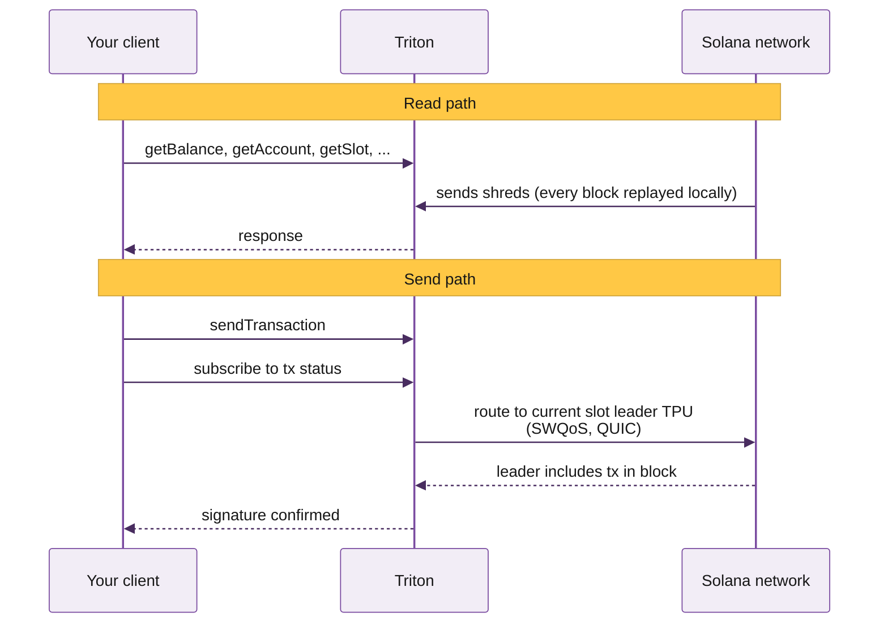

# Welcome to Triton

Premium bare-metal Solana infrastructure: reads, streaming, history, trading APIs, and validator services. Built for teams running production workloads.

Here you'll find everything you need to integrate with Triton's Solana infrastructure. If you're new here, start with the Quickstart for a five-minute walk-through, or jump to the common build guides for the path that matches what you're shipping.

    
    
    
    
    
    
    
    
    
    
    
    
    
    
    
    {/* duplicate for seamless loop */}
    
    
    
    
    
    
    
    
    
    
    
    
    
    
    

    
    
    
    
    
    
    
    
    
    
    
    
    
    
    
    {/* duplicate for seamless loop */}
    
    
    
    
    
    
    
    
    
    
    
    
    
    
    

## Why teams pick Triton

On Solana, your RPC provider sits in the path of every read your application makes and every transaction it sends. Your app inherits whatever reliability and latency they deliver, setting the ceiling on what you can build.

Depending on the workload, four things matter at different ratios: reliability, low latency, direct engineer support, and consistent capacity. We commit to all four without compromise. Here's how:

- **Premium bare metal across 20\+ PoPs on three continents**, GeoDNS-routed with continuous health checks, load balancing, and automatic failover.
- **Hardware tuned for the workload it serves.** Read clusters, streaming nodes, historical indexers, and TPU clients all run on machines configured for their specific role.
- **Direct engineer support.** The person who replies to your ticket is on the team that built the component you're asking about.
- **Consistent capacity.** Our shared infrastructure is purpose-built to absorb spikes across the cluster without affecting your QoS.



## Solana networks we support

Production workloads usually come last. You prototype locally, push to devnet for integration tests, then graduate to mainnet for real traffic. Triton supports every endpoint type on both networks:

- **Mainnet**: production traffic ([learn more](https://solana.com/docs/references/clusters#mainnet-beta))
- **Devnet**: free, for development and integration tests ([learn more](https://solana.com/docs/references/clusters#devnet))

| Network | HTTPS<br />RPC | Web<br />Sockets | Yellowstone<br />gRPC | Fumarole | Steamboat<br />indexed | Hydrant<br />archive |
| --- | :-: | :-: | :-: | :-: | :-: | :-: |
| Solana mainnet | ✓ | ✓ | ✓ | ✓ | ✓ | ✓ |
| Solana devnet | ✓ | ✓ | ✓ | ✗ | v1 only | ✓ |

## Triton stack overview

For most workloads, shared is the right answer. Solana's read layer has split into purpose-built components, which makes geographic distribution and per-component scaling the dominant factors for both low latency and spike absorption.

The exception is gRPC streaming. Dragon's Mouth connects directly to Geyser, and a dedicated node gives you full bandwidth and CPU, flat costs on streaming bandwidth, and absolute minimal latency when colocated.

      Shared infrastructure

          Reading state
          <a className="stack-leaf" href="../reading-state/standard-rpc.md">Standard RPC</a>
          <a className="stack-leaf" href="../reading-state/steamboat-indexed-accounts.md">Steamboat</a>
          <a className="stack-leaf" href="../reading-state/metaplex-das-api.md">DAS API</a>
          <a className="stack-leaf" href="../reading-state/zk-compression-photon.md">ZK Compression</a>
          <a className="stack-leaf" href="../reading-state/account-sync.md">Account Sync</a>

          Streaming
          <a className="stack-leaf" href="../streaming-data/dragon-s-mouth-grpc.md">Dragon's Mouth gRPC</a>
          <a className="stack-leaf" href="../streaming-data/deshred-transactions.md">Deshred transactions</a>
          <a className="stack-leaf" href="../streaming-data/whirligig-websockets.md">Whirligig</a>
          <a className="stack-leaf" href="../streaming-data/fumarole-persistent-streams.md">Fumarole</a>
          <a className="stack-leaf" href="../../../pythnet/pyth/pyth-hermes.md">Hermes</a>
          <a className="stack-leaf" href="../../../pythnet/pyth/overview.md">Pythnet</a>

          History
          <a className="stack-leaf" href="../historical-data/hydrant-archive.md">Hydrant</a>
          <a className="stack-leaf" href="../streaming-data/old-faithful-streams.md">Old Faithful</a>
          <a className="stack-leaf" href="../streaming-data/old-faithful-streams.md">Faithful Streams</a>

          Sending txs
          <a className="stack-leaf" href="../sending-transactions/yellowstone-jet.md">Yellowstone Jet</a>
          <a className="stack-leaf" href="../sending-transactions/priority-fees-api.md">Priority Fees API</a>
          <a className="stack-leaf" href="../sending-transactions/metis-swap-api.md">Metis</a>
          <a className="stack-leaf" href="../sending-transactions/titan-swap-api.md">Titan Prime</a>
          <a className="stack-leaf" href="../sending-transactions/jito-bundles.md">Jito Bundles</a>

      Other services

          <a className="stack-leaf" href="../dedicated-nodes/overview.md">Dedicated gRPC node</a>
          <a className="stack-leaf" href="../validator-services/white-label-validators/overview.md">White-label validator</a>
          <a className="stack-leaf" href="../validator-services/white-label-validators/overview.md">Private trusted validator</a>

## For AI agents

Triton's docs are built for humans and AI agents alike. The single-file index lives at:

```text llms.txt
https://docs.triton.one/llms.txt
```

Drop that URL into your agent's context (Claude Code, Cursor, Codex) for full Triton coverage in one fetch. Per-product `llms.txt` files are also available under each section, e.g. `/solana/streaming/dragons-mouth/llms.txt`.

A native Triton MCP server is **coming soon**, with direct access to RPC queries, gRPC streams, and account management.

## RPC playground

Every Solana app starts with an RPC call. Try the most common ones live, right here in the docs. Choose a task on the left and click **Run on mainnet**.

    <button type="button" className="triton-try-tab active" data-task="balance">Wallet balance</button>
    <button type="button" className="triton-try-tab" data-task="accountInfo">getAccountInfo for a token mint</button>
    <button type="button" className="triton-try-tab" data-task="history">Address history</button>
    <button type="button" className="triton-try-tab" data-task="fees">Priority fee (with percentiles)</button>
    <button type="button" className="triton-try-tab" data-task="sendTx">Send a transaction</button>
    <button type="button" className="triton-try-tab" data-task="streamAccounts">Stream account changes</button>

    Loading...

      <button type="button" className="triton-try-run" data-run>Run on mainnet</button>

## Common builds

The most-asked builder paths. Each card jumps to a working walkthrough with code.


[Stream Solana with gRPC](../../guides/end-to-end-builds/stream-solana-with-grpc.md)



[Get token metadata](../../guides/end-to-end-builds/get-token-metadata.md)



[Copy trade a wallet](../../guides/end-to-end-builds/copy-trade-a-wallet.md)



[Calculate Solana fees end to end](../../guides/end-to-end-builds/calculate-solana-fees-end-to-end.md)



[Stream a Raydium AMM pool](../../guides/end-to-end-builds/stream-a-raydium-amm-pool.md)



[Mint a Solana token](../../guides/end-to-end-builds/mint-a-solana-token.md)



[Integrate Titan Prime](../../guides/end-to-end-builds/integrate-titan-prime.md)


---

## What's next?

New to Triton? Four steps from here to a production endpoint.


[Account management](platform-overview.md)



[Plans and billing](plans-and-billing.md)



[Quickstart](quickstart.md)



[How to sign up](../../guides/account-management/how-to-sign-up.md)


---

---

Need help? Contact support by clicking the chat icon in the bottom right of your [customer dashboard](https://customers.triton.one).  
Manage endpoints, billing, team: [Customer portal](https://customers.triton.one).  
Sales questions? [Contact sales](https://triton.one/contact).  
AI agent? [Read llms.txt](https://docs.triton.one/llms.txt).  
Follow updates: [Blog](https://blog.triton.one) · [X](https://x.com/triton_one) · [YouTube](https://www.youtube.com/@triton_one_ltd) · [Telegram](https://t.me/tritonone) · [GitHub](https://github.com/rpcpool)
