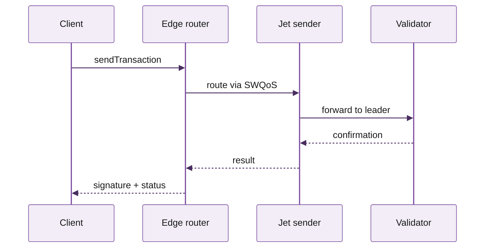
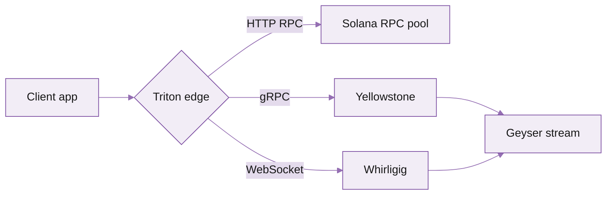

# KATE ALL ELEMENTS

Demo of every Mintlify component used (or considered) for the Triton docs. Temporary -- delete before merging to main.


**Temporary reference page.** This shows every Mintlify component live so Kate can pick the patterns to use across the docs. Each section has the explainer first, then the rendered example. Delete this page before merging to production.


## Top 8 high-impact components

These are the components that move the needle on usability. Aim to use them everywhere.

### Callouts

**Where to use:** inline highlights -- caveats, prerequisites, gotchas.
**Why it works:** 6 colours = instant skim signal. Don't overuse: max 1--2 per page.


**Note.** Supplementary information that's safe to skip. Neutral grey.



**Info.** Helpful context such as permissions or prerequisites. Blue.



**Tip.** Recommendations or best practices. Green.



**Warning.** Potentially destructive actions or important caveats. Yellow.



**Check.** Success confirmation or completed status. Green check.



**Danger.** Critical warnings about data loss or breaking changes. Red.


### Steps

**Where to use:** tutorials, quickstarts, "how to deploy", any sequential flow.
**Why it works:** numbered, checkable, breaks long instructions into visual chunks. Triton-purple number circles for visibility.



#### Create your account

Sign up at [customers.triton.one](https://customers.triton.one/users/sign-up). Verify your email.


#### Add a payment method

From the dashboard, open Billing and add a card. PAYG is enabled by default.


#### Provision your first endpoint

Click "Get an endpoint", pick Solana mainnet, choose a region, and copy the URL + key.


#### Send your first request

Use curl, the Triton SDK, or your favourite Solana library. Authentication uses bearer tokens by default.



### Tabs vs Code groups -- which one?

This trips people up. They look similar but solve different jobs:

- **Tabs** -- generic. Use when the alternatives aren't all code, or when each tab is a *different concept* (e.g. Linux / Mac / Windows install instructions, Bring-your-own-keys vs Hosted, Mainnet vs Devnet endpoints).
- **CodeGroup** -- code-specific. Use when the alternatives are *the same task in different programming languages*. Each tab is a fenced code block with its own language tag.

Rule of thumb: **CodeGroup for code-only, Tabs for everything else.**

#### Tabs example



```bash
brew install solana
solana --version
```


```bash
sh -c "$(curl -sSfL https://release.solana.com/v1.18.0/install)"
solana --version
```


```bash
wsl --install
sh -c "$(curl -sSfL https://release.solana.com/v1.18.0/install)"
```



#### CodeGroup example



```javascript
const client = new Client('https://your-endpoint.rpcpool.com');
const slot = await client.getSlot();
console.log(slot);
```


```python
from solana.rpc.api import Client
client = Client('https://your-endpoint.rpcpool.com')
print(client.get_slot().value)
```


```rust
use solana_client::rpc_client::RpcClient;
let client = RpcClient::new("https://your-endpoint.rpcpool.com");
let slot = client.get_slot()?;
println!("{}", slot);
```


```bash
curl https://your-endpoint.rpcpool.com \
  -H "Content-Type: application/json" \
  -d '{"jsonrpc":"2.0","id":1,"method":"getSlot"}'
```



### Cards + Columns

**Where to use:** landing pages, section hubs, "where do I go next".
**Why it works:** visual nav with icons + descriptions; great for the front of each chain dropdown (e.g. Solana welcome page).

<table data-view="cards"><thead><tr><th></th><th></th><th data-hidden data-card-target data-type="content-ref"></th></tr></thead><tbody><tr><td><i class="fa-rocket">:rocket:</i> <strong>Quickstart</strong></td><td>Get from zero to a working endpoint in about five minutes.</td><td><a href="https://kate-6.gitbook.io/triton-one-docs/documentation/get-started/quickstart">https://kate-6.gitbook.io/triton-one-docs/documentation/get-started/quickstart</a></td></tr><tr><td><i class="fa-code">:code:</i> <strong>API reference</strong></td><td>Every JSON-RPC, WebSocket, and gRPC method we expose, with examples.</td><td><a href="https://kate-6.gitbook.io/triton-one-docs/api-reference/overview-and-auth/api-overview">https://kate-6.gitbook.io/triton-one-docs/api-reference/overview-and-auth/api-overview</a></td></tr><tr><td><i class="fa-radio">:radio:</i> <strong>Streaming data</strong></td><td>Yellowstone gRPC, Whirligig, Fumarole -- pick the right tool for the job.</td><td><a href="https://kate-6.gitbook.io/triton-one-docs/documentation/streaming-data/overview">https://kate-6.gitbook.io/triton-one-docs/documentation/streaming-data/overview</a></td></tr><tr><td><i class="fa-comments">:comments:</i> <strong>FAQs</strong></td><td>Answers to the questions every team asks in the first week.</td><td><a href="https://kate-6.gitbook.io/triton-one-docs/faqs/general">https://kate-6.gitbook.io/triton-one-docs/faqs/general</a></td></tr></tbody></table>
### Accordions

**Where to use:** FAQs, optional sections, advanced settings.
**Why it works:** progressive disclosure -- keep the main page short, hide the long tail.

<details>
<summary>What's the difference between PAYG and committed plans?</summary>

PAYG bills per request and per millisecond of compute. Committed plans pre-pay a credit pool at a discount and are billed monthly. Most teams start on PAYG and upgrade once their volume is steady.

</details>

<details>
<summary>Can I bring my own keys for streaming?</summary>

Yes -- pass your token as a `Bearer` header on the gRPC connection. Token rotation is supported via the dashboard.

</details>

<details>
<summary>Does Triton support custom regions?</summary>

For dedicated nodes, yes. PAYG and shared endpoints route to the closest available region automatically.

</details>

### Tree

**Where to use:** file structures, project layouts.
**Why it works:** beats nested bullet lists for any "here's what's in this folder".

```
my-solana-app/
  src/
    index.ts
    client.ts
    streaming/
      grpc.ts
      websocket.ts
  package.json
  .env.example
  README.md
```

### Frames

**Where to use:** screenshots and diagrams.
**Why it works:** adds caption + drop shadow + rounded border. Stops images looking glued to the page.

  

## Interactive components

Mintlify's most powerful native interactive component is the **API playground** -- the live "Send" button readers see on every method page in `/solana-api/`. There's no separate `<Playground>` component to drop in -- the playground is auto-generated when a page has both:

1. An `api: "POST /endpoint"` line in its frontmatter, AND
2. `
| Parameter | Type | Required | Description |
| --- | --- | --- | --- |
|  |  | — | ` rows describing the parameters. Mintlify reads the frontmatter, builds a request panel on the right, lets the reader fill in their auth token + the params, and POSTs to the endpoint. The response renders below. No JS to write. To see it live, open any existing API method page, e.g. [getSlot](https://kate-6.gitbook.io/triton-one-docs/api-reference/http-rpc-methods/standard/getslot) -- the right column has the playground. The same component is used for HTTP RPC, WebSocket subscribe/unsubscribe, gRPC, and DAS API. There's also `<Prompt>` for *AI* prompts (copyable text with a "Copy to ChatGPT/Claude" button). Useful for "ask AI to migrate your code" CTAs but not relevant for normal docs flow. Other "interactive" things Mintlify ships: - **Search bar in the navbar** -- automatic, indexes every page on build - **Hosted MCP server** -- already live at `/mcp`, lets readers' AI tools query the docs as a tool - **Per-page "Open in Cursor / VS Code / ChatGPT / Claude / Perplexity" menu** -- already configured in `docs.json` `contextual.options` - **`llms.txt` + per-page `.md` exports** -- machine-readable docs for AI agents So the answer to "what about interactive playground / key input" is: **it's already in your docs**, baked into every API method page through `api` frontmatter + `<ParamField>`. You don't need to add a separate component. ## API reference building blocks These are the building blocks behind the playground above. ### `<ParamField>` and ` |
| `commitment` | `string` | — | Commitment level. One of `processed`, `confirmed`, or `finalized`. |
| `encoding` | `string` | — | Optional response encoding. Defaults to `base64`. |
| `value.lamports` | `number` | — | Account balance in lamports. |
| `value.owner` | `string` | — | Program that owns the account. |
### `<RequestExample>` and `<ResponseExample>` -- only on API pages

These render the right-sidebar code panel on a method page (where the table-of-contents normally lives). They only render that way when the page has `api: "..."` in its frontmatter -- on a regular page like this one, they don't show.

To see them in action: open [getSlot](https://kate-6.gitbook.io/triton-one-docs/api-reference/http-rpc-methods/standard/getslot) -- the right rail with the curl/JS example panel is `<RequestExample>`, the JSON below is `<ResponseExample>`.

### Expandable

**Where to use:** nested response objects -- click to expand inside ParamField.
**Why it works:** keeps the top level scannable while the deep object stays one click away.

| Field | Type | Required | Description |
| --- | --- | --- | --- |
| `result` | `object` | — | Top-level response. <Expandable title="result properties">  Slot context. <Expandable title="context properties">  Slot number when the response was generated. |
| `apiVersion` | `string` | — | The Solana API version that served this request. |
      </Expandable>

| Field | Type | Required | Description |
| --- | --- | --- | --- |
| `value` | `object` | — | The actual account data. |
  </Expandable>

## Less common but worth knowing

### Mermaid

**Where to use:** architecture diagrams, sequence flows.
**Why it works:** Triton's content has a lot of "request -> router -> validator -> result" pipelines that read perfectly as mermaid.

Mintlify's default Mermaid theme uses generic blues/greys. To match Triton brand purple, prefix every mermaid block with the `init` directive shown below. The colours pull from the Triton palette (purple-50 / purple-200 / purple-600 / purple-800).





### Badge

**Where to use:** status pills next to product titles -- the four lifecycle states for Triton.
**Why it works:** scans visually faster than parenthetical text.

Mintlify ships 9 colours: `gray`, `blue`, `green`, `yellow`, `orange`, `red`, `purple`, `white`, `surface`. Two shapes: `rounded` (default) or `pill`. Optional `icon`.

#### Triton lifecycle badges (locked)

These four labels and colours are the standard for every Triton product. Use them everywhere a product is mentioned in a heading, sidebar, or landing card.

- `PRIVATE BETA` &nbsp; invite-only, not yet open. Maps to brand violet (Triton purple).
- `PUBLIC BETA` &nbsp; open beta, anyone can use. Maps to brand blue (clarity, trustworthiness).
- `COMING SOON` &nbsp; announced, not yet shipped. Maps to brand gold (anticipation, KPI highlight).
- `DEPRECATED` &nbsp; retired or scheduled for retirement. Maps to semantic error red.

#### All available Mintlify colours (reference)

`default` &nbsp;
`blue` &nbsp;
`green` &nbsp;
`yellow` &nbsp;
`orange` &nbsp;
`red` &nbsp;
`purple`

### Tooltips

**Where to use:** inline glossary -- hover over a term to see its definition without scrolling.
**Why it works:** keeps prose flowing while letting newcomers learn the jargon in place.

The default Tooltip renders a dotted underline (different from a regular link's solid underline) so the reader knows it's a definition, not a navigation link. With the `headline` + `cta` + `href` props, the tooltip becomes a mini popover with a "Read more" button.

Triton's Yellowstone gRPC stack delivers shred-level data with sub-second latency. Dragon's Mouth uses the same wire format, but adds a SWQoS routing layer for transaction sending. For deeper context, see this Geyser link with a CTA inside.

### Update

**Where to use:** changelog entries -- a "What's new" page where multiple Updates stack vertically.
**Why it works:** Update is **not** a table. Each entry is a full rich-content block with a date label, optional version description, and freeform body (lists, code, links). Mintlify stacks them with consistent date markers down the left margin.

## Yellowstone gRPC NAPI bindings: 4x throughput

  Reworked the NAPI bridge to remove a mutex bottleneck. Existing client code continues to work; rebuild against the new package to opt in.

  - 4x sustained throughput on the JS NAPI client
  - Memory usage cut by ~30% for typical Geyser workloads
  - Backwards-compatible API surface

  SWQoS routing is now available on every Solana plan -- no separate Cascade tier required. Existing Cascade customers were migrated automatically on 2026-02-01.

  The State Machine SDK is generally available. See [Steamboat indexed accounts](https://kate-6.gitbook.io/triton-one-docs/documentation/reading-state/steamboat-indexed-accounts) for the new query interface.

## How to delete this page

1. Remove `kate-all-elements.mdx` from the repo root.
2. Remove the `kate-all-elements` entry from `docs.json` navigation.
3. Commit and push.

---

<hr>

<i class="fa-life-ring">:life-ring:</i> Need help? Contact support by clicking the chat icon in the bottom right of your [customer dashboard](https://customers.triton.one)<br><i class="fa-gear">:gear:</i> Manage endpoints, billing, team: [Customer portal](https://customers.triton.one)<br><i class="fa-briefcase">:briefcase:</i> Sales questions? [Contact sales](https://triton.one/contact)<br><i class="fa-sparkles">:sparkles:</i> AI agent? [Read llms.txt](https://docs.triton.one/llms.txt)<br><i class="fa-rss">:rss:</i> Follow updates: [Blog](https://blog.triton.one) · [X](https://x.com/triton_one) · [YouTube](https://www.youtube.com/@triton_one_ltd) · [Telegram](https://t.me/tritonone) · [GitHub](https://github.com/rpcpool)
