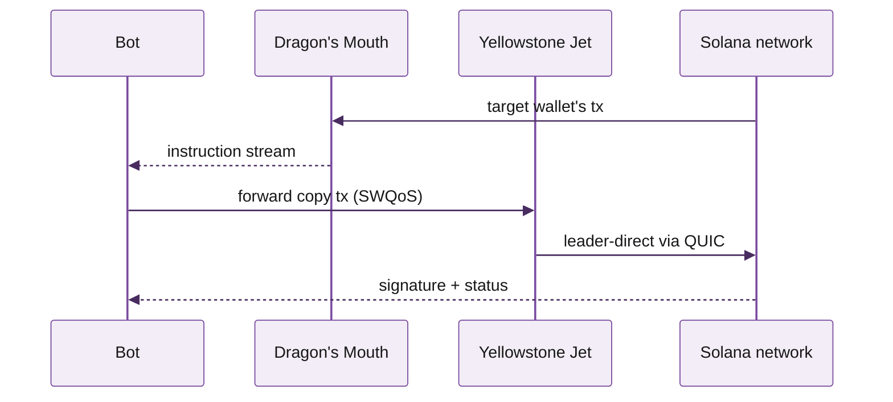

# Guide page template

Reference layout for an end-to-end use-case guide. The structure that works: clear title, time-to-finish, prerequisites, numbered steps with code, what could go wrong.

> **What this is.** A template for guides like "Stream Solana with gRPC" or "Build a Solana Telegram bot". Use it whenever the page answers "how do I build X with Triton". Replace placeholder copy and remove comment blocks before shipping.

## When to use this template

- The page describes a **task or build**, not a single product.
- The reader leaves with working code, not a list of features.
- Anything 5+ minutes of reading should be a guide; shorter is a quickstart on the relevant product page.

---

## How to copy-trade a wallet on Solana

> Title is a goal, not a feature. Verbs first ("How to…", "Build a…", "Stream…"). Avoid Triton-product-name as the leading word.

Watch any wallet in real time, decode its swap activity, and forward the trades to your own bot. Stack: **Dragon's Mouth gRPC** for streaming, **Yellowstone Jet** for landing transactions, **Standard RPC** for state reads.


**Time:** ~15 minutes. **Prerequisites:** a Triton endpoint (see [Quickstart](https://kate-6.gitbook.io/triton-one-docs/documentation/get-started/quickstart)), Node.js 20+, basic familiarity with Solana transactions.


### What you'll build

> One paragraph + a list. Tells the reader exactly what they'll have at the end. Critical: this is what makes them keep reading.

By the end of this guide you'll have a Node.js script that:

- Subscribes to one wallet via Dragon's Mouth gRPC
- Decodes incoming Jupiter / Raydium swap instructions
- Forwards a copy transaction with adjusted slippage through Yellowstone Jet
- Logs landing latency and success rate

### Architecture

> Optional but high-impact for guides that touch 2+ products. A simple mermaid sequence or flowchart frames the rest of the page. Use the Triton mermaid theme directive (see kate-all-elements > Mermaid).



## Step 1: Subscribe to the target wallet

> Section per major step. Use H2 for steps and H3 for sub-tasks within. Mintlify's TOC reads H2/H3.

Open a Dragon's Mouth subscription filtered to a single account. We'll start in TypeScript with the official gRPC client.

```typescript

  ProgramStreamsServiceClient,
  credentials,
  createCallCredentials,
} from "@triton-one/vixen-stream";

const client = new ProgramStreamsServiceClient(
  "<your-endpoint>.mainnet.rpcpool.com:443",
  credentials.combineChannelCredentials(
    credentials.createSsl(),
    createCallCredentials("<your-token>"),
  ),
);

const stream = client.subscribe();
stream.write({
  accounts: {
    target: { account: ["WHALE_WALLET_PUBKEY"] },
  },
  transactions: {
    target: { accountInclude: ["WHALE_WALLET_PUBKEY"], failed: false },
  },
});

stream.on("data", (msg) => {
  if (msg.transaction) handleTx(msg.transaction);
});
```

> Each step's code block must be **runnable**. If the code depends on the previous step's variables, repeat the import / setup so a reader can copy this single block in isolation.

### Verify the stream

```bash
# In another terminal, watch for a real swap from the wallet
node bot.ts
# Expect: a `transaction` event whenever the wallet trades
```

## Step 2: Decode the swap instruction

Triton's [Vixen parsing framework](https://kate-6.gitbook.io/triton-one-docs/documentation/reading-state/steamboat-indexed-accounts) covers Jupiter, Raydium, Orca, and Meteora out of the box.

```typescript

function handleTx(tx) {
  const swap = parseJupiterSwap(tx);
  if (!swap) return;
  console.log("Detected swap:", {
    inputMint: swap.inputMint,
    outputMint: swap.outputMint,
    inputAmount: swap.inputAmount,
  });
  forwardCopyTrade(swap);
}
```

## Step 3: Forward the copy transaction

> When a guide hits an inflection point (read → write, in our case), call it out so the reader knows the consequences. Use a `

` or `<Note>`.

<Warning>
This step **sends real transactions**. Run on devnet first by swapping `mainnet.rpcpool.com` for `devnet.rpcpool.com` and using devnet SOL. Only switch to mainnet after you've validated the slippage and size guards.


```typescript

async function forwardCopyTrade(swap) {
  const myTx = await buildSwapTransaction({
    inputMint: swap.inputMint,
    outputMint: swap.outputMint,
    inputAmount: scaleSize(swap.inputAmount),     // your size, not theirs
    slippageBps: 50,                              // your slippage, not theirs
  });
  const sig = await sendViaJet(myTx);
  console.log("Copy tx submitted:", sig);
}
```

## What can go wrong

> Critical section -- do not skip. Every guide hits failures readers will hit. List the realistic ones with their fix.

<details>
<summary>Stream disconnects every few minutes</summary>

Dragon's Mouth uses long-lived gRPC. Your client needs heartbeats and a reconnect-with-backoff strategy. See the [streaming troubleshooting checklist](/solana-guides/error-handling/streaming).

</details>

<details>
<summary>Copy tx fails with InstructionError: SlippageToleranceExceeded</summary>

The whale sent a swap that, sized down to your bankroll, is too small to clear the same pool's depth. Increase `slippageBps` or add a minimum-size guard.

</details>

<details>
<summary>Jet returns 'leader unavailable'</summary>

Slot rotation, no leader for the next few slots. The Jet client retries automatically; if you see this for >5 seconds, check the [Jet status page](https://kate-6.gitbook.io/triton-one-docs/documentation/sending-transactions/yellowstone-jet).

</details>

## Next steps

<table data-view="cards"><thead><tr><th></th><th></th><th data-hidden data-card-target data-type="content-ref"></th></tr></thead><tbody><tr><td><strong>Stream a Raydium AMM pool</strong></td><td>Pool-state streaming you can layer on top of this.</td><td><a href="https://kate-6.gitbook.io/triton-one-docs/guides/end-to-end-builds/stream-a-raydium-amm-pool">https://kate-6.gitbook.io/triton-one-docs/guides/end-to-end-builds/stream-a-raydium-amm-pool</a></td></tr><tr><td><strong>Send transactions during congestion</strong></td><td>Priority-fee tuning + Jet retry logic for high-traffic windows.</td><td><a href="https://kate-6.gitbook.io/triton-one-docs/guides/end-to-end-builds/send-transactions-during-congestion">https://kate-6.gitbook.io/triton-one-docs/guides/end-to-end-builds/send-transactions-during-congestion</a></td></tr></tbody></table>
---
Need help? Contact support by clicking the chat icon in the bottom right of your [customer dashboard](https://customers.triton.one)  
Manage endpoints, billing, team: [Customer portal](https://customers.triton.one)  
Sales questions? [Contact sales](https://triton.one/contact)  
AI agent? [Read llms.txt](https://docs.triton.one/llms.txt)  
Follow updates: [Blog](https://blog.triton.one) · [X](https://x.com/triton_one) · [YouTube](https://www.youtube.com/@triton_one_ltd) · [Telegram](https://t.me/tritonone) · [GitHub](https://github.com/rpcpool)
