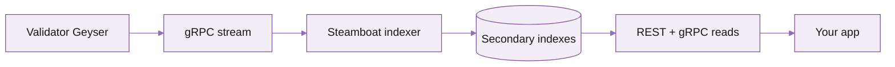

# Product page template

Reference layout for a single Triton product. Title, value prop, what-it-is, why-it-works, how-it-works, get-started CTA.

> **What this is.** A template for a product overview page (Dragon's Mouth, Steamboat, Hydrant, etc). The page sells the product to a developer who's evaluating it, then routes them to the quickstart. Replace placeholder copy and remove comment blocks before shipping.

## When to use this template

- One Triton product per page.
- The page should answer four questions in order: **What is it? Why does it work? How does it work? How do I start?**
- If a product has multiple sub-features (e.g. Yellowstone has Dragon's Mouth, Whirligig, Fumarole, Hermes), make each its own product page and use the [overview template](section-overview-template.md) for the parent.

---

## Steamboat

> Title is just the product name. Subtitle below is the value prop -- one line that gives the reader the promise.

**Custom indexes from your existing gRPC stream. 50x faster than `getProgramAccounts`.**

> The bold subtitle replaces the Mintlify auto-subtitle (frontmatter `description`) when you want it bold and on the page itself. Pick one and stay consistent across product pages.


**Status.** Generally available on shared and dedicated tiers. **Stack fit.** Reading-state services. **Pairs with.** Dragon's Mouth gRPC, Hydrant.


## What is Steamboat

> 2-4 sentences. Plain English first, then the technical "it's actually X". Avoid jargon in sentence 1.

Steamboat is an indexed account read service that turns slow `getProgramAccounts` queries into millisecond responses. You point Steamboat at one of our gRPC streams, define the index keys you care about (program ID, account discriminator, owner, custom byte ranges), and we maintain a hot index keyed exactly on the lookup pattern your app uses.

Under the hood: Steamboat ingests the same Geyser-backed gRPC stream that powers Dragon's Mouth, applies your filter and a custom secondary index, and stores the rolling state in an LSM-tree. Reads return the latest account snapshot at any commitment level.

## Why Steamboat

> 3-5 bullets, each one is a real, measurable benefit. Avoid corporate speak ("seamless", "robust"). Include a comparison if there's one obvious alternative.

- **50x faster than `getProgramAccounts`** on programs with >100k accounts. The stock Solana RPC scans the validator's account index linearly; Steamboat looks up the secondary index directly.
- **No backfill hit at deploy time.** Your custom index is built incrementally from the gRPC stream, so the index goes live in seconds, not hours.
- **Filters happen at index time, not query time.** You can pull "all positions for owner X across all clmm programs" without scanning every clmm account on each query.
- **Streams + reads share infrastructure.** If you're already on Dragon's Mouth gRPC, Steamboat reuses the connection -- no extra plumbing.

### When not to use Steamboat

> Equally important. Honest "no" sells the product better than a list of "yes".

- **One-off lookups.** If you query a few accounts a few times an hour, Standard RPC's `getAccountInfo` is simpler and cheaper.
- **Non-Solana chains.** Steamboat is Solana-only. (Yes, even though we run RPC on Pythnet, Sui, Monad.)
- **Programs that change account layout daily.** Steamboat's indexes assume the byte ranges you specify stay stable. Frequent IDL changes mean re-indexing.

## How it works

> Mermaid diagram + 1 paragraph. Show the data flow at a level a senior dev can absorb in 10 seconds. Use the Triton mermaid theme (see kate-all-elements > Mermaid).

Solana's validator emits every account write to a Geyser plugin, which Triton already ingests for Dragon's Mouth. Steamboat consumes that same stream, applies the filters you registered (program, discriminator, owner-index, custom byte slice), and writes the resulting key/value pairs into a per-tenant LSM-tree. Reads come straight off the index — the latest snapshot is always one disk seek away.

## Get started

> CTA section. One primary card, optionally a few secondary. Always link to the per-product quickstart.

<table data-card-size="large" data-view="cards"><thead><tr><th></th><th></th><th data-hidden data-card-target data-type="content-ref"></th></tr></thead><tbody><tr><td><i class="fa-rocket">:rocket:</i> <strong>Quickstart: your first Steamboat index</strong></td><td>Define a filter, point it at a program, and read it back in under five minutes.</td><td><a href="#">#</a></td></tr><tr><td><i class="fa-server">:server:</i> <strong>Available endpoints</strong></td><td>HTTPS REST and gRPC reads, JS / Python / Rust SDKs.</td><td><a href="#">#</a></td></tr></tbody></table>
## Pricing

> Always link to the central pricing page rather than copying numbers in. Numbers drift.

Included on all PAYG and dedicated plans. Reads are billed at `$10 / million calls + bandwidth` (same as Standard RPC). See the [pricing calculator](https://kate-6.gitbook.io/triton-one-docs/documentation/get-started/plans-and-billing).

## FAQ

> Optional. 3-5 of the most common questions. Not the place for a generic FAQ -- those go on a dedicated FAQ page.

Does Steamboat support all Solana programs?

Yes -- if a program writes account state, Steamboat can index it. The filter syntax accepts any program ID plus a byte slice; you don't need an IDL.

What's the read freshness?

Steamboat reflects state as fast as the gRPC stream lands -- typically &lt;100 ms behind the network at confirmed commitment.

Can I run Steamboat on a dedicated node?

Yes. Dedicated nodes get unmetered Steamboat reads and you can pin custom indexes.

## Related

<table data-card-size="large" data-view="cards"><thead><tr><th></th><th></th><th data-hidden data-card-target data-type="content-ref"></th></tr></thead><tbody><tr><td><i class="fa-radio">:radio:</i> <strong>Dragon's Mouth gRPC</strong></td><td>The streaming layer Steamboat builds on. Subscribe to live account writes.</td><td><a href="https://kate-6.gitbook.io/triton-one-docs/documentation/streaming-data/dragon-s-mouth-grpc">https://kate-6.gitbook.io/triton-one-docs/documentation/streaming-data/dragon-s-mouth-grpc</a></td></tr><tr><td><i class="fa-bolt">:bolt:</i> <strong>Standard RPC</strong></td><td>The simpler `getAccountInfo` / `getProgramAccounts` path for low-volume reads.</td><td><a href="https://kate-6.gitbook.io/triton-one-docs/documentation/reading-state/standard-rpc">https://kate-6.gitbook.io/triton-one-docs/documentation/reading-state/standard-rpc</a></td></tr></tbody></table>
---

<i class="fa-life-ring">:life-ring:</i> Need help? Contact support by clicking the chat icon in the bottom right of your [customer dashboard](https://customers.triton.one) <i class="fa-gear">:gear:</i> Manage endpoints, billing, team: [Customer portal](https://customers.triton.one) <i class="fa-briefcase">:briefcase:</i> Sales questions? [Contact sales](https://triton.one/contact) <i class="fa-sparkles">:sparkles:</i> AI agent? [Read llms.txt](https://docs.triton.one/llms.txt) <i class="fa-rss">:rss:</i> Follow updates: [Blog](https://blog.triton.one) · [X](https://x.com/triton_one) · [YouTube](https://www.youtube.com/@triton_one_ltd) · [Telegram](https://t.me/tritonone) · [GitHub](https://github.com/rpcpool)
