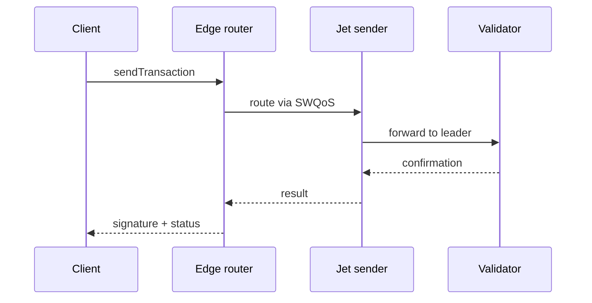
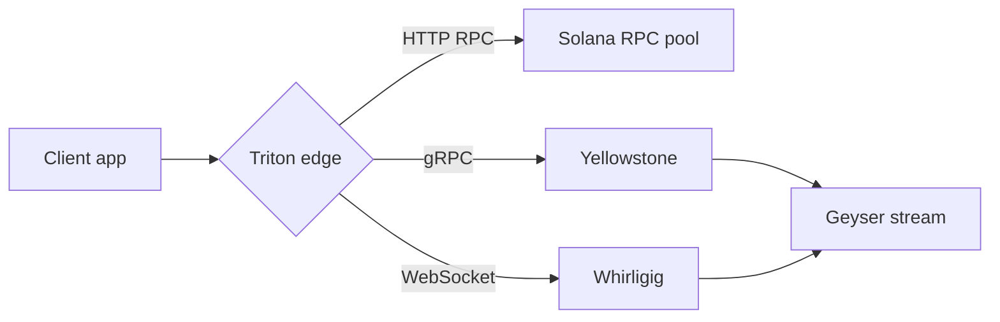

<Note>
**Temporary reference page.** This shows every Mintlify component live so Kate can pick the patterns to use across the docs. Each section has the explainer first, then the rendered example. Delete this page before merging to production.
</Note>

## Top 8 high-impact components

These are the components that move the needle on usability. Aim to use them everywhere.

---

### Callouts

**Where to use:** inline highlights -- caveats, prerequisites, gotchas.
**Why it works:** 6 colours = instant skim signal. Don't overuse: max 1--2 per page.

<Note>
This is a Note. Supplementary information that's safe to skip. Neutral grey.
</Note>

<Info>
This is an Info. Helpful context such as permissions or prerequisites. Blue.
</Info>

<Tip>
This is a Tip. Recommendations or best practices. Green.
</Tip>

<Warning>
This is a Warning. Potentially destructive actions or important caveats. Yellow.
</Warning>

<Check>
This is a Check. Success confirmation or completed status. Green.
</Check>

<Danger>
This is a Danger. Critical warnings about data loss or breaking changes. Red.
</Danger>

---

### Steps

**Where to use:** tutorials, quickstarts, "how to deploy", any sequential flow.
**Why it works:** numbered, checkable, breaks long instructions into visual chunks.

<Steps>
  <Step title="Create your account">
    Sign up at [customers.triton.one](https://customers.triton.one/users/sign-up). Verify your email.
  </Step>
  <Step title="Add a payment method">
    From the dashboard, open Billing and add a card. PAYG is enabled by default.
  </Step>
  <Step title="Provision your first endpoint">
    Click "Get an endpoint", pick Solana mainnet, choose a region, and copy the URL + key.
  </Step>
  <Step title="Send your first request">
    Use curl, the Triton SDK, or your favourite Solana library. Authentication uses bearer tokens by default.
  </Step>
</Steps>

---

### Tabs

**Where to use:** same content, different audience -- npm/yarn, JS/Python/Rust, Linux/Mac/Windows.
**Why it works:** lets one page serve multiple readers without clutter.

<Tabs>
  <Tab title="npm">
    ```bash
    npm install @triton-one/yellowstone-grpc
    ```
  </Tab>
  <Tab title="yarn">
    ```bash
    yarn add @triton-one/yellowstone-grpc
    ```
  </Tab>
  <Tab title="pnpm">
    ```bash
    pnpm add @triton-one/yellowstone-grpc
    ```
  </Tab>
  <Tab title="bun">
    ```bash
    bun add @triton-one/yellowstone-grpc
    ```
  </Tab>
</Tabs>

---

### Code groups

**Where to use:** tabs but for code blocks specifically -- same task in many languages.
**Why it works:** standard in good API docs, readers expect this.

<CodeGroup>

```javascript example.js
const client = new Client('https://your-endpoint.rpcpool.com');
const slot = await client.getSlot();
console.log(slot);
```

```python example.py
from solana.rpc.api import Client
client = Client('https://your-endpoint.rpcpool.com')
print(client.get_slot().value)
```

```rust example.rs
use solana_client::rpc_client::RpcClient;
let client = RpcClient::new("https://your-endpoint.rpcpool.com");
let slot = client.get_slot()?;
println!("{}", slot);
```

```bash curl
curl https://your-endpoint.rpcpool.com \
  -H "Content-Type: application/json" \
  -d '{"jsonrpc":"2.0","id":1,"method":"getSlot"}'
```

</CodeGroup>

---

### Cards + Columns

**Where to use:** landing pages, section hubs, "where do I go next".
**Why it works:** visual nav with icons + descriptions; great for the front of each chain dropdown.

<Columns cols={2}>
  <Card title="Quickstart" icon="rocket" href="/solana/get-started/quickstart">
    Get from zero to a working endpoint in about five minutes.
  </Card>
  <Card title="API reference" icon="code" href="/solana-api/api-overview">
    Every JSON-RPC, WebSocket, and gRPC method we expose, with examples.
  </Card>
  <Card title="Streaming data" icon="radio" href="/solana/streaming/overview">
    Yellowstone gRPC, Whirligig, Fumarole -- pick the right tool for the job.
  </Card>
  <Card title="FAQs" icon="messages-square" href="/solana-faqs/general">
    Answers to the questions every team asks in the first week.
  </Card>
</Columns>

---

### Accordions

**Where to use:** FAQs, optional sections, advanced settings.
**Why it works:** progressive disclosure -- keep the main page short, hide the long tail.

<AccordionGroup>
  <Accordion title="What's the difference between PAYG and committed plans?" icon="credit-card">
    PAYG bills per request and per millisecond of compute. Committed plans pre-pay a credit pool at a discount and are billed monthly. Most teams start on PAYG and upgrade once their volume is steady.
  </Accordion>
  <Accordion title="Can I bring my own keys for streaming?" icon="key">
    Yes -- pass your token as a `Bearer` header on the gRPC connection. Token rotation is supported via the dashboard.
  </Accordion>
  <Accordion title="Does Triton support custom regions?" icon="globe">
    For dedicated nodes, yes. PAYG and shared endpoints route to the closest available region automatically.
  </Accordion>
</AccordionGroup>

---

### Tree

**Where to use:** file structures, project layouts.
**Why it works:** beats nested bullet lists for any "here's what's in this folder".

<Tree>
  <TreeItem title="my-solana-app/" type="folder" defaultOpen>
    <TreeItem title="src/" type="folder" defaultOpen>
      <TreeItem title="index.ts" type="file" />
      <TreeItem title="client.ts" type="file" />
      <TreeItem title="streaming/" type="folder">
        <TreeItem title="grpc.ts" type="file" />
        <TreeItem title="websocket.ts" type="file" />
      </TreeItem>
    </TreeItem>
    <TreeItem title="package.json" type="file" />
    <TreeItem title=".env.example" type="file" />
    <TreeItem title="README.md" type="file" />
  </TreeItem>
</Tree>

---

### Frames

**Where to use:** screenshots and diagrams.
**Why it works:** adds caption + drop shadow + rounded border. Stops images looking glued to the page.

<Frame caption="Triton dashboard, account management view">
  
</Frame>

---

## API reference components

These are the building blocks for any "method docs" page.

---

### `api` frontmatter + `<ParamField>` + `<ResponseField>`

**Where to use:** every API method page.
**Why it works:** auto-generates a live playground -- click "Send" to actually hit the endpoint. Each parameter and response field gets its own row with type, default, and description.

<ParamField path="address" type="string" required>
  Solana account public key, base-58 encoded.
</ParamField>

<ParamField path="commitment" type="string" default="finalized">
  Commitment level. One of `processed`, `confirmed`, or `finalized`.
</ParamField>

<ParamField query="encoding" type="string">
  Optional response encoding. Defaults to `base64`.
</ParamField>

<ResponseField name="value" type="object">
  The account data and metadata.
</ResponseField>

<ResponseField name="value.lamports" type="number">
  Account balance in lamports.
</ResponseField>

<ResponseField name="value.owner" type="string">
  Program that owns the account.
</ResponseField>

---

### Request and response examples

**Where to use:** alongside ParamField/ResponseField on any method page.
**Why it works:** side-by-side code + JSON, just write fenced code with a language tag.

<RequestExample>

```bash curl
curl https://your-endpoint.rpcpool.com \
  -H "Content-Type: application/json" \
  -d '{"jsonrpc":"2.0","id":1,"method":"getAccountInfo","params":["YOUR_ADDRESS"]}'
```

```javascript fetch
const response = await fetch('https://your-endpoint.rpcpool.com', {
  method: 'POST',
  headers: { 'Content-Type': 'application/json' },
  body: JSON.stringify({
    jsonrpc: '2.0',
    id: 1,
    method: 'getAccountInfo',
    params: ['YOUR_ADDRESS']
  })
});
```

</RequestExample>

<ResponseExample>

```json 200 OK
{
  "jsonrpc": "2.0",
  "result": {
    "context": { "slot": 311340987 },
    "value": {
      "lamports": 1000000000,
      "owner": "11111111111111111111111111111111",
      "data": "",
      "executable": false
    }
  },
  "id": 1
}
```

</ResponseExample>

---

### Expandable

**Where to use:** nested response objects -- click to expand inside ParamField.
**Why it works:** keeps the top level scannable while the deep object stays one click away.

<ResponseField name="result" type="object">
  Top-level response.
  <Expandable title="result properties">
    <ResponseField name="context" type="object">
      Slot context.
      <Expandable title="context properties">
        <ResponseField name="slot" type="number">
          Slot number when the response was generated.
        </ResponseField>
        <ResponseField name="apiVersion" type="string">
          The Solana API version that served this request.
        </ResponseField>
      </Expandable>
    </ResponseField>
    <ResponseField name="value" type="object">
      The actual account data.
    </ResponseField>
  </Expandable>
</ResponseField>

---

## Less common but worth knowing

---

### Mermaid

**Where to use:** architecture diagrams, sequence flows.
**Why it works:** Triton's content has a lot of "request -> router -> validator -> result" pipelines that read perfectly as mermaid.





---

### Badge

**Where to use:** `<Badge>BETA</Badge>` next to titles -- for Whirligig, Fumarole, anything pre-GA.
**Why it works:** better than text "(beta)" because it scans.

Whirligig WebSockets <Badge>BETA</Badge>

Fumarole reliable streams <Badge>BETA</Badge>

Steamboat indexed accounts <Badge variant="warning">EARLY ACCESS</Badge>

Hydrant historical data <Badge variant="success">GA</Badge>

Old Faithful <Badge variant="error">DEPRECATED</Badge>

---

### Tooltips

**Where to use:** inline glossary -- hover over a term to see its definition without scrolling.
**Why it works:** keeps prose flowing while letting newcomers learn the jargon in place.

Triton's <Tooltip tip="Yellowstone gRPC: a high-throughput streaming protocol for real-time Solana account and transaction data, built on top of Geyser plugins.">Yellowstone gRPC</Tooltip> stack delivers shred-level data with sub-second latency. Dragon's Mouth uses the same wire format, but adds a <Tooltip tip="SWQoS: Solana stake-weighted quality of service, a network-level prioritisation mechanism">SWQoS</Tooltip> routing layer for transaction sending.

---

### Tile

**Where to use:** bigger sibling of Card, designed for hero rows on landing pages.
**Why it works:** more visual weight than Card, ideal for "pick a chain" or "pick a product" hero blocks.

<Columns cols={2}>
  <Card title="Solana" icon="bolt" href="/solana/welcome">
    Largest independent RPC, Yellowstone gRPC, Jet, Steamboat, Hydrant.
  </Card>
  <Card title="Pyth" icon="chart-line" href="/pyth/overview">
    Hermes, publisher infrastructure, testnet/devnet/Pythnet endpoints.
  </Card>
  <Card title="SUI" icon="layers" href="/sui/overview">
    Move ecosystem support, Walrus storage, Seal access control.
  </Card>
  <Card title="Monad" icon="cpu" href="/monad/overview">
    EVM-compatible high-performance chain, full method coverage.
  </Card>
</Columns>

---

### Update

**Where to use:** changelog entries -- perfect for "What's new" pages.
**Why it works:** date + version label + body, all in a consistent format.

<Update label="2026-04-30" description="v3.2.0">
  Yellowstone gRPC NAPI bindings now deliver 4x the previous throughput. Existing client code continues to work; rebuild against the new package to opt in.
</Update>

<Update label="2026-04-12" description="Cascade retired">
  SWQoS routing is now available on every Solana plan -- no separate Cascade tier required. Existing Cascade customers were migrated automatically on 2026-02-01.
</Update>

<Update label="2026-03-22" description="State Machine SDK GA">
  The State Machine SDK is generally available. See [Steamboat indexed accounts](/solana/reading-state/steamboat-indexed-accounts) for the new query interface.
</Update>

---

### Panel

**Where to use:** sidebar pull-quote / callout that lives alongside main content (not inline).
**Why it works:** for cross-references and "by the way" content that shouldn't break the main flow.

This is the main content. The body of the page is what readers came for. Keep it focused.

<Panel>
**Pro tip.** When you're integrating Triton's RPC for the first time, run `mint validate` against your config before pushing. It catches the silent-drop patterns Mintlify ignores by default.
</Panel>

The main content continues here, picking up where it left off before the Panel. The panel sits beside the prose at desktop and stacks below it on mobile.

---

## How to delete this page

1. Remove `kate-all-elements.mdx` from the repo root.
2. Remove the `kate-all-elements` entry from `docs.json` navigation.
3. Commit and push.
