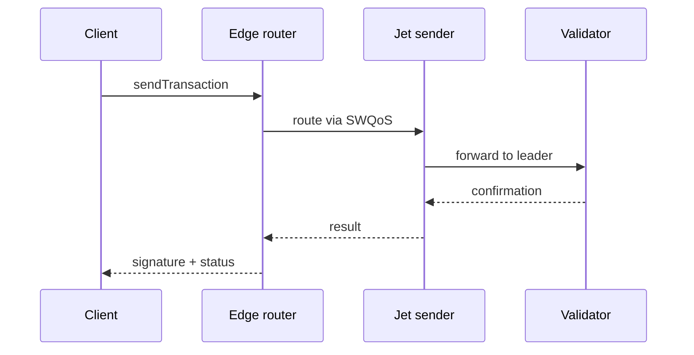
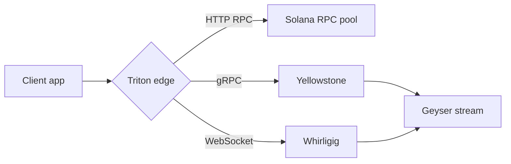

<Note>
**Temporary reference page.** This shows every Mintlify component live so Kate can pick the patterns to use across the docs. Each section has the explainer first, then the rendered example. Delete this page before merging to production.
</Note>

## Top 8 high-impact components

These are the components that move the needle on usability. Aim to use them everywhere.

---

### Callouts

**Where to use:** inline highlights -- caveats, prerequisites, gotchas.
**Why it works:** 6 colours = instant skim signal. Don't overuse: max 1--2 per page.

<Note>
**Note.** Supplementary information that's safe to skip. Neutral grey.
</Note>

<Info>
**Info.** Helpful context such as permissions or prerequisites. Blue.
</Info>

<Tip>
**Tip.** Recommendations or best practices. Green.
</Tip>

<Warning>
**Warning.** Potentially destructive actions or important caveats. Yellow.
</Warning>

<Check>
**Check.** Success confirmation or completed status. Green check.
</Check>

<Danger>
**Danger.** Critical warnings about data loss or breaking changes. Red.
</Danger>

---

### Steps

**Where to use:** tutorials, quickstarts, "how to deploy", any sequential flow.
**Why it works:** numbered, checkable, breaks long instructions into visual chunks. Triton-purple number circles for visibility.

<Steps>
  <Step title="Create your account">
    Sign up at [customers.triton.one](https://customers.triton.one/users/sign-up). Verify your email.
  </Step>
  <Step title="Add a payment method">
    From the dashboard, open Billing and add a card. PAYG is enabled by default.
  </Step>
  <Step title="Provision your first endpoint">
    Click "Get an endpoint", pick Solana mainnet, choose a region, and copy the URL + key.
  </Step>
  <Step title="Send your first request">
    Use curl, the Triton SDK, or your favourite Solana library. Authentication uses bearer tokens by default.
  </Step>
</Steps>

---

### Tabs vs Code groups -- which one?

This trips people up. They look similar but solve different jobs:

- **Tabs** -- generic. Use when the alternatives aren't all code, or when each tab is a *different concept* (e.g. Linux / Mac / Windows install instructions, Bring-your-own-keys vs Hosted, Mainnet vs Devnet endpoints).
- **CodeGroup** -- code-specific. Use when the alternatives are *the same task in different programming languages*. Each tab is a fenced code block with its own language tag. Behaves like Tabs visually but is purpose-built for code: preserves syntax highlighting, copy buttons per language, and standard "switch language" UX every API doc reader expects.

Rule of thumb: **CodeGroup for code-only, Tabs for everything else.**

#### Tabs example

<Tabs>
  <Tab title="macOS">
    ```bash
    brew install solana
    solana --version
    ```
  </Tab>
  <Tab title="Linux">
    ```bash
    sh -c "$(curl -sSfL https://release.solana.com/v1.18.0/install)"
    solana --version
    ```
  </Tab>
  <Tab title="Windows (WSL)">
    ```bash
    wsl --install
    sh -c "$(curl -sSfL https://release.solana.com/v1.18.0/install)"
    ```
  </Tab>
</Tabs>

#### CodeGroup example

<CodeGroup>

```javascript example.js
const client = new Client('https://your-endpoint.rpcpool.com');
const slot = await client.getSlot();
console.log(slot);
```

```python example.py
from solana.rpc.api import Client
client = Client('https://your-endpoint.rpcpool.com')
print(client.get_slot().value)
```

```rust example.rs
use solana_client::rpc_client::RpcClient;
let client = RpcClient::new("https://your-endpoint.rpcpool.com");
let slot = client.get_slot()?;
println!("{}", slot);
```

```bash curl
curl https://your-endpoint.rpcpool.com \
  -H "Content-Type: application/json" \
  -d '{"jsonrpc":"2.0","id":1,"method":"getSlot"}'
```

</CodeGroup>

---

### Cards + Columns vs Tile -- which one?

Another easy-to-confuse pair:

- **Card** -- text-led nav block. Icon (optional) + title + short description + link target. The default for "where do I go next" hubs and section landing pages. Cards inside a `<Columns cols={N}>` arrange in a grid.
- **Tile** -- image-led visual preview. Designed for showing *what something looks like* (component thumbnails, hero blocks). A Tile must contain an `` -- it's basically "Card + screenshot".

Rule of thumb: **use Card by default. Reach for Tile only when you have a visual preview to show off (component gallery, "pick a chain" hero with logos).**

#### Cards + Columns example

<Columns cols={2}>
  <Card title="Quickstart" icon="rocket" href="/solana/get-started/quickstart">
    Get from zero to a working endpoint in about five minutes.
  </Card>
  <Card title="API reference" icon="code" href="/solana-api/api-overview">
    Every JSON-RPC, WebSocket, and gRPC method we expose, with examples.
  </Card>
  <Card title="Streaming data" icon="radio" href="/solana/streaming/overview">
    Yellowstone gRPC, Whirligig, Fumarole -- pick the right tool for the job.
  </Card>
  <Card title="FAQs" icon="messages-square" href="/solana-faqs/general">
    Answers to the questions every team asks in the first week.
  </Card>
</Columns>

#### Tile example

<Columns cols={3}>
  <Tile href="/solana/welcome" title="Solana" description="Largest independent RPC, Yellowstone gRPC, Jet, Steamboat, Hydrant.">
    
  </Tile>
  <Tile href="/pyth/overview" title="Pyth" description="Hermes, publisher infrastructure, testnet/devnet/Pythnet endpoints.">
    
  </Tile>
  <Tile href="/sui/overview" title="SUI" description="Walrus storage, Seal access control, full RPC support.">
    
  </Tile>
</Columns>

---

### Accordions

**Where to use:** FAQs, optional sections, advanced settings.
**Why it works:** progressive disclosure -- keep the main page short, hide the long tail.

<AccordionGroup>
  <Accordion title="What's the difference between PAYG and committed plans?" icon="credit-card">
    PAYG bills per request and per millisecond of compute. Committed plans pre-pay a credit pool at a discount and are billed monthly. Most teams start on PAYG and upgrade once their volume is steady.
  </Accordion>
  <Accordion title="Can I bring my own keys for streaming?" icon="key">
    Yes -- pass your token as a `Bearer` header on the gRPC connection. Token rotation is supported via the dashboard.
  </Accordion>
  <Accordion title="Does Triton support custom regions?" icon="globe">
    For dedicated nodes, yes. PAYG and shared endpoints route to the closest available region automatically.
  </Accordion>
</AccordionGroup>

---

### Tree

**Where to use:** file structures, project layouts.
**Why it works:** beats nested bullet lists for any "here's what's in this folder".

<Tree>
  <Tree.Folder name="my-solana-app" defaultOpen>
    <Tree.Folder name="src" defaultOpen>
      <Tree.File name="index.ts" />
      <Tree.File name="client.ts" />
      <Tree.Folder name="streaming">
        <Tree.File name="grpc.ts" />
        <Tree.File name="websocket.ts" />
      </Tree.Folder>
    </Tree.Folder>
    <Tree.File name="package.json" />
    <Tree.File name=".env.example" />
    <Tree.File name="README.md" />
  </Tree.Folder>
</Tree>

---

### Frames

**Where to use:** screenshots and diagrams.
**Why it works:** adds caption + drop shadow + rounded border. Stops images looking glued to the page.

<Frame caption="Triton mark, framed example">
  
</Frame>

---

## API reference components

These are the building blocks for any "method docs" page.

---

### `<ParamField>` and `<ResponseField>` -- and why parameter names look different from inline `code`

You'll notice the parameter name on the left of each row below (`address`, `commitment`, `encoding`) renders **bigger and brand-coloured**, while inline mentions of `processed`, `confirmed`, `finalized` inside the description render as **plain monospace pills**. That's because they're rendered by *different elements*:

- **ParamField row** = a structured field component. Mintlify pulls the name out and styles it as a heading-like identifier (large, brand colour, monospace) because it's the row's primary identity.
- **Inline backticks** in prose = generic `code` formatting. Small mono pill, used for any code-like token in a sentence (variable names, enum values, paths, keys).

Both use monospace font but one is a row label, the other is an inline mention. The visual hierarchy is intentional -- the row's parameter name is the thing the user actually scans for.

<ParamField path="address" type="string" required>
  Solana account public key, base-58 encoded.
</ParamField>

<ParamField path="commitment" type="string" default="finalized">
  Commitment level. One of `processed`, `confirmed`, or `finalized`.
</ParamField>

<ParamField query="encoding" type="string">
  Optional response encoding. Defaults to `base64`.
</ParamField>

<ResponseField name="value" type="object">
  The account data and metadata.
</ResponseField>

<ResponseField name="value.lamports" type="number">
  Account balance in lamports.
</ResponseField>

<ResponseField name="value.owner" type="string">
  Program that owns the account.
</ResponseField>

---

### `<RequestExample>` and `<ResponseExample>` -- only on API pages

These are the components that put a request/response code panel in the **right sidebar** of an API method page (where the table-of-contents normally lives). They only render that way when the page has `api: "POST /endpoint"` in its frontmatter -- on a regular page like this one, they fall back to inline blocks or don't render at all.

So the way to see them in action: open an existing Solana API method page (e.g. `solana-api/http/standard/getSlot`). The RequestExample becomes the right-sidebar code panel; click "Send" and Mintlify hits the live endpoint.

For reference, the syntax looks like this:

```mdx
<RequestExample>

```bash cURL
curl https://your-endpoint.rpcpool.com \
  -H "Content-Type: application/json" \
  -d '{"jsonrpc":"2.0","id":1,"method":"getSlot"}'
```

```javascript fetch
const response = await fetch('https://your-endpoint.rpcpool.com', {
  method: 'POST',
  headers: { 'Content-Type': 'application/json' },
  body: JSON.stringify({ jsonrpc: '2.0', id: 1, method: 'getSlot' })
});
```

</RequestExample>

<ResponseExample>

```json 200 OK
{ "jsonrpc": "2.0", "result": 311340987, "id": 1 }
```

</ResponseExample>
```

---

### Expandable

**Where to use:** nested response objects -- click to expand inside ParamField.
**Why it works:** keeps the top level scannable while the deep object stays one click away.

<ResponseField name="result" type="object">
  Top-level response.
  <Expandable title="result properties">
    <ResponseField name="context" type="object">
      Slot context.
      <Expandable title="context properties">
        <ResponseField name="slot" type="number">
          Slot number when the response was generated.
        </ResponseField>
        <ResponseField name="apiVersion" type="string">
          The Solana API version that served this request.
        </ResponseField>
      </Expandable>
    </ResponseField>
    <ResponseField name="value" type="object">
      The actual account data.
    </ResponseField>
  </Expandable>
</ResponseField>

---

## Less common but worth knowing

---

### Mermaid

**Where to use:** architecture diagrams, sequence flows.
**Why it works:** Triton's content has a lot of "request -> router -> validator -> result" pipelines that read perfectly as mermaid.





---

### Badge

**Where to use:** status pills next to titles -- BETA, EARLY ACCESS, GA, DEPRECATED.
**Why it works:** scans visually faster than parenthetical text.

Mintlify ships 9 colours: `gray`, `blue`, `green`, `yellow`, `orange`, `red`, `purple`, `white`, `surface`. Two shapes: `rounded` (default) or `pill`. Optional `icon`.

<Badge>default</Badge> &nbsp;
<Badge color="blue">blue</Badge> &nbsp;
<Badge color="green">green</Badge> &nbsp;
<Badge color="yellow">yellow</Badge> &nbsp;
<Badge color="orange">orange</Badge> &nbsp;
<Badge color="red">red</Badge> &nbsp;
<Badge color="purple">purple</Badge>

#### Suggested Triton mapping

- <Badge color="purple" shape="pill">BETA</Badge> &nbsp; for Whirligig, Fumarole, anything pre-GA on the docs side
- <Badge color="orange" shape="pill" icon="flask">EARLY ACCESS</Badge> &nbsp; for Steamboat, Hydrant if invite-only
- <Badge color="green" shape="pill" icon="check">GA</Badge> &nbsp; for stable products
- <Badge color="red" shape="pill">DEPRECATED</Badge> &nbsp; for Cascade, Old Faithful, retired things

---

### Tooltips

**Where to use:** inline glossary -- hover over a term to see its definition without scrolling.
**Why it works:** keeps prose flowing while letting newcomers learn the jargon in place.

The default Tooltip renders a dotted underline (different from a regular link's solid underline) so the reader knows it's a definition, not a navigation link. With the `headline` + `cta` + `href` props, the tooltip becomes a mini popover with a "Read more" button.

Triton's <Tooltip tip="A high-throughput streaming protocol for real-time Solana account and transaction data, built on top of Geyser plugins.">Yellowstone gRPC</Tooltip> stack delivers shred-level data with sub-second latency. Dragon's Mouth uses the same wire format, but adds a <Tooltip tip="Solana stake-weighted quality of service: a network-level prioritisation mechanism that gives staked validators preferential transaction routing.">SWQoS</Tooltip> routing layer for transaction sending. For deeper context, see this <Tooltip tip="The Geyser plugin is Solana's official streaming interface" headline="Geyser" cta="Read more" href="/solana/streaming/overview">Geyser</Tooltip> link with a CTA inside.

---

### Update

**Where to use:** changelog entries -- a "What's new" page where multiple Updates stack vertically.
**Why it works:** Update is **not** a table. Each entry is a full rich-content block with a date label, optional version description, optional tags, and freeform body (lists, code, links). Mintlify stacks them with consistent date markers down the left margin.

<Update label="2026-04-30" description="v3.2.0" tags={["Performance", "gRPC"]}>
  ## Yellowstone gRPC NAPI bindings: 4x throughput

  Reworked the NAPI bridge to remove a mutex bottleneck. Existing client code continues to work; rebuild against the new package to opt in.

  - 4x sustained throughput on the JS NAPI client
  - Memory usage cut by ~30% for typical Geyser workloads
  - Backwards-compatible API surface
</Update>

<Update label="2026-04-12" description="Cascade retired" tags={["Breaking"]}>
  SWQoS routing is now available on every Solana plan -- no separate Cascade tier required. Existing Cascade customers were migrated automatically on 2026-02-01.
</Update>

<Update label="2026-03-22" description="State Machine SDK GA" tags={["Release"]}>
  The State Machine SDK is generally available. See [Steamboat indexed accounts](/solana/reading-state/steamboat-indexed-accounts) for the new query interface.
</Update>

---

### Panel

**Where to use:** completely customise the right sidebar (replaces the table of contents).
**Why it works:** for pages where you want a permanent reference card, ad, CTA, or tool palette in the right rail instead of the auto-generated ToC.

**Caveat -- be careful using Panel.** The component literally swaps out the ToC sidebar wherever it appears. On a normal docs page that's a regression: readers lose the in-page navigation. Reserve Panel for pages where the ToC isn't useful (e.g. very short landing pages or pages with a custom layout).

I'm only showing the syntax here, not rendering it -- so the ToC stays on this page:

```mdx
<Panel>
  <Info>Custom right-sidebar content goes here. Replaces the table of contents.</Info>
</Panel>
```

---

## How to delete this page

1. Remove `kate-all-elements.mdx` from the repo root.
2. Remove the `kate-all-elements` entry from `docs.json` navigation.
3. Commit and push.
