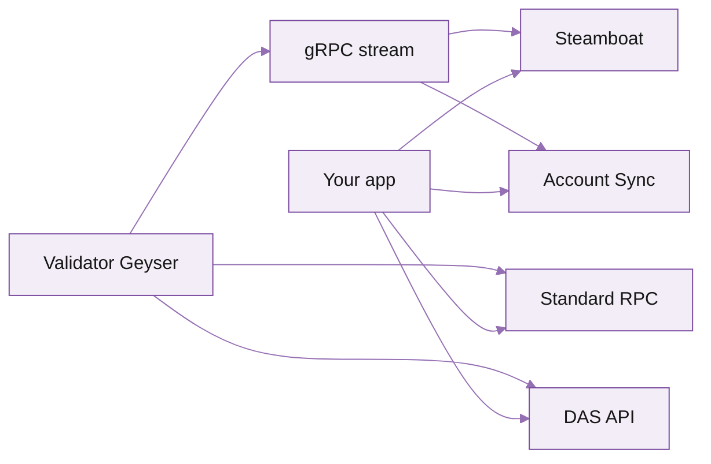

> **What this is.** A template for a section landing / overview page that lives at `/solana/<section>/overview` (e.g. `/solana/reading-state/overview`). The page introduces the section and routes the reader to one of the products underneath it. Replace placeholder copy and remove comment blocks before shipping.

## When to use this template

- Section has 2+ products underneath (otherwise just send the reader straight to the product page).
- You want the reader to compare options before clicking through.
- Use sparingly — too many overview pages add navigation, not content.

---

## Reading state

> Title is the section name, plain. The subtitle below is one sentence framing the whole section.

**Every way to read on-chain state on Solana, from sub-100 ms reads to 50x-faster custom indexes.**

> 1-2 paragraphs orienting the reader. What does this section cover, what's the problem it solves, what's the strategic frame Triton takes here.

Solana's account model is read-heavy: most apps spend most of their RPC budget on `getAccountInfo`, `getMultipleAccounts`, and `getProgramAccounts`. Triton splits the read layer into purpose-built components so each one can be tuned: vanilla JSON-RPC stays close to the native validator behaviour, indexed reads return in milliseconds, NFT data has its own DAS-spec endpoint, and live account state is mirrored without polling.

The right product depends on the access pattern: one-off lookups vs scans, reads vs subscriptions, and whether the data is account state, token state, or NFT metadata. The decision tree below lays it out.

## Pick the right product

> Cards or table. Cards work better when each option has a clear use case; table works better when the comparison is dimensional. Pick one.

<CardGroup cols={2}>
  <Card title="Standard RPC" icon="zap" href="/solana/reading-state/standard-rpc">
    JSON-RPC over HTTPS. Every standard Solana method. **Use when:** one-off account lookups, low-frequency dashboards.
  </Card>
  <Card title="Steamboat" icon="database" href="/solana/streaming/steamboat/overview">
    Custom indexes from your gRPC stream. **Use when:** `getProgramAccounts` is slow or expensive at your scale.
  </Card>
  <Card title="DAS API" icon="image" href="/solana/digital-assets/das-api/overview">
    Unified read for NFTs, cNFTs, SPL, Token-2022. **Use when:** anything NFT or compressed-NFT.
  </Card>
  <Card title="Account Sync" icon="refresh-cw" href="/solana/reading-state/account-sync">
    Live account state mirror, no polling. **Use when:** you need fresh state across many accounts continuously.
  </Card>
</CardGroup>

### Decision matrix

> Optional but high-impact. A small comparison table so the reader can pick at a glance.

| Need | Pick | Why |
| --- | --- | --- |
| One-off `getBalance` / `getAccountInfo` | Standard RPC | Lowest setup cost, fastest path to first byte. |
| `getProgramAccounts` over a 100k-account program | Steamboat | Native scan is O(n); Steamboat reads off a hot index. |
| NFT and cNFT collection feeds | DAS API | Triton helped author the spec. |
| Always-current account state for a watch list | Account Sync | Push-based, no polling, no rate-limit pressure. |
| Real-time slot-by-slot account updates | [Dragon's Mouth gRPC](/solana/streaming/dragons-mouth/overview) | Streaming sits in the next section, but it's often the right answer. |

## How these fit together

> Optional architecture diagram. Use when it actually clarifies — skip if it's just a label-shuffle.

> One paragraph explaining what the diagram shows. The diagram is the visual; the paragraph is the read.

All four read paths share the same underlying validator. Standard RPC and DAS API hit the validator's account database directly. Steamboat and Account Sync derive from the gRPC stream, which lets them serve queries the native RPC can't (custom indexes, push subscriptions). You can mix freely on the same endpoint — there's no separate setup per product.

## Quickstart

> One CTA per overview page. Send the reader to the most likely first stop.

<Card title="Quickstart: get reading in 5 minutes" icon="rocket" href="/solana/get-started/quickstart">
  Sign up, set up an endpoint, and call `getSlot`. Then route into the product that matches your use case.
</Card>

## Related sections

> Cross-link siblings. Helps users navigate without going back to the top-level nav.

<CardGroup cols={2}>
  <Card title="Streaming data" href="/solana/streaming/overview">
    Sub-slot subscriptions, gRPC streams, WebSockets.
  </Card>
  <Card title="Historical data" href="/solana/history/hydrant/overview">
    Millisecond ledger queries from genesis to now.
  </Card>
</CardGroup>
