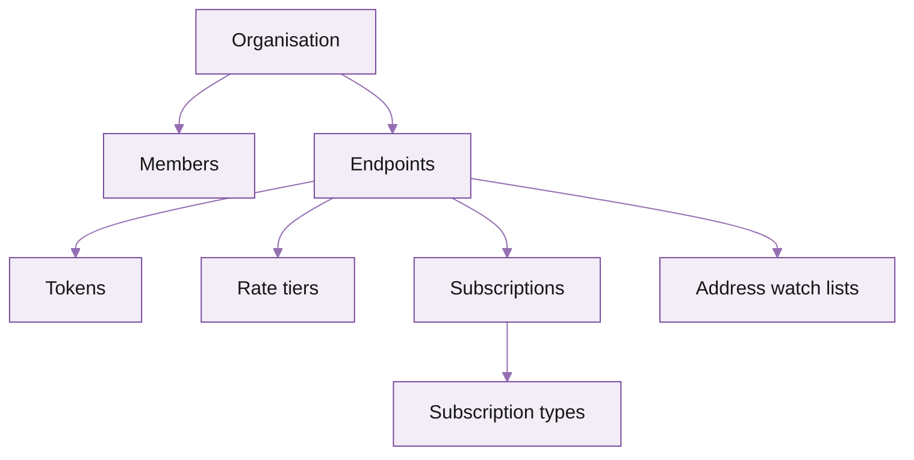

import FooterLinks from '/snippets/footer-links.mdx'

import AmaAccountsCard from '/snippets/cards/ama/accounts.mdx'
import AmaAuthAndHeadersCard from '/snippets/cards/ama/auth-and-headers.mdx'
import AmaEndpointsCard from '/snippets/cards/ama/endpoints.mdx'
import AmaTokensCard from '/snippets/cards/ama/tokens.mdx'
Everything you can do in the portal -- create endpoints, rotate tokens, manage origin allowlists, change rate limits, invite teammates -- is also available as a REST API. Use it for IaC, CI pipelines, automated rotation, and provisioning per-customer endpoints in your own product.

## When to use the API

| Use case | Why API beats portal |
|---|---|
| **Per-tenant endpoints** | If your product gives each of *your* customers a Solana endpoint, the API lets you provision and revoke in code. |
| **Scheduled token rotation** | Cron job hits the API every 90 days; no human in the loop. |
| **Infrastructure as Code** | Terraform / Pulumi / OpenTofu pattern: declare endpoints in code, the API applies. |
| **CI gates** | A failing CI job revokes its temporary endpoint. |
| **Disaster recovery** | Re-provision an environment in seconds from a saved manifest. |

## Where to start

<Columns cols={2}>
  <AmaAuthAndHeadersCard />
  <AmaAccountsCard />
  <AmaEndpointsCard />
  <AmaTokensCard />
</Columns>

## Resource model



- **Members** belong to the organisation.
- **Endpoints** belong to the organisation; everything below belongs to an endpoint.
- **Tokens** authenticate RPC requests against an endpoint.
- **Rate tiers** describe the limits on an endpoint (configurable on dedicated; read-only on shared by default).
- **Subscriptions** + **subscription types** describe what plans are attached.
- **Address watch lists** are server-side filters for streaming endpoints.

## Quickstart: list your endpoints

<CodeGroup>

```bash curl
curl https://api.triton.one/v1/endpoints \
  -H "Authorization: Bearer $TRITON_API_TOKEN" \
  -H "Accept: application/json"
```

```javascript fetch
const res = await fetch('https://api.triton.one/v1/endpoints', {
  headers: {
    'Authorization': `Bearer ${process.env.TRITON_API_TOKEN}`,
    'Accept': 'application/json'
  }
});
const json = await res.json();
console.log(json);
```

```python python
import os, requests

r = requests.get(
    'https://api.triton.one/v1/endpoints',
    headers={
        'Authorization': f'Bearer {os.environ["TRITON_API_TOKEN"]}',
        'Accept': 'application/json',
    }
)
print(r.json())
```

</CodeGroup>

The API returns JSON with one entry per endpoint: ID, region, plan, current usage, list of tokens, and the rate-tier configuration.

## Authentication

Bearer tokens, scoped to an organisation. Issue from **Members → API tokens → New** in the portal. Treat them like a password; rotate quarterly.

```text
Authorization: Bearer triton_pat_<random>
```

See [Auth and headers](/solana/get-started/account-management/account-management-api/auth-and-headers) for the full header set including organisation switching.

## Rate limits on the API itself

The Account Management API is rate-limited at **60 requests per minute per token**. Mutating calls (POST / PATCH / DELETE) count the same as reads. If you hit the limit you get `429 Too Many Requests` and an `X-Ratelimit-Reset` header telling you how many seconds until the window resets.

<Info>
This is separate from your *RPC* rate limits. The API token authenticates portal-style management calls, not Solana RPC traffic.
</Info>

## Errors

| Status | Meaning |
|---|---|
| `200 OK` / `201 Created` | Success |
| `400 Bad Request` | Malformed body or missing required field; error message identifies the field |
| `401 Unauthorized` | Token missing, expired, or revoked |
| `403 Forbidden` | Token valid but lacks the role required for this action (e.g. viewer trying to create an endpoint) |
| `404 Not Found` | Resource doesn't exist or isn't visible to your organisation |
| `409 Conflict` | Duplicate (e.g. endpoint name already taken) |
| `429 Too Many Requests` | API rate limit hit; back off and retry |
| `5xx` | Server-side; retry with backoff. Persistent 5xx -> [contact support](https://customers.triton.one) |

## What's next

<Columns cols={2}>
  <AmaAuthAndHeadersCard />
  <AmaEndpointsCard />
</Columns>

---

<FooterLinks />
