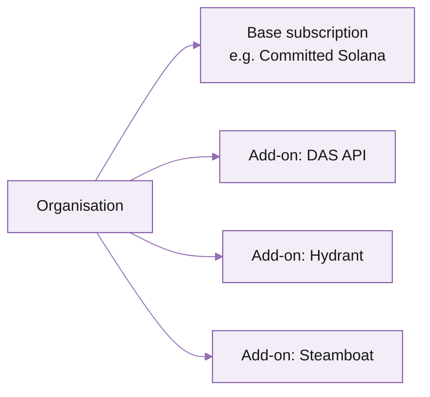

import FooterLinks from '/snippets/footer-links.mdx'
import PlansAndBillingCard from '/snippets/cards/plans-and-billing.mdx'

The Subscriptions resource describes which products your organisation has access to (Solana, Pyth, SUI, Monad) and which add-ons (DAS, Hydrant, Steamboat). The API is read + minor writes; full plan changes go through the portal or your account manager.

Resource path: `/v1/subscriptions`

## What's a subscription

A subscription couples your organisation to a [subscription type](/solana/get-started/account-management/account-management-api/subscription-types). One organisation typically has one base plan (PAYG / committed) plus zero or more add-ons (DAS, Hydrant, Steamboat).



## List active subscriptions

```
GET /v1/subscriptions
```

```bash
curl https://api.triton.one/v1/subscriptions \
  -H "Authorization: Bearer $TRITON_API_TOKEN"
```

```json
{
  "data": [
    {
      "id": "sub_base_abc",
      "type_id": "type_committed_solana_500",
      "status": "active",
      "started_at": "2026-02-01T00:00:00Z",
      "renewal_at": "2026-06-01T00:00:00Z",
      "monthly_credits": 500000
    },
    {
      "id": "sub_addon_das",
      "type_id": "type_addon_das",
      "status": "active",
      "started_at": "2026-03-15T00:00:00Z",
      "renewal_at": null
    }
  ]
}
```

## Attach an add-on

```
POST /v1/subscriptions
```

<ParamField path="type_id" type="string" required>
  Subscription type ID. List available types via `GET /v1/subscription-types`.
</ParamField>

<ParamField path="metadata" type="object">
  Optional key-value notes (cost-centre, project name).
</ParamField>

```bash
curl https://api.triton.one/v1/subscriptions \
  -H "Authorization: Bearer $TRITON_API_TOKEN" \
  -H "Content-Type: application/json" \
  -X POST -d '{ "type_id": "type_addon_hydrant" }'
```

Add-ons activate immediately. Billing prorates from the activation timestamp.

## Detach an add-on

```
DELETE /v1/subscriptions/{id}
```

```bash
curl https://api.triton.one/v1/subscriptions/sub_addon_das \
  -H "Authorization: Bearer $TRITON_API_TOKEN" \
  -X DELETE
```

Add-on stops billing at the next billing cycle (no proration of the partial month). The feature stays active until cycle end.

## Change base plan

Base plan changes (PAYG -> committed, sizing up / down) go through the portal or via your account manager. The API only supports add-on attach / detach.

[Reach out to support](https://customers.triton.one) for plan changes.

## What's next

<Columns cols={2}>
  <Card title="Subscription types" icon="list" href="/solana/get-started/account-management/account-management-api/subscription-types">
    The catalogue of plans and add-ons you can attach.
  </Card>
  <PlansAndBillingCard />
</Columns>

---

<FooterLinks />
