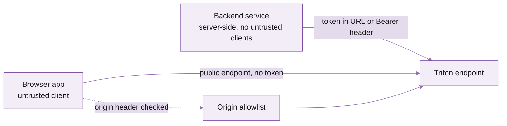

Triton supports two authentication patterns: **token in URL path** for backend systems, and **public endpoints with origin allowlists** for browser apps. Pick the right one and your tokens never end up on GitHub.

## The two patterns



### Backend: token in URL or bearer header

```bash
# Token in URL path
curl https://<your-app>.mainnet.rpcpool.com/<token> \
  -H "Content-Type: application/json" -d '{...}'

# Or as a Bearer header
curl https://<your-app>.mainnet.rpcpool.com/ \
  -H "Authorization: Bearer <token>" \
  -H "Content-Type: application/json" -d '{...}'
```

Use this for any code that runs on a server you control: backend services, indexers, bots, batch jobs.

### Browser: public endpoint + origin allowlist

For frontends, **never put a token in the page**. Anyone with devtools can read it. Instead:

1. In the portal, open **Auth → Public endpoints → Add**.
2. Add the origin(s) your app serves from (e.g. `https://yourapp.com`, `https://staging.yourapp.com`, `http://localhost:3000` for dev).
3. Use the public endpoint URL in your frontend code -- no token.

Triton checks the request's `Origin` header against the allowlist on every call.

```javascript
// Frontend — no token, no secrets
import { Connection } from '@solana/web3.js';
const connection = new Connection(
  'https://<your-public-endpoint>.mainnet.rpcpool.com',
  'confirmed'
);
```

<Warning>
The `Origin` header is set by the browser and **cannot be reliably spoofed by web pages**. It can be spoofed by curl / Postman, so the allowlist isn't a substitute for auth on backends -- only for browsers.
</Warning>

## Token hygiene

<AccordionGroup>
  <Accordion title="Use a different token per environment" icon="layers">
    Separate tokens for dev, staging, and production. If staging leaks, prod still works. Create them under the same endpoint via **Auth → Tokens → New**.
  </Accordion>
  <Accordion title="Use a different token per service" icon="boxes">
    For multi-service backends, give each service its own token so you can trace usage in **Logs** and rotate one without disrupting the others.
  </Accordion>
  <Accordion title="Rotate on a schedule" icon="rotate-cw">
    Set a quarterly reminder to rotate. **Auth → Tokens → \<token\> → Rotate** generates a new token, leaves the old one valid for 24h, then revokes it. Update your secret store between issue and revoke.
  </Accordion>
  <Accordion title="Store secrets in a real secret manager" icon="lock">
    AWS Secrets Manager, GCP Secret Manager, HashiCorp Vault, Doppler -- any of these. Don't commit tokens to git, don't paste them in Slack, don't put them in `.env` files that get committed. Use `.env.example` with placeholder values.
  </Accordion>
</AccordionGroup>

## What to do if a token leaks

<Steps>
  <Step title="Revoke immediately">
    **Auth → Tokens → \<token\> → Revoke**. The token stops working within seconds across our edge fleet.
  </Step>
  <Step title="Issue a replacement">
    Same screen, **New token**. Copy the value once -- it's only displayed at creation.
  </Step>
  <Step title="Roll services">
    Update your secret store and roll the dependent services. With per-service tokens, only the affected service needs to roll.
  </Step>
  <Step title="Audit usage during the leaked window">
    Open **Logs** for the endpoint, filter by the leaked token, and look at IPs / methods. If you see anything you don't recognise, [contact support](/solana/get-started/account-management/reach-out-to-support) -- we can help correlate with our edge logs.
  </Step>
  <Step title="If GitHub flagged the leak">
    GitHub's secret-scanning partners with Triton. If they emailed you, the token has likely already been revoked automatically. Verify in the portal and re-issue.
  </Step>
</Steps>

## Network-level protections

Beyond tokens and origin allowlists, you can additionally restrict by IP:

- **Auth → IP allowlist → Add**. Add your backend's static IPs (or NAT gateway range) and Triton refuses connections from anywhere else.
- For dedicated nodes, you can route the endpoint over a private VPC peering instead of the public internet. Talk to support.

## TLS

Every Triton endpoint is HTTPS-only. HTTP requests get `308` redirected. Pin to TLS 1.3 where your client supports it. Cipher suites and HSTS are configured at the edge -- you don't need to do anything.

## Compliance and data handling

- **No request bodies are logged** beyond the method name. We log timestamps, IPs, status, and method, not the request payload.
- **No private keys ever transit Triton**. We're an RPC provider -- you hold the keys, you sign locally, we relay the signed transaction.
- **SOC 2 Type II** report available under NDA via support.

## What's next

<Columns cols={2}>
  <Card title="Account management API" icon="code" href="/solana/get-started/account-management/account-management-api/overview">
    Programmatic token rotation, member changes, etc.
  </Card>
  <Card title="Platform overview" icon="layout" href="/solana/get-started/account-management/platform-overview">
    Where each setting lives in the portal.
  </Card>
</Columns>
