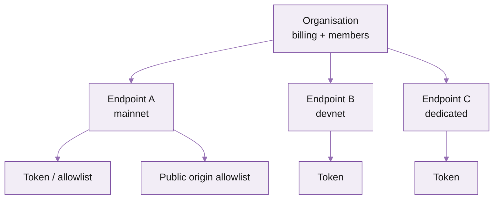

import FooterLinks from '/snippets/footer-links.mdx'

## What's in the portal

<Columns cols={2}>
  <Card title="Endpoints" icon="link">
    Provision, monitor, and configure every endpoint your organisation has -- shared and dedicated.
  </Card>

  <Card title="Auth" icon="key">
    Manage tokens, public-endpoint origin allowlists, and IP allowlists per endpoint.
  </Card>

  <Card title="Usage" icon="bar-chart">
    Live request count, RPS, error rate, and cost-to-date. Drilldowns by method.
  </Card>

  <Card title="Billing" icon="credit-card">
    Deposits, top-ups, payment methods, invoices, and credit balance.
  </Card>

  <Card title="Members" icon="users">
    Invite teammates, set roles (owner, admin, viewer), rotate credentials.
  </Card>

  <Card title="Audit log" icon="scroll">
    Every config change with timestamp, actor, and before/after values.
  </Card>
</Columns>

## Mental model: organisation -\> endpoint -\> token

- **Organisation** is the billing root. One payment method, one invoice. Members are scoped here.
- **Endpoints** belong to the organisation. Each has its own URL, region, infrastructure type (shared or dedicated), and limits.
- **Tokens / allowlists** belong to the endpoint. Multiple tokens per endpoint so you can rotate without downtime.

## Where to do common things

| Task | Where | Time |
| --- | --- | --- |
| Provision a new endpoint | **Endpoints → New** | 30s |
| Find a token | **Endpoints → \<endpoint\> → Auth** | 5s |
| Add an origin to the allowlist | **Auth → Origin allowlist → Add** | 10s |
| Add a teammate | **Members → Invite** | 30s |
| Change payment method | **Billing → Payment methods** | 1m |
| Top up credits | **Billing → Credits → Top up** | 1m |
| See live usage and cost | **Usage** (top-right card on dashboard) | instant |
| Rotate a token | **Auth → Token → Rotate** | 30s |
| Lower / raise rate limit (where configurable) | **Endpoints → \<endpoint\> → Limits** | 30s |
| Open a support ticket | **Help → New request** | 1m |

## Per-endpoint pages

Each endpoint has six tabs:

1. **Overview** -- region, infrastructure type, status, recent uptime.
2. **Auth** -- tokens and allowlists.
3. **Usage** -- per-method counts, error rate, cost.
4. **Methods** -- which JSON-RPC and gRPC methods are enabled / cost-multiplied.
5. **Limits** -- rate, concurrency, per-method overrides (configurable on dedicated; read-only on shared by default -- support can tune).
6. **Logs** -- recent requests with timestamp, method, status, and latency. Useful for debugging 429s and unusual responses.

## What's next

<Columns cols={2}>
  <Card title="Set up your account" icon="user-plus" href="/solana/get-started/account-management/set-up-your-account-and-add-users">
    Create the organisation and invite teammates.
  </Card>

  <Card title="Auth and security" icon="shield" href="/solana/get-started/auth-and-security">
    Token rotation, allowlists, and what to do if a token leaks.
  </Card>

  <Card title="How to top up credits" icon="wallet" href="/solana/get-started/account-management/how-to-top-up-credits">
    Manual top-ups and auto-top-up.
  </Card>

  <Card title="Account management API" icon="code" href="/solana/get-started/account-management/account-management-api/overview">
    Programmatically manage endpoints, tokens, and members.
  </Card>
</Columns>

Five minutes from "I just signed up" to "the team is in and we have a working endpoint". Follow the steps below.

## Create the organisation

<Steps>
  <Step title="Sign up" titleSize="h3">
    Sign up at [customers.triton.one](https://customers.triton.one/users/sign-up) with your work email. You'll receive a verification link; click it.
  </Step>
  <Step title="Name the organisation" titleSize="h3">
    On first sign-in, you'll be prompted to create an organisation. Use your company name. The organisation is the billing root -- everything (endpoints, members, payment methods) belongs to it.
  </Step>
  <Step title="Add a payment method" titleSize="h3">
    **Billing → Payment methods → Add**. Card, USDC, hel.io, or wire. PAYG is enabled by default; you can move to a [committed plan](https://tritonone.mintlify.app/solana/get-started/plans-and-billing) later.
  </Step>
  <Step title="Provision your first endpoint" titleSize="h3">
    **Endpoints → New**. Pick `Solana mainnet`, choose your closest region, click **Create**. Copy the URL and token from the **Auth** tab.
  </Step>
</Steps>

## Invite teammates

<Steps>
  <Step title="Open Members" titleSize="h3">
    From the portal sidebar, click **Members**.
  </Step>
  <Step title="Send the invite" titleSize="h3">
    Click **Invite**, enter the email, pick a role (see below), click **Send**. The teammate gets an email with a one-click join link.
  </Step>
  <Step title="They confirm and join" titleSize="h3">
    They click the link, sign up if they don't have an account, and land in your organisation with the role you assigned.
  </Step>
</Steps>

## Roles

| Role | Can do | Cannot do |
| :-- | :-- | :-- |
| **Owner** | Everything: billing, endpoints, members, dangerous actions (deleting an endpoint, transferring ownership) | -- |
| **Admin** | Manage endpoints, tokens, allowlists, members | Change billing details, transfer ownership, delete the organisation |
| **Viewer** | Read endpoints, view usage, view billing | Anything that mutates state |

<Tip>
  Use **Viewer** for stakeholders who only need to see usage and cost (PMs, finance). Use **Admin** for the engineers actually shipping. Limit **Owner** to a small group -- it's the only role that can transfer billing.
</Tip>

## Two-factor authentication

Owners and admins must enable 2FA. From your profile (top-right avatar), open **Security → Two-factor**, scan the QR with an authenticator (1Password, Authy, Google Authenticator), and save the recovery codes somewhere offline.

## Single sign-on (SSO)

SSO via Google, GitHub, and SAML is available on enterprise plans. To enable, [reach out to support](https://tritonone.mintlify.app/solana/get-started/account-management/reach-out-to-support) with your IdP details.

## What's next

<Columns cols={2}>
  <Card title="Auth and security" icon="shield" href="/solana/get-started/auth-and-security">
    Token rotation, allowlists, and incident response.
  </Card>

  <Card title="Platform overview" icon="layout" href="/solana/get-started/account-management/platform-overview">
    Tour of the customer portal: where everything lives.
  </Card>
</Columns>

---

<FooterLinks />