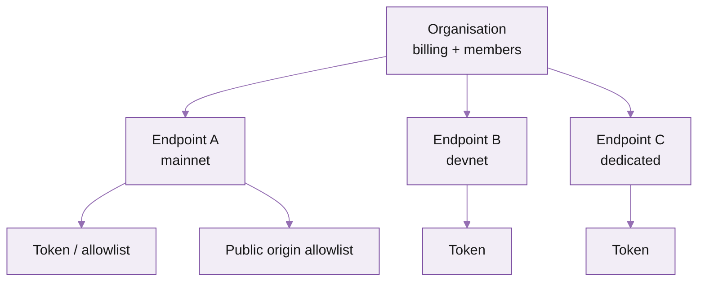

The Triton customer portal is where you provision endpoints, manage tokens, monitor usage, and pay invoices. This page is a quick tour so you know where to find each thing.

Sign in at [customers.triton.one](https://customers.triton.one).

## What's in the portal

<Columns cols={2}>
  <Card title="Endpoints" icon="link">
    Provision, monitor, and configure every endpoint your organisation has -- shared and dedicated.
  </Card>
  <Card title="Auth" icon="key">
    Manage tokens, public-endpoint origin allowlists, and IP allowlists per endpoint.
  </Card>
  <Card title="Usage" icon="bar-chart">
    Live request count, RPS, error rate, and cost-to-date. Drilldowns by method.
  </Card>
  <Card title="Billing" icon="credit-card">
    Deposits, top-ups, payment methods, invoices, and credit balance.
  </Card>
  <Card title="Members" icon="users">
    Invite teammates, set roles (owner, admin, viewer), rotate credentials.
  </Card>
  <Card title="Audit log" icon="scroll">
    Every config change with timestamp, actor, and before/after values.
  </Card>
</Columns>

## Mental model: organisation -> endpoint -> token

- **Organisation** is the billing root. One payment method, one invoice. Members are scoped here.
- **Endpoints** belong to the organisation. Each has its own URL, region, infrastructure type (shared or dedicated), and limits.
- **Tokens / allowlists** belong to the endpoint. Multiple tokens per endpoint so you can rotate without downtime.

## Where to do common things

| Task | Where | Time |
|---|---|---|
| Provision a new endpoint | **Endpoints → New** | 30s |
| Find a token | **Endpoints → \<endpoint\> → Auth** | 5s |
| Add an origin to the allowlist | **Auth → Origin allowlist → Add** | 10s |
| Add a teammate | **Members → Invite** | 30s |
| Change payment method | **Billing → Payment methods** | 1m |
| Top up credits | **Billing → Credits → Top up** | 1m |
| See live usage and cost | **Usage** (top-right card on dashboard) | instant |
| Rotate a token | **Auth → Token → Rotate** | 30s |
| Lower / raise rate limit (where configurable) | **Endpoints → \<endpoint\> → Limits** | 30s |
| Open a support ticket | **Help → New request** | 1m |

## Per-endpoint pages

Each endpoint has six tabs:

1. **Overview** -- region, infrastructure type, status, recent uptime.
2. **Auth** -- tokens and allowlists.
3. **Usage** -- per-method counts, error rate, cost.
4. **Methods** -- which JSON-RPC and gRPC methods are enabled / cost-multiplied.
5. **Limits** -- rate, concurrency, per-method overrides (configurable on dedicated; read-only on shared by default -- support can tune).
6. **Logs** -- recent requests with timestamp, method, status, and latency. Useful for debugging 429s and unusual responses.

## What's next

<Columns cols={2}>
  <Card title="Set up your account" icon="user-plus" href="/solana/get-started/account-management/set-up-your-account-and-add-users">
    Create the organisation and invite teammates.
  </Card>
  <Card title="Auth and security" icon="shield" href="/solana/get-started/account-management/auth-and-security-best-practices">
    Token rotation, allowlists, and what to do if a token leaks.
  </Card>
  <Card title="How to top up credits" icon="wallet" href="/solana/get-started/account-management/how-to-top-up-credits">
    Manual top-ups and auto-top-up.
  </Card>
  <Card title="Account management API" icon="code" href="/solana/get-started/account-management/account-management-api/overview">
    Programmatically manage endpoints, tokens, and members.
  </Card>
</Columns>
