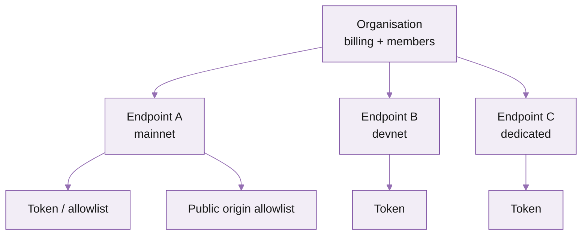

import FooterLinks from '/snippets/footer-links.mdx'
import AuthAndSecurityCard from '/snippets/cards/auth-and-security.mdx'
import PlansAndBillingCard from '/snippets/cards/plans-and-billing.mdx'
import HowToSignUpCard from '/snippets/cards/how-to-sign-up.mdx'
import AccountManagementApiCard from '/snippets/cards/account-management-api.mdx'
import DashEndpointsCard from '/snippets/cards/dashboard/endpoints.mdx'
import DashAuthCard from '/snippets/cards/dashboard/auth.mdx'
import DashUsageCard from '/snippets/cards/dashboard/usage.mdx'
import DashBillingCard from '/snippets/cards/dashboard/billing.mdx'
import DashMembersCard from '/snippets/cards/dashboard/members.mdx'
import DashAuditLogCard from '/snippets/cards/dashboard/audit-log.mdx'

<Warning>
**Work in progress.** This page is being reviewed -- don't reference it yet, copy isn't final.
</Warning>

## What's in the portal

<Columns cols={2}>
  <DashEndpointsCard />

  <DashAuthCard />

  <DashUsageCard />

  <DashBillingCard />

  <DashMembersCard />

  <DashAuditLogCard />
</Columns>

## Mental model: organisation -\> endpoint -\> token

- **Organisation** is the billing root. One payment method, one invoice. Members are scoped here.
- **Endpoints** belong to the organisation. Each has its own URL, region, infrastructure type (shared or dedicated), and limits.
- **Tokens / allowlists** belong to the endpoint. Multiple tokens per endpoint so you can rotate without downtime.

## Where to do common things

| Task | Where | Time |
| --- | --- | --- |
| Provision a new endpoint | **Endpoints → New** | 30s |
| Find a token | **Endpoints → \<endpoint\> → Auth** | 5s |
| Add an origin to the allowlist | **Auth → Origin allowlist → Add** | 10s |
| Add a teammate | **Members → Invite** | 30s |
| Change payment method | **Billing → Payment methods** | 1m |
| Top up credits | **Billing → Credits → Top up** | 1m |
| See live usage and cost | **Usage** (top-right card on dashboard) | instant |
| Rotate a token | **Auth → Token → Rotate** | 30s |
| Lower / raise rate limit (where configurable) | **Endpoints → \<endpoint\> → Limits** | 30s |
| Open a support ticket | **Help → New request** | 1m |

## Per-endpoint pages

Each endpoint has six tabs:

1. **Overview** -- region, infrastructure type, status, recent uptime.
2. **Auth** -- tokens and allowlists.
3. **Usage** -- per-method counts, error rate, cost.
4. **Methods** -- which JSON-RPC and gRPC methods are enabled / cost-multiplied.
5. **Limits** -- rate, concurrency, per-method overrides (configurable on dedicated; read-only on shared by default -- support can tune).
6. **Logs** -- recent requests with timestamp, method, status, and latency. Useful for debugging 429s and unusual responses.

## Walkthroughs

Short clips for the seven things you'll do most often in the portal. Each one is ~15 seconds.

### 1. Sign up

<Columns cols={2}>
  <video autoPlay muted loop playsInline controls className="w-full rounded-lg shadow">
    <source src="/images/account-management/sign-up.mp4" type="video/mp4" />
  </video>

  

    Sign up at [customers.triton.one](https://customers.triton.one/users/sign-up) with your work email, verify the link in your inbox, and name your organisation. The organisation is the billing root -- every endpoint, member, and payment method belongs to it.

    First-time sign-in walks you through creating your first endpoint too. Pick **Solana mainnet** and your closest region.
  

</Columns>

### 2. Add a teammate

<Columns cols={2}>
  

    From the portal sidebar, click **Members → Invite**. Enter the email, pick a [role](#roles), click **Send**.

    The teammate gets an email with a one-click join link. They sign up if they don't have an account, then land directly in your organisation with the role you assigned.
  

  <video autoPlay muted loop playsInline controls className="w-full rounded-lg shadow">
    <source src="/images/account-management/add-user.mp4" type="video/mp4" />
  </video>
</Columns>

### 3. Add a domain to the origin allowlist

<Columns cols={2}>
  <video autoPlay muted loop playsInline controls className="w-full rounded-lg shadow">
    <source src="/images/account-management/add-allow-origin.mp4" type="video/mp4" />
  </video>

  

    Click into the mainnet subscription, then the endpoint name. Under **Allowed origins**, hit `+` to add a domain and save. All subdomains are automatically allowed.

    Origin allowlists are how browser apps authenticate without exposing a token. Backend apps use the secret token instead -- see [Auth and security](/solana/get-started/auth-and-security).
  

</Columns>

### 4. View usage

<Columns cols={2}>
  

    Open the **v3 Billing** tab. You'll see total requests and GB used (the two dimensions you're billed on), plus a per-service breakdown below with product-level detail.

    Click **Export CSV** in the top-right corner to download. Usage data refreshes every \~4 hours; gRPC bandwidth is metered when the connection closes.
  

  <video autoPlay muted loop playsInline controls className="w-full rounded-lg shadow">
    <source src="/images/account-management/view-usage.mp4" type="video/mp4" />
  </video>
</Columns>

### 5. Top up credits

<Columns cols={2}>
  <video autoPlay muted loop playsInline controls className="w-full rounded-lg shadow">
    <source src="/images/account-management/top-up.mp4" type="video/mp4" />
  </video>

  

    Open **Billing → Buy credits**. Pay in stablecoins via Wallet Connect (any supported token) or transfer from any external wallet or exchange.

    If you'd rather pay by card or wire, switch to invoiced billing -- contact support from the dashboard chat.
  

</Columns>

### 6. Set up low-balance notifications

<Columns cols={2}>
  

    Open **Billing**, toggle alerts on, and set a threshold (for example, $10). When your balance hits that amount, every user on the account gets a notification.

    Pair this with PAYG to avoid surprise service interruptions -- the alert fires before you run out of credit.
  

  <video autoPlay muted loop playsInline controls className="w-full rounded-lg shadow">
    <source src="/images/account-management/add-notifications.mp4" type="video/mp4" />
  </video>
</Columns>

### 7. Contact support

<Columns cols={2}>
  <video autoPlay muted loop playsInline controls className="w-full rounded-lg shadow">
    <source src="/images/account-management/contact-support.mp4" type="video/mp4" />
  </video>

  

    Click the chat icon in the bottom right of any dashboard page. Your message goes straight to engineering, not a tier-1 queue.

    Include your endpoint URL and the timestamp of the issue when reporting incidents -- it cuts the back-and-forth in half.
  

</Columns>

## Roles

| Role | Can do | Cannot do |
| :-- | :-- | :-- |
| **Owner** | Everything: billing, endpoints, members, dangerous actions (deleting an endpoint, transferring ownership) | -- |
| **Admin** | Manage endpoints, tokens, allowlists, members | Change billing details, transfer ownership, delete the organisation |
| **Viewer** | Read endpoints, view usage, view billing | Anything that mutates state |

<Tip>
  Use **Viewer** for stakeholders who only need to see usage and cost (PMs, finance). Use **Admin** for the engineers actually shipping. Limit **Owner** to a small group -- it's the only role that can transfer billing.
</Tip>

## Two-factor authentication

Owners and admins must enable 2FA. From your profile (top-right avatar), open **Security → Two-factor**, scan the QR with an authenticator (1Password, Authy, Google Authenticator), and save the recovery codes somewhere offline.

## Single sign-on (SSO)

SSO via Google, GitHub, and SAML is available on enterprise plans. To enable, contact support by clicking the chat icon in the bottom right of your [customer dashboard](https://customers.triton.one) with your IdP details.

## What's next

<CardGroup cols={2}>
  <HowToSignUpCard />

  <PlansAndBillingCard />

  <AuthAndSecurityCard />

  <AccountManagementApiCard />
</CardGroup>

---

<FooterLinks />