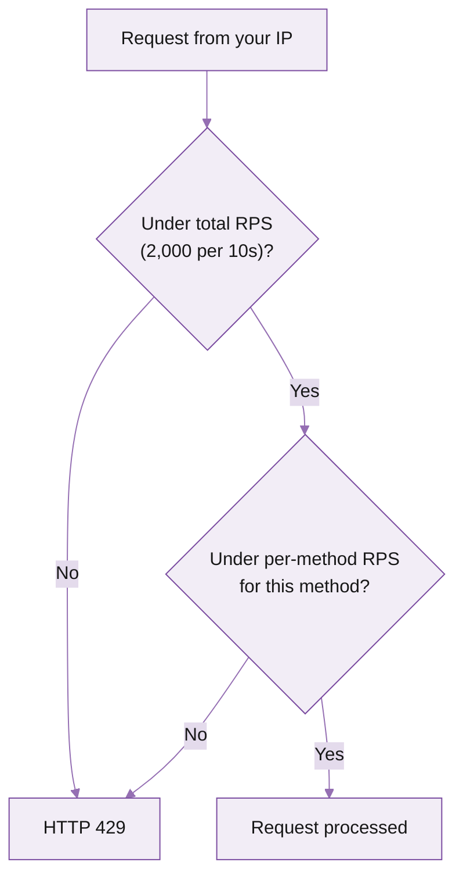

Triton has two kinds of limits: rate limits for HTTP requests (per IP, 10-second window) and connection limits for streaming (simultaneous connections per endpoint). This page covers each, defaults, where to read your live numbers, and what to do when you hit one.

## Rate limits

Two budgets apply at the same time, both reset every 10 seconds, both keyed to the IP making the request:

- **Total RPS** is the budget across every method. If your IP sends 1,000 `getBalance` and 1,000 `getSlot` in 10 seconds, that counts as 2,000 against this budget.
- **Per-method RPS** is a separate budget for each individual RPC method. Even if your total is under the cap, you can hit the per-method cap on a single hot method (most often `getBalance`, `getProgramAccounts`, or similar).



If either check fails, the response is HTTP 429 Too Many Requests. In practice, we see most of the 429s come from the per-method limit, not the total.

<Info>
**Per IP** means the IP making the request. Backends sharing one IP share one budget.
</Info>

### Defaults

| Limit | Default |
|---|---|
| Total RPS per IP | 2,000 per 10 seconds |
| Per-method RPS per IP | Lower than total, varies by method |

### Read your live limits

Every endpoint exposes its current limits at `/ratelimits`:

```bash
curl https://<your-app>.mainnet.rpcpool.com/ratelimits
```

The response is JSON, listing the request budget per window, every per-method override, and the connection cap. Bookmark this URL. It's the source of truth for your endpoint's exact numbers, which can differ from defaults if support has tuned them.

Every JSON-RPC response also carries `X-Ratelimit-*` headers. Watch them in your client to back off before you hit a 429:

| Header | What it tells you |
|---|---|
| `X-Ratelimit-Limit` | Total budget for the current 10-second window |
| `X-Ratelimit-Remaining` | How many total requests you have left |
| `X-Ratelimit-Reset` | Seconds until the window resets |
| `X-Ratelimit-Method-Limit` | Per-method cap for this RPC |
| `X-Ratelimit-Method-Remaining` | How many of this method you have left |

If you do hit one, see the [Error handling guide](/solana-guides/error-handling/overview) for the full debug flow.

### Method-specific limits

Some Solana methods scan large datasets: they use a separate, lower per-method counter so that a single heavy call doesn't starve the rest of your traffic.

| Method | Why is it expensive | Mitigation |
|---|---|---|
| `getProgramAccounts` | Full program-state scan can return MBs of data | Filter aggressively (`dataSize`, `memcmp`); for production, use [Steamboat indexed accounts](/solana/streaming/steamboat/overview) |
| `getTokenAccountsByOwner` (large owners) | Iterates every token account for an owner | Cache results, batch by owner, use Steamboat for indexed reads |
| `getSignaturesForAddress` (deep history) | Walks signatures back through epochs | Cap `limit`; for archival depth use [Hydrant historical data](/solana/history/hydrant/overview) |

A 429 on these methods usually means you've burned the per-method budget. The total RPS remains unaffected, so other reads continue to work.

### Browser concurrency

Browsers cap parallel HTTP/2 streams to a single host, so a frontend with many parallel calls can self-throttle before Triton's limits ever apply. Best practices:

- Use a single shared `Connection` (web3.js) per page
- Batch reads with `getMultipleAccounts` instead of N parallel `getAccountInfo` calls
- Move heavy reads (program scans, signature crawls) to your backend

## Connection limits

Streaming products (Yellowstone gRPC, Whirligig WebSockets, Fumarole) cap simultaneous connections, not request rate.

Connection limits are flexible. If you hit one, let us know and we'll work with you to either optimise usage or raise the cap.

A single gRPC connection can multiplex many subscriptions. The right pattern is one connection plus many `subscribe` messages, not one connection per filter. See the [Dragon's Mouth quickstart](/solana/streaming/dragons-mouth/quickstart) for the canonical multiplex example.

## What's next

<Columns cols={2}>
  <Card title="Plans and billing" icon="credit-card" href="/solana/get-started/plans-and-billing">
    Per-service rates, invoicing, when to move to dedicated.
  </Card>
  <Card title="Dedicated nodes" icon="server" href="/solana/dedicated-nodes/overview">
    Custom limits, isolated capacity, dedicated regions.
  </Card>
</Columns>
