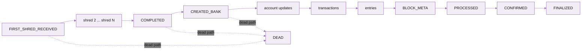

import FooterLinks from '/snippets/footer-links.mdx'

## What is Dragon's Mouth

Dragon's Mouth is Triton's Geyser-fed gRPC interface for streaming Solana data. It taps the validator's Geyser plugin directly, so you get account, transaction, slot, and block updates as the validator processes them -- before the regular RPC interface sees them. For DeFi traders, that's up to a 400 ms head start over a polling client.

It's the fastest live data path available, more stable than the traditional WebSocket interface, and the recommended choice for any backend service where latency matters. For browser clients that can't speak gRPC, use [Whirligig WebSockets](/solana/streaming/whirligig-websockets) instead.

## Use cases

<CardGroup cols={2}>
  <Card title="Trading and MEV" icon="coins">
    Lowest-latency reads of pool state, oracles, AMM accounts, and price-impacting transactions.
  </Card>
  <Card title="Indexers" icon="bar-chart-3">
    Full transaction firehose with server-side filters, exactly-once processing per slot.
  </Card>
  <Card title="Real-time UIs" icon="activity">
    Live balances, transaction feeds, and account state for backends that proxy to wallets and explorers.
  </Card>
  <Card title="Compliance and analytics" icon="shield-check">
    Watch specific addresses or programs, route updates to a downstream pipeline.
  </Card>
</CardGroup>

## Features and benefits

<CardGroup cols={2}>
  <Card title="Sub-slot latency" icon="zap">
    Intra-slot updates arrive ~400 ms ahead of standard RPC, which only emits at slot boundaries.
  </Card>
  <Card title="Server-side filtering" icon="filter">
    Filter by pubkey, program owner, signature, memcmp, datasize, or token-account state. The matching subset reaches you, not the firehose.
  </Card>
  <Card title="Replay from a slot" icon="rotate-ccw">
    Resume from a specific slot after a disconnect. The server replays buffered updates, then continues live on the same stream.
  </Card>
  <Card title="Bi-directional streams" icon="repeat">
    Modify subscriptions on the fly -- send a new request and the server swaps your filter set without reconnecting.
  </Card>
</CardGroup>

## Stream types and unary operations

Dragon's Mouth exposes two interfaces on the same gRPC service: streaming subscriptions and one-shot unary calls.

<Tabs>
  <Tab title="Streaming subscriptions">
    Open a subscribe stream, receive matching events as the validator processes them.

    | Stream | What you receive |
    | --- | --- |
    | Account writes | Updates whenever a matching account's data, lamports, or owner changes |
    | Transactions | Every transaction matching your filter, with full `meta` (logs, status, balance deltas) |
    | Deshred transactions (paid beta) | Transactions reconstructed from shreds _before_ execution. Separate `SubscribeDeshred` method. See [Deshred transactions](#deshred-transactions). |
    | Entries | Solana ledger entries (low-level, rare use case) |
    | Block notifications | Full blocks as they're produced, optionally with their transactions and accounts |
    | Block metadata | Block headers only, without the transaction payload |
    | Slot notifications | Slot-status events (processed/confirmed/finalized plus intra-slot lifecycle) |
  </Tab>
  <Tab title="Unary operations">
    One request, one response. Use these for occasional queries instead of a persistent stream.

    | Method | Returns |
    | --- | --- |
    | `getLatestBlockhash` | The latest blockhash + last valid block height at a commitment level |
    | `getBlockHeight` | The current block height at a commitment level |
    | `getSlot` | The current slot at a commitment level |
    | `isValidBlockhash` | Whether a given blockhash is still valid |
    | `subscribeReplayInfo` | Earliest slot still available for stream replay |
  </Tab>
</Tabs>

## Subscribe request

Every stream subscription is a single `SubscribeRequest` message. It has fields that apply across all stream types and a per-stream filter map. Send it once when you open the stream; send it again at any time to modify (the new request fully replaces the old one).

<Tabs>
  <Tab title="commitment">
    Commitment level for buffering. Optional. Defaults to `processed`.

    | Value | Meaning |
    | --- | --- |
    | `PROCESSED` (0) | Highest slot seen, possibly on a fork. Lowest latency. |
    | `CONFIRMED` (1) | Voted on by supermajority. Some buffering. |
    | `FINALIZED` (2) | Max vote lockout. Most buffering. |

    For maximum performance, work at `processed` and manage commitment client-side using [slot notifications](#slots).
  </Tab>
  <Tab title="ping">
    Sends a periodic keepalive to prevent idle-connection drops by load balancers and NATs. Server replies with `pong`. Optional but recommended for long-running streams.

    See [pings](#pings).
  </Tab>
  <Tab title="accountsDataSlice">
    Truncates account data payloads to a byte range, reducing bandwidth. Optional. Empty array means full payload.

    Example: `[{ "offset": 32, "length": 40 }]` returns 40 bytes starting at byte 32.
  </Tab>
  <Tab title="fromSlot">
    Replay buffered updates starting from this slot, then continue live. Optional. Used for reconnection logic.

    See [replaying from a slot](#replay-from-a-slot).
  </Tab>
</Tabs>

### Filter configuration

Each `SubscribeRequest` has a map per stream type. The key is a label you choose (returned with each match so you can route it); the value is the filter spec.

#### Account filters

<ParamField path="account" type="string[]">
  List of pubkeys to subscribe to directly. Each must be a base58-encoded address.
</ParamField>

<ParamField path="owner" type="string[]">
  List of program owners. Subscribes to every account owned by these programs.
</ParamField>

<ParamField path="filters" type="AccountsFilter[]">
  Content-based filters on the account data. Each filter is one of: `memcmp`, `datasize`, `tokenAccountState`, or `lamports`. Combined as logical AND.
</ParamField>

#### Transaction filters

<ParamField path="vote" type="bool" optional>
  Include or exclude vote transactions. `false` excludes votes.
</ParamField>

<ParamField path="failed" type="bool" optional>
  Include or exclude failed transactions. `false` excludes failures.
</ParamField>

<ParamField path="signature" type="string" optional>
  Subscribe to a specific signature's status updates.
</ParamField>

<ParamField path="account_include" type="string[]">
  Accounts mentioned anywhere in the transaction.
</ParamField>

<ParamField path="account_exclude" type="string[]">
  Exclude transactions mentioning these accounts.
</ParamField>

<ParamField path="account_required" type="string[]">
  Accounts that MUST all be mentioned (every one of them).
</ParamField>

#### Block filters

<ParamField path="account_include" type="string[]">
  Only deliver transactions and accounts in the block that mention these.
</ParamField>

<ParamField path="include_transactions" type="bool" default="true">
  Include the block's transactions.
</ParamField>

<ParamField path="include_accounts" type="bool" default="false">
  Include accounts updated during the block.
</ParamField>

<ParamField path="include_entries" type="bool" default="false">
  Include the block's entries.
</ParamField>

#### Slot filters

<ParamField path="filter_by_commitment" type="bool" default="false">
  If `true`, only receive updates matching the request's `commitment`. If `false`, receive every status change.
</ParamField>

#### Entry filters

No filter parameters. Subscribe by adding any named entry to the `entry` map.

### Filter logic

Within a single filter category (e.g. one transaction filter), values are combined as follows:

- **Within an array, OR.** `account_include: [A, B]` matches transactions mentioning A _or_ B.
- **Across fields, AND.** `vote: false, account_include: [A]` matches non-vote transactions mentioning A.

For transactions specifically:

```text
match = (accountInclude OR empty) AND (accountRequired AND all) AND NOT accountExclude
```

Across multiple named filters in the same category (e.g. two transaction filters), you receive matches from any of them. Each match comes tagged with the filter name(s) that produced it, so you can route updates downstream.

## Subscribing to each stream type

\[you'll need\>....\]

- An active Triton subscription
- Your endpoint URL and secret token from the [customer dashboard](https://customers.triton.one/)
- A backend environment in TypeScript, Rust, Go, or another language with a gRPC client
- Familiarity with gRPC and Protocol Buffers

The latest protobuf files live in the [yellowstone-grpc repo](https://github.com/rpcpool/yellowstone-grpc/tree/master/yellowstone-grpc-proto/proto). For Rust, use the [yellowstone-grpc-proto crate](https://crates.io/crates/yellowstone-grpc-proto).

The examples below use gRPC JSON for the request body and TypeScript for the client. Other languages use the same shape. Each example assumes you've already created and connected a `Client` (see [clients and SDKs](#clients-and-sdks)).

### Accounts

<Tabs>
  <Tab title="By pubkey">
    Subscribe to one or more specific accounts. The label `wsol/usdc` is yours -- it comes back on each match for routing.

    <CodeGroup>

    ```json gRPC
    {
      "slots": { "slots": {} },
      "accounts": {
        "wsol/usdc": {
          "account": ["8BnEgHoWFysVcuFFX7QztDmzuH8r5ZFvyP3sYwn1XTh6"]
        }
      },
      "transactions": {},
      "blocks": {},
      "blocks_meta": {},
      "accounts_data_slice": [],
      "commitment": 1
    }
    ```

    ```typescript TypeScript
    import { CommitmentLevel } from "@triton-one/yellowstone-grpc";
    
    const request = {
      slots: { slots: {} },
      accounts: {
        "wsol/usdc": {
          account: ["8BnEgHoWFysVcuFFX7QztDmzuH8r5ZFvyP3sYwn1XTh6"],
        },
      },
      transactions: {},
      blocks: {},
      blocksMeta: {},
      accountsDataSlice: [],
      commitment: CommitmentLevel.CONFIRMED,
    };
    ```

    </CodeGroup>
  </Tab>
  <Tab title="By owner (program)">
    Subscribe to every account owned by a program. The example tracks all Solend accounts.

    <CodeGroup>

    ```json gRPC
    {
      "slots": { "slots": {} },
      "accounts": {
        "solend": {
          "owner": ["So1endDq2YkqhipRh3WViPa8hdiSpxWy6z3Z6tMCpAo"]
        }
      },
      "transactions": {},
      "blocks": {},
      "blocks_meta": {},
      "accounts_data_slice": [],
      "commitment": 0
    }
    ```

    ```typescript TypeScript
    import { CommitmentLevel } from "@triton-one/yellowstone-grpc";
    
    const request = {
      slots: { slots: {} },
      accounts: {
        solend: {
          owner: ["So1endDq2YkqhipRh3WViPa8hdiSpxWy6z3Z6tMCpAo"],
        },
      },
      transactions: {},
      blocks: {},
      blocksMeta: {},
      accountsDataSlice: [],
      commitment: CommitmentLevel.PROCESSED,
    };
    ```

    </CodeGroup>
  </Tab>
  <Tab title="Multiple programs">
    Combine multiple programs in one filter, or use separate filters for different routing tags.

    Both programs in one filter:

    <CodeGroup>

    ```json gRPC
    {
      "slots": { "slots": {} },
      "accounts": {
        "programs": {
          "owner": [
            "So1endDq2YkqhipRh3WViPa8hdiSpxWy6z3Z6tMCpAo",
            "9xQeWvG816bUx9EPjHmaT23yvVM2ZWbrrpZb9PusVFin"
          ]
        }
      },
      "transactions": {},
      "blocks": {},
      "blocks_meta": {},
      "accounts_data_slice": []
    }
    ```

    </CodeGroup>

    Separate filters with different tags:

    <CodeGroup>

    ```json gRPC
    {
      "slots": { "slots": {} },
      "accounts": {
        "solend": { "owner": ["So1endDq2YkqhipRh3WViPa8hdiSpxWy6z3Z6tMCpAo"] },
        "serum":  { "owner": ["9xQeWvG816bUx9EPjHmaT23yvVM2ZWbrrpZb9PusVFin"] }
      },
      "transactions": {},
      "blocks": {},
      "blocks_meta": {},
      "accounts_data_slice": []
    }
    ```

    </CodeGroup>
  </Tab>
  <Tab title="Advanced filters + data slice">
    Filter by content (memcmp, token account state) and trim the returned payload to save bandwidth. The example tracks USDC token accounts and returns only 40 bytes starting at offset 32 (owner \+ lamports).

    <CodeGroup>

    ```json gRPC
    {
      "accounts": {
        "usdc": {
          "owner": ["TokenkegQfeZyiNwAJbNbGKPFXCWuBvf9Ss623VQ5DA"],
          "filters": [
            { "token_account_state": true },
            {
              "memcmp": {
                "offset": 0,
                "data": { "base58": "EPjFWdd5AufqSSqeM2qN1xzybapC8G4wEGGkZwyTDt1v" }
              }
            }
          ]
        }
      },
      "accounts_data_slice": [{ "offset": 32, "length": 40 }]
    }
    ```

    ```typescript TypeScript
    import { CommitmentLevel } from "@triton-one/yellowstone-grpc";
    
    const request = {
      slots: {},
      accounts: {
        usdc: {
          owner: ["TokenkegQfeZyiNwAJbNbGKPFXCWuBvf9Ss623VQ5DA"],
          filters: [
            { tokenAccountState: true },
            {
              memcmp: {
                offset: 0,
                data: { base58: "EPjFWdd5AufqSSqeM2qN1xzybapC8G4wEGGkZwyTDt1v" },
              },
            },
          ],
        },
      },
      transactions: {},
      blocks: {},
      blocksMeta: {},
      entry: {},
      commitment: CommitmentLevel.CONFIRMED,
      accountsDataSlice: [{ offset: 32, length: 40 }],
    };
    ```

    </CodeGroup>
  </Tab>
</Tabs>

### Transactions

<Tabs>
  <Tab title="All non-vote, non-failed">
    Subscribe to every successful, non-vote transaction at finalized commitment.

    <CodeGroup>

    ```json gRPC
    {
      "slots": { "slots": {} },
      "accounts": {},
      "transactions": {
        "alltxs": { "vote": false, "failed": false }
      },
      "blocks": {},
      "blocks_meta": {},
      "accounts_data_slice": [],
      "commitment": 2
    }
    ```

    ```typescript TypeScript
    import { CommitmentLevel } from "@triton-one/yellowstone-grpc";
    
    const request = {
      slots: { slots: {} },
      accounts: {},
      transactions: {
        alltxs: { vote: false, failed: false },
      },
      blocks: {},
      blocksMeta: {},
      accountsDataSlice: [],
      commitment: CommitmentLevel.FINALIZED,
    };
    ```

    </CodeGroup>
  </Tab>
  <Tab title="Mentioning an account">
    Subscribe to non-vote transactions that mention a specific account anywhere.

    <CodeGroup>

    ```json gRPC
    {
      "transactions": {
        "serum": {
          "vote": false,
          "account_include": ["9xQeWvG816bUx9EPjHmaT23yvVM2ZWbrrpZb9PusVFin"]
        }
      }
    }
    ```

    </CodeGroup>
  </Tab>
  <Tab title="Excluding accounts">
    Drop transactions that mention any of the listed accounts.

    <CodeGroup>

    ```json gRPC
    {
      "transactions": {
        "serum": {
          "account_exclude": [
            "9xQeWvG816bUx9EPjHmaT23yvVM2ZWbrrpZb9PusVFin",
            "TokenkegQfeZyiNwAJbNbGKPFXCWuBvf9Ss623VQ5DA"
          ]
        }
      }
    }
    ```

    </CodeGroup>
  </Tab>
  <Tab title="Combined include + exclude">
    Combine include \+ exclude in one filter. The example matches transactions mentioning a Serum program but excludes any that also touch a specific account.

    <CodeGroup>

    ```json gRPC
    {
      "transactions": {
        "serum": {
          "account_include": ["9xQeWvG816bUx9EPjHmaT23yvVM2ZWbrrpZb9PusVFin"],
          "account_exclude": ["9wFFyRfZBsuAha4YcuxcXLKwMxJR43S7fPfQLusDBzvT"]
        }
      }
    }
    ```

    </CodeGroup>
  </Tab>
  <Tab title="By signature">
    Track a specific transaction's lifecycle from confirmed to finalized.

    <CodeGroup>

    ```json gRPC
    {
      "transactions": {
        "sign": {
          "signature": "5rp2hL9b6kexex11Mugfs3vfU9GhieKruj4CkFFSnu52WLxiGn4VcLLwsB62XURhMmT1j4CZiXT6FFtYbXsLq2Zs"
        }
      }
    }
    ```

    </CodeGroup>
  </Tab>
</Tabs>

#### Transaction data structure

Each transaction update is a `SubscribeUpdateTransaction` containing the full transaction info plus its execution metadata.

<AccordionGroup>
  <Accordion title="Transaction message structure">
    Top-level fields on the update:

    - `signature` -- the transaction signature, as a byte buffer
    - `isVote` -- boolean, whether this is a vote transaction
    - `transaction.message` -- the transaction's `Message` (account keys, recent blockhash, instructions, address table lookups)
    - `transaction.signatures` -- list of signatures
    - `meta` -- execution metadata, see below
    - `slot` -- the slot in which this transaction was included
  </Accordion>

  <Accordion title="Execution meta">
    Contained in `meta` on the transaction update:

    - `err` -- transaction error (null on success)
    - `fee` -- fee paid in lamports
    - `computeUnitsConsumed` -- CU consumed during execution
    - `logMessages` -- log lines from the program(s) invoked
    - `preBalances` / `postBalances` -- SOL balances per account before/after
    - `preTokenBalances` / `postTokenBalances` -- SPL token balance deltas
    - `innerInstructions` -- CPIs (cross-program invocations) emitted by top-level instructions
    - `loadedAddresses` -- writable \+ readonly addresses resolved from address lookup tables
  </Accordion>

  <Accordion title="Token balance changes">
    Each entry in `preTokenBalances` and `postTokenBalances`:

    - `accountIndex` -- index into the transaction's account keys
    - `mint` -- token mint pubkey
    - `owner` -- account owner
    - `programId` -- which token program (Token vs Token-2022)
    - `uiTokenAmount.amount` -- raw amount as string
    - `uiTokenAmount.decimals` -- token decimals
    - `uiTokenAmount.uiAmount` -- decimal-formatted amount as number
    - `uiTokenAmount.uiAmountString` -- decimal-formatted amount as string
  </Accordion>

  <Accordion title="Instruction details">
    Within `transaction.message.instructions`:

    - `programIdIndex` -- index of the invoked program in the account keys array
    - `accounts` -- byte array of account-key indices used by the instruction
    - `data` -- instruction data, base58-encoded

    Inner instructions (CPIs) follow the same shape, grouped by their parent's index in `meta.innerInstructions`.
  </Accordion>
</AccordionGroup>

### Slots

Subscribe to slot status changes. No filter parameters needed beyond a label.

<CodeGroup>

```json gRPC
{
  "slots": { "incoming_slots": {} },
  "accounts": {},
  "transactions": {},
  "blocks": {},
  "blocks_meta": {},
  "accounts_data_slice": []
}
```

</CodeGroup>

Each update carries a `SlotStatus` enum -- see [intra-slot updates](#intra-slot-updates) for the full lifecycle.

### Blocks

<Tabs>
  <Tab title="All blocks">
    Receive every block as it's produced, with full transaction payload.

    <CodeGroup>

    ```json gRPC
    {
      "slots": {},
      "accounts": {},
      "transactions": {},
      "blocks": { "blocks": {} },
      "blocks_meta": {},
      "accounts_data_slice": []
    }
    ```

    </CodeGroup>
  </Tab>
  <Tab title="Customise payload">
    Trim the block payload by toggling `include_transactions` / `include_accounts`.

    <CodeGroup>

    ```json gRPC
    {
      "blocks": {
        "blocks": {
          "include_transactions": false,
          "include_accounts": true
        }
      }
    }
    ```

    </CodeGroup>
  </Tab>
  <Tab title="Filtered by account">
    Restrict the block's transactions and accounts to those mentioning specific addresses.

    <CodeGroup>

    ```json gRPC
    {
      "blocks": {
        "blocks": {
          "account_include": ["So1endDq2YkqhipRh3WViPa8hdiSpxWy6z3Z6tMCpAo"]
        }
      }
    }
    ```

    </CodeGroup>
  </Tab>
  <Tab title="Block metadata only">
    Get block headers without the transaction payload (much smaller messages).

    <CodeGroup>

    ```json gRPC
    {
      "blocks": {},
      "blocks_meta": { "blockmetadata": {} }
    }
    ```

    </CodeGroup>
  </Tab>
</Tabs>

### Entries

Subscribe to ledger entries (groups of transactions that make up a slot). No filters; subscribe by adding any named entry filter.

<CodeGroup>

```json gRPC
{
  "entry": { "all": {} }
}
```

</CodeGroup>

This is a low-level signal, mostly useful for validator tooling. Most consumers want transactions or blocks instead.

## Modifying and unsubscribing

The subscribe stream is bi-directional. Send a new `SubscribeRequest` at any time to update filters -- it fully replaces the previous subscription, so your client must keep a local copy of the full config it wants.

To unsubscribe from everything but keep the connection open:

<CodeGroup>

```json gRPC
{
  "slots": {},
  "accounts": {},
  "transactions": {},
  "blocks": {},
  "blocks_meta": {}
}
```

</CodeGroup>

## Pings

Some load balancers (e.g. Cloudflare) close idle connections after a minute or two. Send periodic pings to keep your stream alive. The server responds with `pong` every 15 seconds.

<CodeGroup>

```typescript TypeScript
const PING_INTERVAL_MS = 30_000;

const pingRequest = {
  ping: { id: 1 },
  accounts: {},
  accountsDataSlice: [],
  transactions: {},
  transactionsStatus: {},
  blocks: {},
  blocksMeta: {},
  entry: {},
  slots: {},
};

setInterval(async () => {
  await new Promise<void>((resolve, reject) => {
    stream.write(pingRequest, (err) =>
      err ? reject(err) : resolve()
    );
  });
}, PING_INTERVAL_MS);

stream.on("data", (data) => {
  if (data.pong) {
    console.log("Received pong");
  }
});
```

</CodeGroup>

A Rust example: [gist by @lvboudre](https://gist.github.com/lvboudre/7bbcd895ab3b7df3cd6b0ad1450fac88).

## Replay from a slot

Dragon's Mouth can replay recently buffered updates by setting `from_slot` on `SubscribeRequest`. The server replays buffered updates from that slot, then continues live on the same stream.

Use it for short-disconnection recovery:

1. Track the latest slot your application has processed.
2. On disconnect, reconnect and resubscribe with `from_slot` set to that slot.
3. If the slot is no longer available, fall back to a fresh live subscription or your own backfill path.

<CodeGroup>

```json gRPC
{
  "slots": { "incoming_slots": {} },
  "accounts": {},
  "transactions": {
    "alltxs": { "vote": false, "failed": false }
  },
  "blocks": {},
  "blocks_meta": {},
  "accounts_data_slice": [],
  "from_slot": 382001234
}
```

```typescript TypeScript
const request = {
  slots: { incoming_slots: {} },
  accounts: {},
  transactions: {
    alltxs: { vote: false, failed: false },
  },
  blocks: {},
  blocksMeta: {},
  accountsDataSlice: [],
  fromSlot: 382001234,
};
```

</CodeGroup>

To discover the earliest replayable slot, call the unary `subscribeReplayInfo` RPC:

<CodeGroup>

```typescript TypeScript
const info = await client.subscribeReplayInfo();
console.log(info.firstAvailable);
```

</CodeGroup>

**Important details:**

- Replay only covers the server's retained replay window.
- If `from_slot` is older than the earliest available, the request fails. Retry with a newer slot.
- Replay uses the same filters and commitment level as the live subscription.
- Replay starts at a slot boundary -- you may receive duplicate updates from your last-processed slot, so dedupe.

<Note>
  For teams self-hosting a Yellowstone gRPC server, replay must be enabled by setting `replay_stored_slots` to a value greater than `0`.
</Note>

## Commitment levels

Streams default to `processed`. You can buffer updates server-side at `confirmed` or `finalized` by setting `commitment` on `SubscribeRequest`:

```protobuf
enum CommitmentLevel {
  PROCESSED = 0;
  CONFIRMED = 1;
  FINALIZED = 2;
}
```

For maximum performance, work at `processed` and manage commitment client-side. The pattern:

1. Subscribe to [slot notifications](#slots) alongside your data.
2. Buffer incoming events by slot.
3. When you see a slot status change to `confirmed` or `finalized`, release the matching buffer.
4. You'll always receive the slot's events _before_ its commitment notification.

### The finalized quirk

Due to a Geyser quirk (fixed in `master` of solana, may not be on your validator yet), not every slot's `finalized` notification is emitted. To handle finalized correctly: when you see a `finalized` notification for slot N, retroactively mark all of slot N's ancestors as `finalized` too, even if you never received notifications for them.

## Intra-slot updates

Subscribers can listen for "intra-slot" lifecycle events that show what's happening inside a slot, from the first shred received to a fully replayed bank.

```protobuf
enum SlotStatus {
  // ... standard commitment statuses ...
  SLOT_FIRST_SHRED_RECEIVED = 3;
  SLOT_COMPLETED            = 4;
  SLOT_CREATED_BANK         = 5;
  SLOT_DEAD                 = 6;
}
```

| Status | What it means |
| --- | --- |
| `SLOT_FIRST_SHRED_RECEIVED` | The RPC node has received the first shred of this slot. Not yet replayed. Occurs in the [retransmit stage](https://docs.anza.xyz/validator/tvu#retransmit-stage). |
| `SLOT_CREATED_BANK` | A bank for this slot has been created on the node. Banks are isolated execution contexts -- one per slot, forming a fork graph through parent-child relationships. |
| `SLOT_COMPLETED` | All shreds for this slot received. Not necessarily replayed yet. |
| `SLOT_DEAD` | The slot was rejected (invalid signature, bad PoH, wrong entry count). It's discarded by the network. Can happen at any point, even after `SLOT_COMPLETED`. |

Lifecycle of a typical slot:



## Deshred transactions

Dragon's Mouth also supports `SubscribeDeshred`, a separate gRPC method that delivers transactions reconstructed from shreds _before_ the validator executes them. This is the earliest usable on-chain signal -- designed for arbitrage, market making, copy trading, liquidations, and HFT pipelines.

A deshred update contains:

- `slot`
- `signature`
- vote flag
- raw transaction
- `loaded_writable_addresses` (resolved from address lookup tables)
- `loaded_readonly_addresses`

Filters supported on `SubscribeDeshred`:

- `vote`
- `account_include`
- `account_exclude`
- `account_required`

<Warning>
  **Deshred has no execution context.** No status, logs, inner instructions, balance changes, compute units, or `TransactionStatusMeta`. There's also no confirmation or finality guarantee -- a transaction may fail, land on a dead fork, or never confirm. If you need execution results, use Deshred together with the normal `transactions` stream.
</Warning>

`SubscribeDeshred` is currently a paid beta on Triton infrastructure. For the wire format and proto definitions, see [`geyser.proto`](https://github.com/rpcpool/yellowstone-grpc/blob/master/yellowstone-grpc-proto/proto/geyser.proto). For architecture and tradeoffs, see [Deshred transactions: the fastest path to Solana data](https://blog.triton.one/deshred-transactions-the-fastest-path-to-solana-data/).

A full Rust example is in the [streaming quickstart](/solana/streaming/quickstart).

## Excluded programs

Certain programs are excluded from all Dragon's Mouth gRPC streams and are also unavailable via `getProgramAccounts`.

| Program | Address |
| --- | --- |
| Light Protocol / ZK Compression | `compr6CUsB5m2jS4Y3831ztGSTnDpnKJTKS95d64XVq` |

**Why is ZK Compression excluded?** It generates extremely high-volume account updates -- each update is a ~10MB blob, producing several gigabits per second of data. That volume isn't practical to include in standard streams.

Most consumers of this data want the **end result** processed by the [Photon indexer](https://github.com/helius-labs/photon), not raw account blobs. Triton offers a [hosted Photon service](https://docs.triton.one/chains/solana/photon) -- use that instead.

## Clients and SDKs

Sample clients in multiple languages live in the [yellowstone-grpc/examples](https://github.com/rpcpool/yellowstone-grpc/tree/master/examples) directory. Match your client to the current proto version.

<Tabs>
  <Tab title="grpcurl">
    Good for ad-hoc testing. Needs `geyser.proto` \+ dependencies.

    ```shell
    ./grpcurl \
      -proto geyser.proto \
      -d '{"slots": { "slots": {} }, "accounts": { "usdc": { "account": ["9wFFyRfZBsuAha4YcuxcXLKwMxJR43S7fPfQLusDBzvT"] } }, "transactions": {}, "blocks": {}, "blocks_meta": {}}' \
      -H "x-token: <token>" \
      api.rpcpool.com:443 \
      geyser.Geyser/Subscribe
    ```

    Self-hosters can drop the `x-token` header.
  </Tab>
  <Tab title="TypeScript / NodeJS">
    From `5.1.x` the TypeScript SDK is supercharged with a Rust NAPI backend. [More on the NAPI rewrite](https://blog.triton.one/grpc-js-alternative-napi-rust/).

    Install:

    ```bash
    npm install --save @triton-one/yellowstone-grpc
    ```

    Initialise:

    ```typescript
    import Client from "@triton-one/yellowstone-grpc";
    
    const client = new Client(
      "https://api.rpcpool.com:443",
      "<your-token>"
    );
    
    await client.connect();
    
    const version = await client.getVersion();
    console.log(version);
    ```

    Open a subscription stream:

    ```typescript
    import { SubscribeRequest } from "@triton-one/yellowstone-grpc";
    
    const stream = client.subscribe();
    
    stream.on("data", (data) => {
      console.log("data", data);
    });
    
    const request: SubscribeRequest = { /* see Subscribe request */ };
    
    await new Promise<void>((resolve, reject) => {
      stream.write(request, (err) =>
        err == null ? resolve() : reject(err)
      );
    });
    ```

    Full example: [yellowstone-grpc/examples/typescript](https://github.com/rpcpool/yellowstone-grpc/tree/master/examples/typescript).
  </Tab>
  <Tab title="Rust">
    Sample client: [yellowstone-grpc/examples/rust](https://github.com/rpcpool/yellowstone-grpc/tree/master/examples/rust).
  </Tab>
  <Tab title="Go">
    Sample client: [yellowstone-grpc/examples/golang](https://github.com/rpcpool/yellowstone-grpc/tree/master/examples/golang).
  </Tab>
</Tabs>

## Related

<CardGroup cols={2}>
  <Card title="Streaming quickstart" icon="zap" href="/solana/streaming/quickstart">
    Get a Dragon's Mouth stream running in five minutes.
  </Card>

  <Card title="Whirligig WebSockets" icon="rotate-cw" href="/solana/streaming/whirligig-websockets">
    Browser-friendly version of the same data over WebSocket.
  </Card>

  <Card title="Fumarole" icon="layers" href="/solana/streaming/fumarole-persistent-streams">
    Add deduplication and resume-from-cursor on top of Dragon's Mouth.
  </Card>

  <Card title="Streaming overview" icon="radio" href="/solana/streaming/overview">
    Compare Dragon's Mouth against the rest of the streaming stack.
  </Card>
</CardGroup>

---

<FooterLinks />

<FooterLinks />