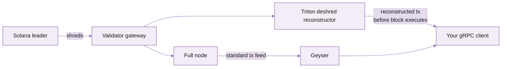
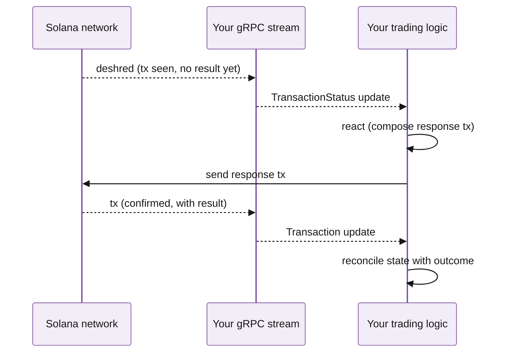

Deshred is a Triton extension to Yellowstone gRPC that delivers transactions reconstructed directly from network shreds, **before** the slot finalises. It's the lowest-latency way to see a transaction on Solana -- typically 100--300ms ahead of a normal `transactions` subscription, and ahead of every WebSocket-based RPC.

If you're building a trading bot, a sandwich detector, or anything where milliseconds matter, this is the subscription you want.

## What's a shred?

Solana validators don't broadcast finished blocks. They broadcast **shreds** -- small UDP packets containing fragments of transactions and entries -- as the leader produces them. Validators reconstruct the block from shreds in real time and execute it. By the time you see a "transaction" on standard streaming APIs, the leader has already produced and distributed all the shreds, the validators have reassembled and executed the block, and the result has been propagated to a full node which then pushes it via Geyser.

Deshred sits a step earlier in that pipeline. We capture shreds at the validator gateway, reconstruct transactions as soon as enough shreds for a transaction arrive, and push them to your gRPC client.



The standard Geyser path is still there; deshred is a parallel, earlier feed.

## What you get

- **Transactions visible 100--300ms earlier** than the standard `transactions` filter.
- **Same transaction object structure** as the standard feed -- the `tx` payload is identical, just delivered sooner.
- **A `confirmed` flag** -- a deshred message tells you whether this transaction has been seen on enough shreds to be confident it'll execute (vs ones that might still get dropped).

## What you give up

<Warning>
Deshred is a "fastest possible delivery" mechanism, not a guaranteed-correctness one. The trade-offs:
</Warning>

- **No commitment levels.** Deshred messages are pre-execution. The transaction *will* execute (or at least be attempted) but you don't yet know its outcome.
- **No execution result.** No `meta.err`, no `logMessages`, no balance changes. You're seeing the transaction *intent*, not the result. To get the result, also subscribe to standard `transactions` and correlate by signature.
- **Occasional duplicates.** During failover or re-shred propagation, you may see the same transaction twice. Dedupe by signature on your side.
- **Higher CPU on your client.** The reconstructed-transaction byte format is slightly different to parse than the standard one; budget for the difference.

## Subscribe

In your `SubscribeRequest`, add a `transactions_status` filter (the deshred-specific path) alongside or instead of the standard `transactions` filter:

<CodeGroup>

```rust rust
let request = SubscribeRequest {
    transactions_status: HashMap::from([(
        "deshred-pumpfun".to_string(),
        SubscribeRequestFilterTransactions {
            vote: Some(false),
            failed: Some(false),
            account_include: vec!["6EF8rrecthR5Dkzon8Nwu78hRvfCKubJ14M5uBEwF6P".to_string()], // pump.fun
            account_exclude: vec![],
            account_required: vec![],
            ..Default::default()
        }
    )]),
    ..Default::default()
};
```

```javascript node
await stream.write({
  transactionsStatus: {
    'deshred-pumpfun': {
      vote: false,
      failed: false,
      accountInclude: ['6EF8rrecthR5Dkzon8Nwu78hRvfCKubJ14M5uBEwF6P'],
      accountExclude: [],
      accountRequired: [],
    },
  },
  // ...rest of the request
});
```

</CodeGroup>

You receive `SubscribeUpdate` messages with the `transaction_status` field populated -- not the regular `transaction` field. Different field, same downstream parsing apart from the missing `meta`.

## Pattern: combine deshred with standard for two-stage processing

Most trading systems run two parallel subscriptions:

1. **Deshred** -- "I just saw a transaction; act now." Update your strategy state, submit your reaction transaction.
2. **Standard `transactions`** at `confirmed` -- "the transaction succeeded with these results." Reconcile your state with the actual outcome (logs, errors, balance changes).

Correlate the two by signature.



## Performance

| Metric | Deshred | Standard `transactions` filter |
|---|---|---|
| Time-to-client from leader broadcast | 100--300ms | 400--800ms |
| Includes transaction body | Yes | Yes |
| Includes execution result | **No** | Yes |
| Includes commitment level | **No** | Yes |
| CPU cost on client to parse | Slightly higher | Standard |

## Availability

Deshred is available on dedicated by default and as an add-on for high-volume shared customers. [Contact support](/solana/get-started/account-management/reach-out-to-support) to enable.

## What's next

<Columns cols={2}>
  <Card title="Quickstart" icon="rocket" href="/solana/streaming/dragons-mouth/quickstart">
    Get the standard subscription working first.
  </Card>
  <Card title="Yellowstone Jet" icon="send" href="/solana/sending-transactions/jet-sender">
    The matching low-latency *send* path: SWQoS-routed transaction submission.
  </Card>
  <Card title="Dragon's Mouth overview" icon="info" href="/solana/streaming/dragons-mouth/overview">
    Background on the streaming protocol.
  </Card>
</Columns>
