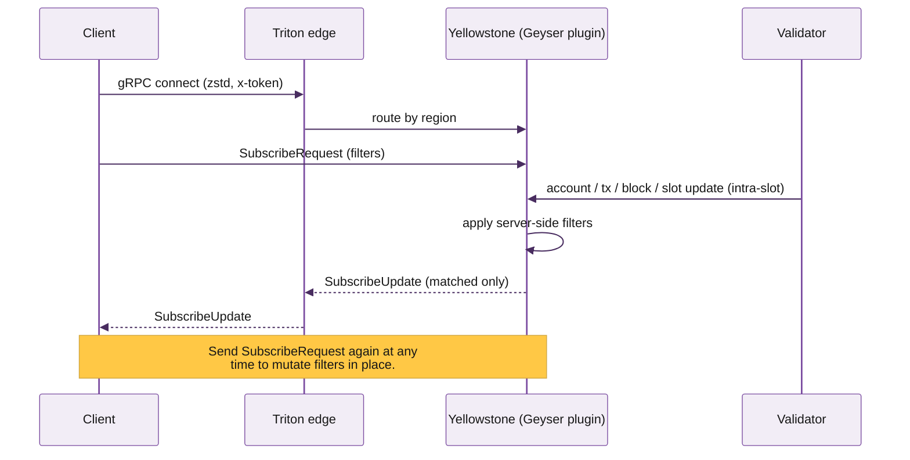

Dragon's Mouth is Triton's gRPC stream of Solana account, transaction, slot, and block data. It's powered by **Yellowstone gRPC** -- the open-source Geyser plugin Triton wrote and maintains, used today by most of the Solana ecosystem (block explorers, MEV searchers, indexers, trading systems, oracle pipelines).

If you need real-time Solana data on a backend, this is the lowest-latency, highest-throughput, server-side filterable option Triton offers. It's enabled by default on every Triton subscription -- shared or dedicated.

## Why teams use it

- **Intra-slot updates.** Account and transaction changes stream as the leader produces them, often **200--400ms ahead** of what WebSocket-based RPC can see. For trading and MEV, that gap is the difference between catching the move and missing it.
- **Server-side filters.** Subscribe by account, by program owner, by transaction signature, by `memcmp` / `dataSize` / token-account-state, by inclusion or exclusion of accounts. The server only sends what matches; you don't pay bandwidth for events you'd discard.
- **One connection, many filters.** A single bidirectional gRPC stream multiplexes hundreds of independent subscriptions. Re-send `SubscribeRequest` at any time to mutate filters without reconnecting.
- **Compressed wire.** zstd over HTTP/2 keeps even full-chain subscriptions fitting on commodity bandwidth.
- **Backpressure-aware.** Slow consumers don't lose messages; the server respects flow control.
- **Replay-from-slot.** Reconnect with `from_slot: <N>` and the stream resumes from the slot you specify, replaying buffered updates up to a recent horizon. Pair with [Fumarole](/solana/streaming/fumarole/overview) for unbounded historical backfill.

## When to use Dragon's Mouth (and when not to)

<Tabs>
  <Tab title="Use Dragon's Mouth when">
    - You're on a backend that can run Rust, Go, Node (with the Triton NAPI client), Python, or Java.
    - You need updates faster than WebSocket can deliver.
    - You want server-side filtering by program / account / signature / `memcmp` instead of pulling everything and filtering client-side.
    - You're building: trading bots, MEV searchers, indexers, accounting systems, real-time dashboards (server-rendered), oracle pipelines.
  </Tab>
  <Tab title="Use Whirligig WebSocket instead when">
    - You're in a browser. gRPC isn't browser-friendly. Whirligig is a drop-in replacement for Solana's standard WebSocket API and runs anywhere.
    - You're already using `accountSubscribe` / `signatureSubscribe` / `logsSubscribe` and want to upgrade with zero code changes.
    - We recommend Whirligig over plain WebSockets even when both work, because Whirligig sits on the same Geyser pipeline as Dragon's Mouth -- same intra-slot advantage.
    - See [Whirligig WebSockets](/solana/streaming/whirligig/overview).
  </Tab>
  <Tab title="Use Fumarole instead when">
    - You can't afford to lose data on disconnect (compliance, accounting, full-history analytics).
    - You need historical backfill -- "give me everything since slot N from a week ago" -- not just live-from-now or near-now replay.
    - Fumarole tracks a delivery cursor server-side; reconnect from any cursor and pick up exactly where you left off, with no gaps.
    - See [Fumarole reliable streams](/solana/streaming/fumarole/overview).
  </Tab>
  <Tab title="Use Deshred when">
    - You need transactions **before** the slot finalises -- 100--300ms ahead of standard `transactions` filter.
    - You can handle incomplete information (no execution result, no commitment level).
    - See [Deshred transactions](/solana/streaming/dragons-mouth/deshred-transactions).
  </Tab>
</Tabs>

## How it works



A single bidirectional gRPC stream:

1. Client opens `Subscribe()`, sends an initial `SubscribeRequest`.
2. Server starts pushing `SubscribeUpdate` messages whose contents match the filter.
3. Client can re-send `SubscribeRequest` mid-stream -- the server applies the new filter immediately without disconnecting.
4. Client can send `Ping` keep-alives. Server responds with `Pong`.
5. On reconnect, client can send `from_slot: <N>` to replay from a recent slot.

## What you can subscribe to

| Filter type | What it matches |
|---|---|
| `accounts` | Updates to specific account public keys, all accounts owned by a program, or accounts matching `memcmp` / `dataSize` / token-account-state filters |
| `accounts_data_slice` | Bandwidth optimisation -- receive only the offset+length you actually need from each account update |
| `transactions` | Transactions touching specific accounts (`account_include`), excluding accounts (`account_exclude`), requiring all of (`account_required`), filtered by `vote` / `failed`, or matching a specific `signature` |
| `transactions_status` | Same filters as `transactions` but pre-execution -- the deshred path. See [Deshred transactions](/solana/streaming/dragons-mouth/deshred-transactions). |
| `slots` | Slot-progression events (`processed`, `confirmed`, `finalized`) |
| `blocks` | Full block payloads with optional `include_transactions`, `include_accounts`, `account_include` filtering |
| `blocks_meta` | Block summary only -- timestamp, leader, parent, hash. Cheap firehose for "follow tip" pipelines. |
| `entry` | Lower-level entry / shred metadata (advanced) |

## Performance and infrastructure requirements

<Warning>
Yellowstone gRPC is designed for production backends with serious network capacity. Hobby-grade infrastructure will drop messages and lag behind.
</Warning>

| Requirement | Why |
|---|---|
| **5 Gbps network** for full-chain subscriptions | Solana is high-throughput; an unfiltered stream of all account writes saturates anything less |
| **RTT to Triton region ≤ 50ms** | gRPC flow control kicks in past this; you see lag and backpressure |
| **zstd compression enabled** | 4--6x bandwidth reduction; without it you'll saturate even gigabit links |
| **HTTP/2 adaptive window enabled** | Default tonic / Node settings throttle large streams; adaptive window unsticks them |
| **Initial connection / stream window 8 MiB / 4 MiB** | Default 64 KiB window stalls on full-chain volume |

For *filtered* subscriptions (one program, a few accounts), bandwidth requirements drop dramatically. Most teams run filtered streams comfortably on 100 Mbps.

## Authentication

gRPC connections authenticate with the same secret token you use for HTTP RPC. Pass it as an `x-token` metadata key on the connection:

```
metadata: { "x-token": "<your-secret-token>" }
```

For the Yellowstone reference clients, pass `--x-token <token>` on the command line.

## Cost

Dragon's Mouth is available on **all** Triton subscriptions -- shared and dedicated, PAYG and invoiced. Streaming bills at `$0.08 / GB` of egress (zstd-compressed). Watch the live cost in the portal under **Usage → Streaming**.

## Where to next

<Columns cols={2}>
  <Card title="Quickstart" icon="rocket" href="/solana/streaming/dragons-mouth/quickstart">
    Subscribe end-to-end. Reference client first, then code, with every common filter pattern.
  </Card>
  <Card title="SDK clients setup" icon="package" href="/solana/streaming/dragons-mouth/sdks-and-client-libraries">
    Rust, Go, Node, Python, Java -- install and connect.
  </Card>
  <Card title="Deshred transactions" icon="zap" href="/solana/streaming/dragons-mouth/deshred-transactions">
    Sub-slot transaction reconstruction for the lowest-latency consumers.
  </Card>
  <Card title="Fumarole reliable streams" icon="anchor" href="/solana/streaming/fumarole/overview">
    Persistent streams with backfill -- no message loss.
  </Card>
</Columns>
