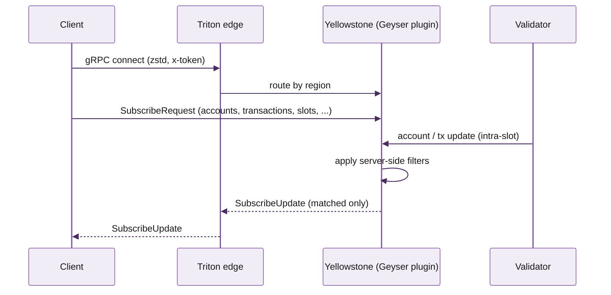

Dragon's Mouth is Triton's gRPC stream of Solana account and transaction data. It's the same wire protocol as **Yellowstone gRPC** -- the open-source Geyser plugin Triton wrote and maintains -- with Triton's edge routing and SWQoS layered on top.

If you need real-time Solana data on a backend, this is what you use.

## What you get

- **Intra-slot updates.** Account and transaction changes stream as they happen, often 200--400ms ahead of what WebSocket-based RPC sees.
- **Filter at the server.** Subscribe to specific accounts, programs, or transaction signatures. The server only sends what matches.
- **One connection, many subscriptions.** Multiplex hundreds of filters over a single bidirectional gRPC stream.
- **Backpressure-aware.** The server respects flow control; slow consumers don't lose updates, they just receive them as they can.
- **Battle-tested.** Yellowstone is used by most of the Solana ecosystem -- block explorers, MEV searchers, indexers, trading systems.

## When to use it (and when not to)

<Tabs>
  <Tab title="Use Dragon's Mouth when">
    - You're on a backend that can run Rust / Go / Node (with the proper client) / Python / Java.
    - You need updates faster than WebSocket can deliver.
    - You're filtering by program, account, or signature, and you want server-side filtering instead of client-side.
    - You're building: trading bots, MEV searchers, indexers, accounting systems, real-time dashboards (server-rendered).
  </Tab>
  <Tab title="Use Whirligig WebSocket instead when">
    - You're in a browser. gRPC isn't browser-friendly; Whirligig is a drop-in replacement for Solana's standard WebSocket API and runs anywhere.
    - You're already using `accountSubscribe` / `signatureSubscribe` / `logsSubscribe` and want to upgrade with zero code changes.
    - See [Whirligig WebSockets](/solana/streaming/whirligig/overview).
  </Tab>
  <Tab title="Use Fumarole instead when">
    - You can't afford to lose data on disconnect (compliance, accounting, analytics).
    - You need historical backfill -- "give me everything since slot N" -- not just live-from-now.
    - See [Fumarole reliable streams](/solana/streaming/fumarole/overview).
  </Tab>
</Tabs>

## How it works



A single bidirectional gRPC stream. The client sends `SubscribeRequest` once, then receives `SubscribeUpdate` messages as matching events occur. The client can re-send `SubscribeRequest` at any time to mutate the filter set without disconnecting.

## What you can subscribe to

| Filter | What it matches |
|---|---|
| `accounts` | Updates to specific account public keys, or all accounts owned by a program |
| `transactions` | Transactions touching specific accounts, signed by specific keys, or matching signatures |
| `slots` | Slot-progression events (`processed`, `confirmed`, `finalized`) |
| `blocks` | Full block metadata as slots finalise |
| `entries` | Lower-level entry / shred metadata (advanced) |
| `block_meta` | Block-level summary (timestamp, leader, parent, etc.) |

## Performance and infrastructure requirements

<Warning>
Yellowstone gRPC is designed for production backends with serious network capacity. Hobby-grade infrastructure will drop messages and lag.
</Warning>

| Requirement | Why |
|---|---|
| **5 Gbps network** for full-chain subscriptions | Solana is high-throughput; an unfiltered stream of all account writes saturates anything less |
| **RTT to Triton region ≤ 50ms** | gRPC flow control kicks in past this; you see lag and backpressure |
| **zstd compression enabled** | 4--6x bandwidth reduction; without it you'll saturate even gigabit links |
| **HTTP/2 adaptive window enabled** | Default tonic / NodeJS settings throttle large streams; adaptive window unsticks them |

For filtered subscriptions (e.g. one program, a few accounts), bandwidth requirements drop dramatically. Most teams run filtered streams comfortably on 100 Mbps.

## Authentication

gRPC connections authenticate with the same `x-token` you use for HTTP RPC. Pass it as a metadata key on the gRPC connection:

```
metadata: { "x-token": "<your-secret-token>" }
```

Or for the Yellowstone reference clients, pass `--x-token <token>` on the command line.

## Cost

gRPC streaming is included in committed and dedicated plans. PAYG charges per active connection-hour and per delivered byte (zstd-compressed) -- check the live cost in the portal under **Usage → Streaming**.

## Where to next

<Columns cols={2}>
  <Card title="Quickstart" icon="rocket" href="/solana/streaming/dragons-mouth/quickstart">
    Connect and stream your first updates in five minutes.
  </Card>
  <Card title="SDK clients setup" icon="package" href="/solana/streaming/dragons-mouth/sdks-and-client-libraries">
    Rust, Go, Node, Python, Java -- install and connect.
  </Card>
  <Card title="Deshred transactions" icon="zap" href="/solana/streaming/dragons-mouth/deshred-transactions">
    Sub-slot transaction reconstruction for the lowest-latency consumers.
  </Card>
  <Card title="API reference: gRPC subscribe" icon="code" href="/solana-api/grpc/subscribe">
    Full subscription schema and method reference.
  </Card>
</Columns>
