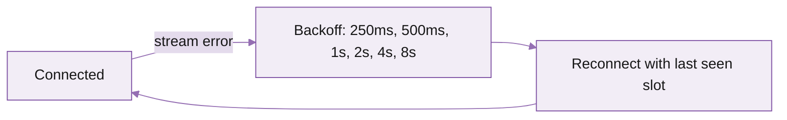

Connect, subscribe, and stream live updates in five minutes -- then refer back to this page for the full set of subscription patterns.

## Before you start

You need:

- A Triton endpoint. Streaming is enabled by default on every subscription -- shared and dedicated alike.
- The endpoint URL (the same `<endpoint>.mainnet.rpcpool.com` you use for HTTP RPC; gRPC uses the same host on port 443).
- The endpoint's secret token.
- Network capacity matching your filter (see the [requirements](/solana/streaming/dragons-mouth/overview#performance-and-infrastructure-requirements)).

## Fastest sanity check: the reference client

Before writing code, confirm connectivity with Triton's precompiled reference client. No SDK install.

<Steps>
  <Step title="Download the binary">
    Latest release: [github.com/rpcpool/yellowstone-grpc/releases](https://github.com/rpcpool/yellowstone-grpc/releases). Pick the file matching your OS (`client-ubuntu-22.04`, `client-macos`, etc.).
  </Step>
  <Step title="Connect with stats only">
    First call confirms the connection works without subscribing to any data:

    ```bash
    ./client \
      --endpoint https://<endpoint>.mainnet.rpcpool.com \
      --x-token <your-token> \
      --http2-adaptive-window true \
      --compression zstd \
      subscribe --stats
    ```

    Slot ticks every ~400ms; you should see `slot=...` lines in the terminal.
  </Step>
  <Step title="Subscribe to a program">
    All Raydium AMM accounts:

    ```bash
    ./client \
      --endpoint https://<endpoint>.mainnet.rpcpool.com \
      --x-token <your-token> \
      --http2-adaptive-window true --compression zstd \
      subscribe --accounts \
      --accounts-owner 675kPX9MHTjS2zt1qfr1NYHuzeLXfQM9H24wFSUt1Mp8
    ```

    Updates print as Raydium accounts change.
  </Step>
</Steps>

If those work, you're connected. Move on to your client code.

## Your first client (Node.js)

The Triton NAPI client is the recommended Node binding (4x faster than pure JS, no backpressure stalls). Other languages: see [SDK clients setup](/solana/streaming/dragons-mouth/sdks-and-client-libraries).

```javascript
import Client, { CommitmentLevel } from "@triton-one/yellowstone-grpc";

const client = new Client(
  "https://<endpoint>.mainnet.rpcpool.com:443",
  "<your-token>",
  { "grpc.max_receive_message_length": 64 * 1024 * 1024 }
);

await client.connect();
console.log(await client.getVersion()); // smoke test: prints server version

const stream = await client.subscribe();

stream.on("data", (data) => console.log("data", data));
stream.on("error", (err) => console.error("error", err));

// Send the initial subscription (see patterns below).
await new Promise((resolve, reject) => {
  stream.write(buildRequest(), (err) => err ? reject(err) : resolve());
});
```

`buildRequest()` returns a `SubscribeRequest` shaped to whatever you want to receive. The patterns below cover every common case from the GitBook reference.

## Subscription patterns

Each pattern shows the JSON-shape gRPC `SubscribeRequest` and a Node equivalent. The two are equivalent to whichever language SDK you use; field names and capitalisation differ slightly between the proto JSON form and the Node SDK.

### Subscribe to one account

gRPC (JSON form):

```json
{"slots": { "slots": {} }, "accounts": { "wsol/usdc": { "account": ["8BnEgHoWFysVcuFFX7QztDmzuH8r5ZFvyP3sYwn1XTh6"] } }, "transactions": {}, "blocks": {}, "blocks_meta": {}, "accounts_data_slice": [], "commitment": 1}
```

Node:

```javascript
import { CommitmentLevel } from "@triton-one/yellowstone-grpc";

const request = {
  slots: { slots: {} },
  accounts: {
    "wsol/usdc": {
      account: ["8BnEgHoWFysVcuFFX7QztDmzuH8r5ZFvyP3sYwn1XTh6"]
    }
  },
  transactions: {},
  blocks: {},
  blocksMeta: {},
  accountsDataSlice: [],
  commitment: CommitmentLevel.CONFIRMED
};
```

### Subscribe with `account_data_slice` and `memcmp` (USDC token accounts)

Server-side filtering by token-account-state and `memcmp`, plus a 40-byte data slice from offset 32 to cut bandwidth.

```json
{
  "accounts": {
    "usdc": {
      "owner": ["TokenkegQfeZyiNwAJbNbGKPFXCWuBvf9Ss623VQ5DA"],
      "filters": [
        { "token_account_state": true },
        {
          "memcmp": {
            "offset": 0,
            "data": { "base58": "EPjFWdd5AufqSSqeM2qN1xzybapC8G4wEGGkZwyTDt1v" }
          }
        }
      ]
    }
  },
  "accounts_data_slice": [{ "offset": 32, "length": 40 }]
}
```

```javascript
import { CommitmentLevel } from "@triton-one/yellowstone-grpc";

const request = {
  slots: {},
  accounts: {
    usdc: {
      owner: ["TokenkegQfeZyiNwAJbNbGKPFXCWuBvf9Ss623VQ5DA"],
      filters: [
        { tokenAccountState: true },
        {
          memcmp: {
            offset: 0,
            data: { base58: "EPjFWdd5AufqSSqeM2qN1xzybapC8G4wEGGkZwyTDt1v" }
          }
        }
      ]
    }
  },
  transactions: {},
  blocks: {},
  blocksMeta: {},
  entry: {},
  commitment: CommitmentLevel.CONFIRMED,
  accountsDataSlice: [{ offset: 32, length: 40 }]
};
```

### Subscribe to a program (one)

```json
{"slots": { "slots": {} }, "accounts": { "solend": { "owner": ["So1endDq2YkqhipRh3WViPa8hdiSpxWy6z3Z6tMCpAo"] } }, "transactions": {}, "blocks": {}, "blocks_meta": {}, "accounts_data_slice": [], "commitment": 0}
```

```javascript
const request = {
  slots: { slots: {} },
  accounts: {
    solend: { owner: ["So1endDq2YkqhipRh3WViPa8hdiSpxWy6z3Z6tMCpAo"] }
  },
  transactions: {},
  blocks: {},
  blocksMeta: {},
  accountsDataSlice: [],
  commitment: CommitmentLevel.PROCESSED
};
```

### Subscribe to multiple programs (combined into one filter)

```json
{"slots": { "slots": {} }, "accounts": { "programs": { "owner": ["So1endDq2YkqhipRh3WViPa8hdiSpxWy6z3Z6tMCpAo", "9xQeWvG816bUx9EPjHmaT23yvVM2ZWbrrpZb9PusVFin"] } }, "transactions": {}, "blocks": {}, "blocks_meta": {}, "accounts_data_slice": []}
```

### Subscribe to multiple programs (separate tags)

Lets you tell which subscription a given update came from on receipt.

```json
{"slots": { "slots": {} }, "accounts": { "solend": { "owner": ["So1endDq2YkqhipRh3WViPa8hdiSpxWy6z3Z6tMCpAo"] }, "serum": { "owner": ["9xQeWvG816bUx9EPjHmaT23yvVM2ZWbrrpZb9PusVFin"] } }, "transactions": {}, "blocks": {}, "blocks_meta": {}, "accounts_data_slice": []}
```

```javascript
const request = {
  slots: { slots: {} },
  accounts: {
    solend: { owner: ["So1endDq2YkqhipRh3WViPa8hdiSpxWy6z3Z6tMCpAo"] },
    serum:  { owner: ["9xQeWvG816bUx9EPjHmaT23yvVM2ZWbrrpZb9PusVFin"] }
  },
  transactions: {},
  blocks: {},
  blocksMeta: {},
  accountsDataSlice: []
};
```

### Subscribe to all finalised non-vote, non-failed transactions

```json
{"slots": { "slots": {} }, "accounts": {}, "transactions": { "alltxs": { "vote": false, "failed": false }}, "blocks": {}, "blocks_meta": {}, "accounts_data_slice": [], "commitment": 2}
```

```javascript
import { CommitmentLevel } from "@triton-one/yellowstone-grpc";

const request = {
  slots: { slots: {} },
  accounts: {},
  transactions: { alltxs: { vote: false, failed: false } },
  blocks: {},
  blocksMeta: {},
  accountsDataSlice: [],
  commitment: CommitmentLevel.FINALIZED
};
```

### Subscribe to non-vote transactions mentioning an account

```json
{"slots": { "slots": {} }, "accounts": {}, "transactions": { "serum": { "vote": false, "account_include": ["9xQeWvG816bUx9EPjHmaT23yvVM2ZWbrrpZb9PusVFin"] }}, "blocks": {}, "blocks_meta": {}, "accounts_data_slice": []}
```

```javascript
const request = {
  slots: { slots: {} },
  accounts: {},
  transactions: {
    serum: {
      vote: false,
      accountInclude: ["9xQeWvG816bUx9EPjHmaT23yvVM2ZWbrrpZb9PusVFin"]
    }
  },
  blocks: {},
  blocksMeta: {},
  accountsDataSlice: []
};
```

### Subscribe to transactions, excluding accounts

```json
{"slots": { "slots": {} }, "accounts": {}, "transactions": { "serum": { "account_exclude": ["9xQeWvG816bUx9EPjHmaT23yvVM2ZWbrrpZb9PusVFin", "TokenkegQfeZyiNwAJbNbGKPFXCWuBvf9Ss623VQ5DA"] }}, "blocks": {}, "blocks_meta": {}, "accounts_data_slice": []}
```

### Subscribe to transactions, including AND excluding accounts

```json
{"slots": { "slots": {} }, "accounts": {}, "transactions": { "serum": { "account_include": ["9xQeWvG816bUx9EPjHmaT23yvVM2ZWbrrpZb9PusVFin"], "account_exclude": ["9wFFyRfZBsuAha4YcuxcXLKwMxJR43S7fPfQLusDBzvT"] }}, "blocks": {}, "blocks_meta": {}, "accounts_data_slice": []}
```

### Subscribe to a single transaction signature

Useful when you've sent a transaction and want to watch it through `processed → confirmed → finalized`.

```json
{"slots": {}, "accounts": {}, "transactions": { "sign": { "signature": "5rp2hL9b6kexex11Mugfs3vfU9GhieKruj4CkFFSnu52WLxiGn4VcLLwsB62XURhMmT1j4CZiXT6FFtYbXsLq2Zs"}}, "blocks": {}, "blocks_meta": {}, "accounts_data_slice": []}
```

### Subscribe to slots

```json
{"slots": { "incoming_slots": {} }, "accounts": {}, "transactions": {}, "blocks": {}, "blocks_meta": {}, "accounts_data_slice": []}
```

### Subscribe to blocks

```json
{"slots": {}, "accounts": {}, "transactions": {}, "blocks": { "blocks": {} }, "blocks_meta": {}, "accounts_data_slice": []}
```

### Subscribe to blocks with options

`include_transactions: false` and `include_accounts: true` is a common combo for indexers that only want account-level changes per block, not the full transaction body.

```json
{"slots": {}, "accounts": {}, "transactions": {}, "blocks": { "blocks": {"include_transactions": false, "include_accounts": true} }, "blocks_meta": {}, "accounts_data_slice": []}
```

### Subscribe to blocks filtered by account

```json
{"slots": {}, "accounts": {}, "transactions": {}, "blocks": { "blocks": {"account_include": ["So1endDq2YkqhipRh3WViPa8hdiSpxWy6z3Z6tMCpAo"]} }, "blocks_meta": {}, "accounts_data_slice": []}
```

### Subscribe to block metadata only

Cheap firehose for "follow tip" pipelines. Slot, blockhash, parent, leader, timestamp -- no transactions, no accounts.

```json
{"slots": {}, "accounts": {}, "transactions": {}, "blocks": {}, "blocks_meta": { "blockmetadata": {} }, "accounts_data_slice": []}
```

### Mutate filters mid-stream

Send `stream.write({...})` again with a new filter set at any time. The server applies the change without disconnecting.

For very large or frequently-changing filter sets, define the filter as an [address watch list](/solana/get-started/account-management/account-management-api/address-watch-lists) and reference it by name -- mutate the list via API and every active subscription picks up the change.

### Unsubscribe (clear filters, keep connection open)

Useful when you want to pause traffic without dropping the connection.

```json
{"slots": {}, "accounts": {}, "transactions": {}, "blocks": {}, "blocks_meta": {}}
```
## Keep the stream alive: ping / pong

Long-lived connections through firewalls or proxies can be killed if idle. Send a ping every 30 seconds; the server replies with `pong`. Most Triton SDKs handle this automatically; for raw clients:

```typescript
const PING_INTERVAL_MS = 30_000;

const pingRequest = {
  ping: { id: 1 },
  accounts: {}, accountsDataSlice: [],
  transactions: {}, transactionsStatus: {},
  blocks: {}, blocksMeta: {}, entry: {}, slots: {},
};

setInterval(() => {
  stream.write(pingRequest, (err) => err && console.error(err));
}, PING_INTERVAL_MS);

stream.on("data", (data) => {
  if (data.pong) console.log("pong received");
});
```

## Reconnect with replay-from-slot

If the stream drops and you want to catch up without missing events, reconnect with `from_slot` set to where you left off. Yellowstone keeps a buffer of recent slots for replay.

```json
{
  "slots": { "incoming_slots": {} },
  "accounts": {},
  "transactions": { "alltxs": { "vote": false, "failed": false } },
  "blocks": {},
  "blocks_meta": {},
  "accounts_data_slice": [],
  "from_slot": 382001234
}
```

```typescript
const request = {
  slots: { incoming_slots: {} },
  accounts: {},
  transactions: { alltxs: { vote: false, failed: false } },
  blocks: {},
  blocksMeta: {},
  accountsDataSlice: [],
  fromSlot: 382001234
};
```
To know the earliest replay-able slot before connecting:

```typescript
const info = await client.subscribeReplayInfo();
console.log(info.firstAvailable);
```

For unbounded backfill (older than the replay window), use [Fumarole](/solana/streaming/fumarole/overview) instead.

## Reconnect strategy



- Exponential backoff with jitter, capped at 30s.
- Re-send the full `SubscribeRequest` on every reconnect, including `from_slot` if you want replay.
- For zero-message-loss across arbitrary downtime, switch to [Fumarole](/solana/streaming/fumarole/overview).

## Common issues

<AccordionGroup>
  <Accordion title="Connection succeeds but no messages arrive" icon="search">
    Your filter doesn't match anything. Run with `--stats` to confirm the connection is alive, then widen the filter (drop an `account` array, add a `--accounts-owner`, etc.).
  </Accordion>
  <Accordion title="Stream lags behind real-time" icon="hourglass">
    The client is consuming slower than the server is sending. Three usual culprits: (1) blocking work in the receive callback -- offload to a queue, (2) zstd not enabled -- you're transferring 4--6x more bytes, (3) network capacity insufficient for the filter scope -- narrow the filter or upgrade.
  </Accordion>
  <Accordion title="UNIMPLEMENTED or PERMISSION_DENIED on connect" icon="lock">
    Token wrong, expired, or your endpoint doesn't allow gRPC. Check the token under your endpoint's **Auth** tab in the portal and re-test.
  </Accordion>
  <Accordion title="Resource exhausted: max message size" icon="alert-triangle">
    Default gRPC client limits message size to 4 MB. Solana program-account batches blow past this. Set `grpc.max_receive_message_length` (Node) or `max_decoding_message_size` (Rust) to 64 MB or higher.
  </Accordion>
  <Accordion title="Connection dies after a minute of idle" icon="zzz">
    Firewall or proxy killing idle connections. Send pings every 30s (see "Keep the stream alive" above).
  </Accordion>
</AccordionGroup>

## What's next

<Columns cols={2}>
  <Card title="SDK clients setup" icon="package" href="/solana/streaming/dragons-mouth/sdks-and-client-libraries">
    Install and connect from Rust, Go, Node, Python, Java.
  </Card>
  <Card title="Deshred transactions" icon="zap" href="/solana/streaming/dragons-mouth/deshred-transactions">
    Pre-execution transactions: 100--300ms ahead of standard `transactions`.
  </Card>
  <Card title="Yellowstone gRPC reference" icon="book" href="/solana-api/grpc/subscribe">
    Full schema for SubscribeRequest and SubscribeUpdate.
  </Card>
  <Card title="Fumarole reliable streams" icon="anchor" href="/solana/streaming/fumarole/overview">
    Persistent streams with full backfill -- no message loss.
  </Card>
</Columns>
