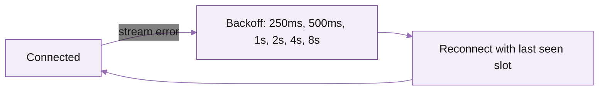

Five minutes from your endpoint to a live stream of Solana data. After that, this page is your reference for filter shapes, common subscription patterns, ping/pong, replay-from-slot, and SDK options.

## Before you start

You need:

- A Triton endpoint. Streaming is enabled by default on every subscription, shared and dedicated alike.
- The endpoint URL (`<endpoint>.mainnet.rpcpool.com`, port 443 for gRPC).
- The endpoint's secret token.
- Network capacity matching your filter scope. See [requirements](/solana/streaming/dragons-mouth/overview#performance-and-infrastructure-requirements).

## Sanity check with the reference client

Before writing code, confirm connectivity with Triton's precompiled reference client. No SDK install needed.

<Steps>
  <Step title="Download the binary" titleSize="h3">
    Latest release: [github.com/rpcpool/yellowstone-grpc/releases](https://github.com/rpcpool/yellowstone-grpc/releases). Pick the file matching your OS (`client-ubuntu-22.04`, `client-macos`, etc.).
  </Step>

  <Step title="Connect with stats only" titleSize="h3">
    First call confirms the connection works without subscribing to data:

    ```bash
    ./client \
      --endpoint https://<endpoint>.mainnet.rpcpool.com \
      --x-token <your-token> \
      --http2-adaptive-window true \
      --compression zstd \
      subscribe --stats
    ```

    Slot ticks every ~400ms; you should see `slot=...` lines in the terminal.
  </Step>

  <Step title="Subscribe to a program" titleSize="h3">
    All Raydium AMM accounts:

    ```bash
    ./client \
      --endpoint https://<endpoint>.mainnet.rpcpool.com \
      --x-token <your-token> \
      --http2-adaptive-window true --compression zstd \
      subscribe --accounts \
      --accounts-owner 675kPX9MHTjS2zt1qfr1NYHuzeLXfQM9H24wFSUt1Mp8
    ```

    Updates print as Raydium accounts change.
  </Step>
</Steps>

If both work, you're connected. Move on to your client code.

## Your first subscription

The Triton NAPI client is the recommended Node binding (4x faster than pure JS, no backpressure stalls). For other languages see [SDKs and client libraries](/solana/streaming/dragons-mouth/sdks-and-client-libraries).

```javascript
import Client, { CommitmentLevel } from "@triton-one/yellowstone-grpc";

const client = new Client(
  "https://<endpoint>.mainnet.rpcpool.com:443",
  "<your-token>",
  { "grpc.max_receive_message_length": 64 * 1024 * 1024 }
);

await client.connect();
console.log(await client.getVersion()); // smoke test: prints server version

const stream = await client.subscribe();

stream.on("data", (data) => console.log("data", data));
stream.on("error", (err) => console.error("error", err));

// Send the initial subscription (see patterns below).
await new Promise((resolve, reject) => {
  stream.write(buildRequest(), (err) => err ? reject(err) : resolve());
});
```

`buildRequest()` returns a `SubscribeRequest` shaped to whatever you want to receive.

## The SubscribeRequest shape

A `SubscribeRequest` is a single object with optional filter blocks per data type plus a top-level commitment. Send it once to start the stream; send it again any time to mutate filters in place.

```javascript
{
  slots:             { /* slot filters */ },
  accounts:          { /* account filters */ },
  transactions:      { /* tx filters */ },
  transactionsStatus:{ /* pre-execution tx filters */ },
  blocks:            { /* block filters */ },
  blocksMeta:        { /* block-meta filters */ },
  entry:             { /* entry filters */ },
  accountsDataSlice: [ /* offset+length pairs */ ],
  commitment:        CommitmentLevel.CONFIRMED,
  // Optional:
  // fromSlot:       "382001234"  // replay from a recent slot
}
```

Each filter block is keyed by a **user-defined label** so a single subscription can hold multiple named filters. Receive every update is tagged with the label that matched it.

## Filter shapes

Each tab below shows the filter shape for one data type, the parameters available, and a minimal example.

<Tabs>
  <Tab title="Accounts">
    Subscribe to one account, an entire program, or accounts matching `memcmp` / `dataSize` / token-account-state filters. Optionally limit the bandwidth via `accounts_data_slice`.

    **Parameters**

    - `account` (string[]): match any of these public keys.
    - `owner` (string[]): match any account owned by these program IDs.
    - `filters` (object[]): array of `{ dataSize }`, `{ memcmp: { offset, bytes } }`, or `{ tokenAccountState }`. All entries operate as logical **AND**.

    **Logic across fields**

    - Top-level fields combine with **AND**.
    - Values in array fields combine with **OR** (except `filters` which AND together).
    - Empty filter = match all accounts (very high volume; almost always wrong for production).

    ```javascript
    accounts: {
      "wsol-usdc": {
        account: ["8BnEgHoWFysVcuFFX7QztDmzuH8r5ZFvyP3sYwn1XTh6"]
      }
    }
    ```
  </Tab>

  <Tab title="Transactions">
    Subscribe to transactions touching specific accounts, by signature, or filter by vote / failed status.

    **Parameters**

    - `vote` (boolean): include or exclude vote transactions.
    - `failed` (boolean): include or exclude failed transactions.
    - `signature` (string): match a single transaction signature.
    - `accountInclude` (string[]): require any of these accounts to appear.
    - `accountExclude` (string[]): drop transactions involving any of these.
    - `accountRequired` (string[]): require **all** of these to appear (AND logic).

    **Logic across fields**

    - Top-level fields combine with **AND**.
    - `accountInclude` and `accountExclude` arrays are **OR**.
    - `accountRequired` is **AND**.

    ```javascript
    transactions: {
      "serum-non-vote": {
        vote: false,
        failed: false,
        accountInclude: ["9xQeWvG816bUx9EPjHmaT23yvVM2ZWbrrpZb9PusVFin"]
      }
    }
    ```
  </Tab>

  <Tab title="Slots">
    Lightweight slot-progression events. Useful for "follow tip" monitoring.

    **Parameters**

    - `filterByCommitment` (boolean): only emit at the request's commitment level (default off, all levels emitted).
    - `interslotUpdates` (boolean): emit fine-grained sub-slot updates (advanced).

    ```javascript
    slots: {
      tip: { filterByCommitment: true }
    }
    ```
  </Tab>

  <Tab title="Blocks">
    Full block payloads, optionally filtered by account.

    **Parameters**

    - `accountInclude` (string[]): only emit blocks touching these accounts.
    - `includeTransactions` (boolean, default true): include the transaction list.
    - `includeAccounts` (boolean, default false): include all account writes.
    - `includeEntries` (boolean, default false): include ledger entries.

    ```javascript
    blocks: {
      indexer: {
        accountInclude: ["So1endDq2YkqhipRh3WViPa8hdiSpxWy6z3Z6tMCpAo"],
        includeTransactions: true,
        includeAccounts: false,
        includeEntries: false
      }
    }
    ```
  </Tab>

  <Tab title="Block meta">
    Block summary only: timestamp, leader, parent, hash. Cheap firehose for "follow tip" pipelines without the full block body. No filters available.

    ```javascript
    blocksMeta: {
      tip: {}
    }
    ```
  </Tab>

  <Tab title="Entries">
    Lower-level entry / shred metadata. Advanced; most teams don't need this. No filters available.

    ```javascript
    entry: {
      stream: {}
    }
    ```
  </Tab>
</Tabs>

## Common subscription patterns

The patterns most teams need on day one. Tab through by category.

<Tabs>
  <Tab title="Account / program">
    Most-used pattern: track specific accounts or every account owned by a program.

    **One account**

    ```javascript
    {
      slots: { tip: {} },
      accounts: {
        "wsol-usdc": {
          account: ["8BnEgHoWFysVcuFFX7QztDmzuH8r5ZFvyP3sYwn1XTh6"]
        }
      },
      transactions: {}, blocks: {}, blocksMeta: {}, entry: {},
      accountsDataSlice: [],
      commitment: CommitmentLevel.CONFIRMED
    }
    ```

    **One program (e.g. Solend)**

    ```javascript
    accounts: {
      solend: { owner: ["So1endDq2YkqhipRh3WViPa8hdiSpxWy6z3Z6tMCpAo"] }
    }
    ```

    **Multiple programs (one bucket)**

    ```javascript
    accounts: {
      programs: {
        owner: [
          "So1endDq2YkqhipRh3WViPa8hdiSpxWy6z3Z6tMCpAo",
          "9xQeWvG816bUx9EPjHmaT23yvVM2ZWbrrpZb9PusVFin"
        ]
      }
    }
    ```

    **Multiple programs (separate labels)**

    Receive a label on every update so you can route by program in your handler.

    ```javascript
    accounts: {
      solend: { owner: ["So1endDq2YkqhipRh3WViPa8hdiSpxWy6z3Z6tMCpAo"] },
      serum:  { owner: ["9xQeWvG816bUx9EPjHmaT23yvVM2ZWbrrpZb9PusVFin"] }
    }
    ```

    **USDC token accounts with `memcmp` and a 40-byte data slice**

    Server-side filter by token-account-state and `memcmp`, plus a data slice to cut bandwidth by 4x.

    ```javascript
    {
      accounts: {
        usdc: {
          owner: ["TokenkegQfeZyiNwAJbNbGKPFXCWuBvf9Ss623VQ5DA"],
          filters: [
            { tokenAccountState: true },
            {
              memcmp: {
                offset: 0,
                data: { base58: "EPjFWdd5AufqSSqeM2qN1xzybapC8G4wEGGkZwyTDt1v" }
              }
            }
          ]
        }
      },
      accountsDataSlice: [{ offset: 32, length: 40 }],
      commitment: CommitmentLevel.CONFIRMED
    }
    ```
  </Tab>

  <Tab title="Transactions">
    Watch live transaction activity, filter by vote/failed, or wait on a specific signature.

    **All finalised non-vote, non-failed transactions**

    ```javascript
    {
      transactions: {
        alltxs: { vote: false, failed: false }
      },
      slots: {}, accounts: {}, blocks: {}, blocksMeta: {}, entry: {},
      accountsDataSlice: [],
      commitment: CommitmentLevel.FINALIZED
    }
    ```

    **Transactions touching a specific program**

    ```javascript
    transactions: {
      serum: {
        vote: false,
        accountInclude: ["9xQeWvG816bUx9EPjHmaT23yvVM2ZWbrrpZb9PusVFin"]
      }
    }
    ```

    **Transactions excluding system noise**

    ```javascript
    transactions: {
      app: {
        accountExclude: [
          "9xQeWvG816bUx9EPjHmaT23yvVM2ZWbrrpZb9PusVFin",
          "TokenkegQfeZyiNwAJbNbGKPFXCWuBvf9Ss623VQ5DA"
        ]
      }
    }
    ```

    **Include AND exclude (compose filters)**

    ```javascript
    transactions: {
      serum: {
        accountInclude: ["9xQeWvG816bUx9EPjHmaT23yvVM2ZWbrrpZb9PusVFin"],
        accountExclude: ["9wFFyRfZBsuAha4YcuxcXLKwMxJR43S7fPfQLusDBzvT"]
      }
    }
    ```

    **Watch a single signature**

    Useful for tracking your own submitted tx through `processed → confirmed → finalized`.

    ```javascript
    transactions: {
      sign: {
        signature: "5rp2hL9b6kexex11Mugfs3vfU9GhieKruj4CkFFSnu52WLxiGn4VcLLwsB62XURhMmT1j4CZiXT6FFtYbXsLq2Zs"
      }
    }
    ```
  </Tab>

  <Tab title="Slots & blocks">
    Slot ticks, full blocks, and lightweight block metadata.

    **Slot ticks**

    ```javascript
    slots: { tip: {} }
    ```

    **All blocks**

    ```javascript
    blocks: { all: {} }
    ```

    **Blocks with options (indexer-friendly)**

    Account-only updates per block, no transaction body.

    ```javascript
    blocks: {
      indexer: {
        includeTransactions: false,
        includeAccounts: true,
        includeEntries: false
      }
    }
    ```

    **Blocks filtered by account**

    ```javascript
    blocks: {
      solend: { accountInclude: ["So1endDq2YkqhipRh3WViPa8hdiSpxWy6z3Z6tMCpAo"] }
    }
    ```

    **Block metadata only (cheap firehose)**

    Slot, blockhash, parent, leader, timestamp. No transactions, no accounts.

    ```javascript
    blocksMeta: { tip: {} }
    ```
  </Tab>

  <Tab title="Mutate / unsubscribe">
    Long-lived connections often need to change filter shape without reconnecting.

    **Mutate filters mid-stream**

    Re-send `stream.write({...})` with a new request shape. The server applies the change immediately, no disconnect.

    For very large or frequently-changing filter sets, define an [address watch list](/solana/get-started/account-management/account-management-api/address-watch-lists) and reference it by name. Mutate the list via API and every active subscription picks up the change.

    **Unsubscribe (clear filters, keep connection open)**

    Useful when you want to pause traffic without dropping the connection.

    ```javascript
    {
      slots: {}, accounts: {}, transactions: {},
      blocks: {}, blocksMeta: {}, entry: {}
    }
    ```
  </Tab>
</Tabs>

## Keep the stream alive (ping / pong)

Long-lived connections through firewalls or proxies can be killed if idle. Send a ping every 30 seconds; the server replies with `pong`. The Triton SDKs handle this automatically. For raw clients:

```typescript
const PING_INTERVAL_MS = 30_000;

const pingRequest = {
  ping: { id: 1 },
  accounts: {}, accountsDataSlice: [],
  transactions: {}, transactionsStatus: {},
  blocks: {}, blocksMeta: {}, entry: {}, slots: {},
};

setInterval(() => {
  stream.write(pingRequest, (err) => err && console.error(err));
}, PING_INTERVAL_MS);

stream.on("data", (data) => {
  if (data.pong) console.log("pong received");
});
```

<Warning>
Don't include `ping` in your initial `SubscribeRequest`. Some implementations silently ignore the rest of the request when the first message is a ping. Send the subscription first, then ping on a separate cadence.
</Warning>

## Reconnect with replay-from-slot

If the stream drops and you want to catch up without missing events, reconnect with `from_slot` set to where you left off. Yellowstone keeps a buffer of recent slots for replay.

```javascript
{
  slots: { tip: {} },
  accounts: {},
  transactions: { alltxs: { vote: false, failed: false } },
  blocks: {}, blocksMeta: {}, entry: {},
  accountsDataSlice: [],
  fromSlot: 382001234
}
```

To know the earliest replay-able slot before connecting:

```typescript
const info = await client.subscribeReplayInfo();
console.log(info.firstAvailable);
```

For unbounded backfill (older than the replay window), use [Fumarole](/solana/streaming/fumarole/overview) instead.

## Reconnect strategy



- Exponential backoff with jitter, capped at 30s.
- Re-send the full `SubscribeRequest` on every reconnect, including `fromSlot` if you want replay.
- For zero-message-loss across arbitrary downtime, switch to [Fumarole](/solana/streaming/fumarole/overview).

## Common issues

<AccordionGroup>
  <Accordion title="Connection succeeds but no messages arrive" icon="search">
    Your filter doesn't match anything. Run with `--stats` to confirm the connection is alive, then widen the filter (drop an `account` array, add a `--accounts-owner`, etc.).
  </Accordion>
  <Accordion title="Stream lags behind real-time" icon="hourglass">
    The client is consuming slower than the server is sending. Three usual culprits:
    1. Blocking work in the receive callback. Offload to a queue.
    2. zstd compression not enabled. Without it you transfer 4-6x more bytes.
    3. Network capacity insufficient for the filter scope. Narrow the filter or upgrade.
  </Accordion>
  <Accordion title="UNIMPLEMENTED or PERMISSION_DENIED on connect" icon="lock">
    Token wrong, expired, or your endpoint doesn't allow gRPC. Check the token under your endpoint's **Auth** tab in the portal and re-test.
  </Accordion>
  <Accordion title="Resource exhausted: max message size" icon="alert-triangle">
    Default gRPC client limits message size to 4 MB. Solana program-account batches blow past this. Set `grpc.max_receive_message_length` (Node) or `max_decoding_message_size` (Rust) to 64 MB or higher.
  </Accordion>
  <Accordion title="Connection dies after a minute of idle" icon="moon">
    Firewall or proxy killing idle connections. Send pings every 30s. See [Keep the stream alive](#keep-the-stream-alive-ping--pong) above.
  </Accordion>
</AccordionGroup>

## SDKs and client libraries

Use the Triton SDK for your language. All wrap the same gRPC interface and add reconnect, ping/pong, and ergonomic builders.

<CardGroup cols={3}>
  <Card title="Node.js (NAPI)" icon="rocket" href="/solana/streaming/dragons-mouth/sdks-and-client-libraries#nodejs-napi">
    Recommended for Node. Rust core via NAPI, 4x faster than pure JS.
  </Card>
  <Card title="Rust" icon="code" href="/solana/streaming/dragons-mouth/sdks-and-client-libraries#rust">
    Native gRPC client with full type generation.
  </Card>
  <Card title="Go" icon="arrow-right" href="/solana/streaming/dragons-mouth/sdks-and-client-libraries#go">
    Standard `grpc-go` codegen with Triton helpers.
  </Card>
  <Card title="Python" icon="terminal" href="/solana/streaming/dragons-mouth/sdks-and-client-libraries#python">
    `grpcio` codegen with example subscribers.
  </Card>
  <Card title="Java" icon="boxes" href="/solana/streaming/dragons-mouth/sdks-and-client-libraries#java">
    Standard `grpc-java` codegen.
  </Card>
  <Card title="Other languages" icon="globe" href="https://github.com/rpcpool/yellowstone-grpc/tree/master/yellowstone-grpc-proto/proto">
    Generate clients from the proto files for any gRPC-supported language.
  </Card>
</CardGroup>

## What's next

<Columns cols={2}>
  <Card title="SDKs and client libraries" icon="package" href="/solana/streaming/dragons-mouth/sdks-and-client-libraries">
    Install and connect from Rust, Go, Node, Python, Java.
  </Card>
  <Card title="Deshred transactions" icon="zap" href="/solana/streaming/dragons-mouth/deshred-transactions">
    Pre-execution transactions: 100-300ms ahead of standard `transactions`.
  </Card>
  <Card title="Yellowstone gRPC reference" icon="book" href="/solana-api/grpc/subscribe">
    Full schema for SubscribeRequest and SubscribeUpdate.
  </Card>
  <Card title="Fumarole reliable streams" icon="anchor" href="/solana/streaming/fumarole/overview">
    Persistent streams with full backfill, no message loss.
  </Card>
</Columns>
