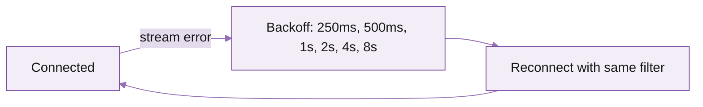

You'll subscribe to slot progression and account updates for the SOL-USDC Raydium pool. Five minutes end to end.

## Before you start

You need:

- A Triton endpoint with **streaming enabled** (PAYG, committed, or dedicated). Check **Endpoints → \<endpoint\> → Methods → gRPC** in the portal.
- The endpoint URL (the same `<your-app>.mainnet.rpcpool.com` you use for HTTP RPC -- gRPC is on the same host, port 443).
- The endpoint's secret token.
- Network capacity matching your filter (see [requirements](/solana/streaming/dragons-mouth/overview#performance-and-infrastructure-requirements)).

## Fastest path: the reference client

Triton publishes a precompiled `client` binary that subscribes via your terminal -- no SDK install. Use it to confirm connectivity and explore filters before writing code.

<Steps>
  <Step title="Download">
    Get the latest release from [github.com/rpcpool/yellowstone-grpc/releases](https://github.com/rpcpool/yellowstone-grpc/releases). Pick the binary matching your OS (`client-ubuntu-22.04`, `client-macos`, etc.).
  </Step>
  <Step title="Connect with stats only">
    First call confirms the connection works without subscribing to traffic.

    ```bash
    ./client \
      --endpoint https://<your-app>.mainnet.rpcpool.com \
      --x-token <your-token> \
      --http2-adaptive-window true \
      --compression zstd \
      subscribe --stats
    ```

    You should see slot ticks every ~400ms.
  </Step>
  <Step title="Subscribe to a single account">
    Watch the SOL-USDC Raydium pool:

    ```bash
    ./client \
      --endpoint https://<your-app>.mainnet.rpcpool.com \
      --x-token <your-token> \
      --http2-adaptive-window true --compression zstd \
      subscribe \
      --accounts \
      --accounts-account 58oQChx4yWmvKdwLLZzBi4ChoCc2fqCUWBkwMihLYQo2
    ```

    Updates print whenever the pool's account state changes (every swap, deposit, withdrawal).
  </Step>
  <Step title="Subscribe to a program's accounts">
    All Raydium AMM accounts:

    ```bash
    ./client \
      --endpoint https://<your-app>.mainnet.rpcpool.com \
      --x-token <your-token> \
      --http2-adaptive-window true --compression zstd \
      subscribe \
      --accounts \
      --accounts-owner 675kPX9MHTjS2zt1qfr1NYHuzeLXfQM9H24wFSUt1Mp8
    ```

    <Warning>
    Programs with thousands of accounts (e.g. Token Program, large AMMs) push high traffic. Use the `--stats` flag to monitor message rate and bandwidth.
    </Warning>
  </Step>
</Steps>

If those work, you're connected. Now write your application.

## Write your client (JavaScript example)

The full SDK matrix (Rust, Go, Node, Python, Java) is on the next page. Here's a Node example to get the shape:

```javascript
import Client, {
  CommitmentLevel,
  SubscribeRequestFilterAccountsFilterMemcmp,
} from '@triton-one/yellowstone-grpc';

const ENDPOINT = 'https://<your-app>.mainnet.rpcpool.com';
const TOKEN = process.env.TRITON_TOKEN;

const client = new Client(ENDPOINT, TOKEN, {
  'grpc.max_receive_message_length': 64 * 1024 * 1024,  // 64 MB
});

const stream = await client.subscribe();

// Send the subscription
await stream.write({
  accounts: {
    'sol-usdc-pool': {
      account: ['58oQChx4yWmvKdwLLZzBi4ChoCc2fqCUWBkwMihLYQo2'],
      owner: [],
      filters: [],
    },
  },
  slots: { commitment: CommitmentLevel.PROCESSED },
  transactions: {},
  transactionsStatus: {},
  blocks: {},
  blocksMeta: {},
  entry: {},
  accountsDataSlice: [],
  commitment: CommitmentLevel.PROCESSED,
});

// Receive updates
stream.on('data', (update) => {
  if (update.account) {
    const { account } = update.account;
    console.log('account update:', account.pubkey.toString('base64'));
  }
  if (update.slot) {
    console.log('slot:', update.slot.slot, update.slot.status);
  }
});

stream.on('error', (err) => {
  console.error('stream error', err);
});
```

Run with:

```bash
TRITON_TOKEN=<your-token> node app.js
```

## Mutate filters mid-stream

Send `stream.write({...})` again with a new filter set at any time. The server applies the change without disconnecting -- useful when your watchlist grows or shrinks at runtime.

For very large or frequently-changing filter sets, use [address watch lists](/solana/get-started/account-management/account-management-api/address-watch-lists) so you don't have to mutate the subscription on every change.

## Reconnect strategy

gRPC connections occasionally drop -- network blips, edge restarts, etc. Best practice:



- Exponential backoff with jitter, capped at 30s.
- Re-send the full `SubscribeRequest` on every reconnect.
- For zero-message-loss, switch to [Fumarole](/solana/streaming/fumarole/overview) -- it tracks delivery cursors so you can resume without gaps.

## Common issues

<AccordionGroup>
  <Accordion title="Connection succeeds but no messages arrive" icon="search">
    Your filter doesn't match anything. Try `--stats` to confirm the connection is alive, then widen the filter (drop an `account` array, add a `--accounts-owner`, etc.).
  </Accordion>
  <Accordion title="Stream lags behind real-time" icon="hourglass">
    The client is consuming slower than the server is sending. Three usual culprits: (1) blocking work in the receive callback -- offload to a queue, (2) zstd not enabled -- you're transferring 4--6x more bytes, (3) network capacity insufficient for the filter scope -- narrow the filter or upgrade.
  </Accordion>
  <Accordion title="UNIMPLEMENTED or PERMISSION_DENIED on connect" icon="lock">
    Token wrong, expired, or your endpoint doesn't have gRPC enabled. Check **Endpoints → \<endpoint\> → Methods → gRPC** in the portal.
  </Accordion>
  <Accordion title="Resource exhausted: max message size" icon="alert-triangle">
    Default gRPC client limits the message size to 4 MB. Solana program-account batches can blow past this. Set `grpc.max_receive_message_length` to 64 MB (or higher) on the client.
  </Accordion>
</AccordionGroup>

## What's next

<Columns cols={2}>
  <Card title="SDK clients setup" icon="package" href="/solana/streaming/dragons-mouth/sdks-and-client-libraries">
    Install and connect from Rust, Go, Node, Python, Java.
  </Card>
  <Card title="Deshred transactions" icon="zap" href="/solana/streaming/dragons-mouth/deshred-transactions">
    Sub-slot transaction reconstruction for the lowest-latency consumers.
  </Card>
  <Card title="Yellowstone gRPC reference" icon="book" href="/solana-api/grpc/subscribe">
    Full schema for SubscribeRequest and SubscribeUpdate.
  </Card>
  <Card title="Fumarole reliable streams" icon="anchor" href="/solana/streaming/fumarole/overview">
    Persistent streams with backfill -- no message loss.
  </Card>
</Columns>
