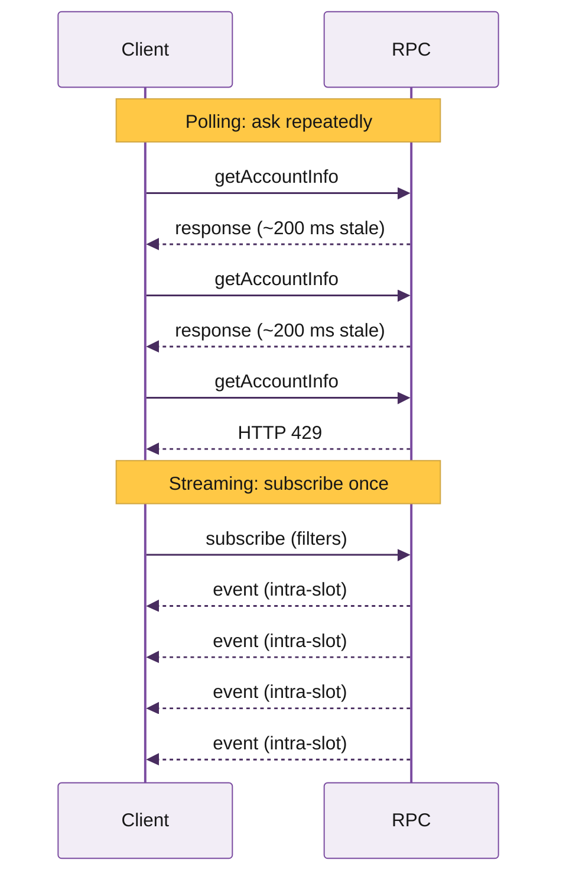
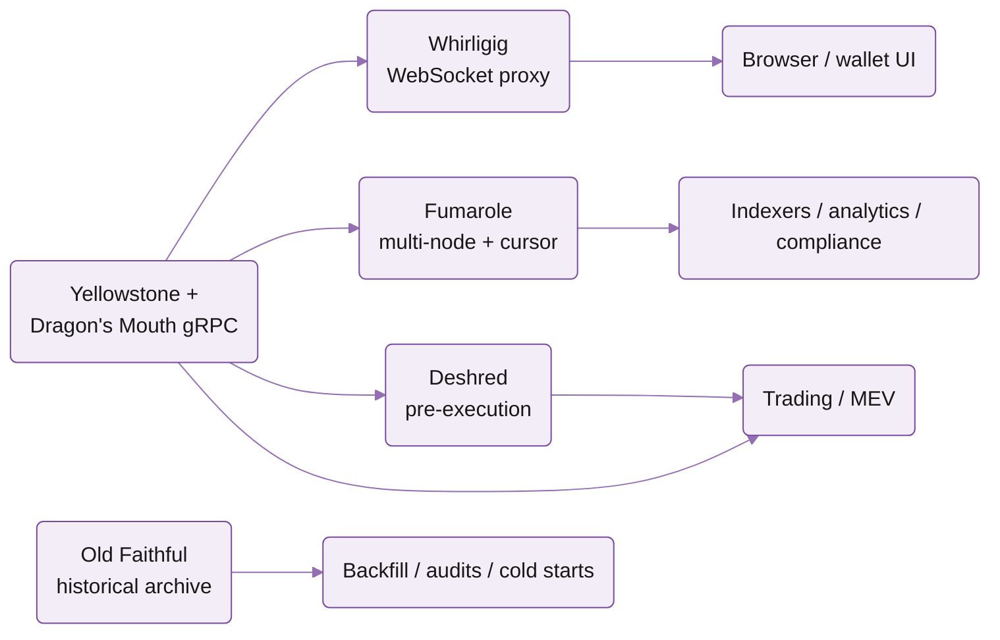

## What is streaming?

Solana produces a new block every ~400 ms. If you poll RPC every 200 ms, your data is at best 200 ms stale by the time you see it, and you'll easily hit rate limits hammering the same endpoint. Streaming inverts the model: you open one connection, say what you need (specific accounts, programs, transaction patterns), and the node pushes you matching events the instant they happen.

You get sub-slot latency, structured Protobuf payloads, and visibility into intra-slot updates that polling can't see. For real-time updates at scale, streaming is also significantly cheaper than the equivalent polling traffic, as it only incurs bandwidth cost.

Streaming is the right tool when you're building:

- **Trading and MEV systems** where 50 ms of staleness costs money
- **Indexers, accounting, and analytics pipelines** that need every block processed exactly once
- **Real-time UIs** (DEXs, wallets, explorers) with live balances and transaction feeds
- **Anything that needs to backfill chain history** at scale

## How Triton does streaming

Triton was first to ship gRPC streaming on Solana with **Yellowstone gRPC**, the open-source Geyser plugin that most of the ecosystem now runs on. Self-hosting is great for MVPs. At production scale, running on Triton gives you:

- **Dedicated streaming clusters.** Specialised infrastructure that doesn't serve general RPC traffic, tuned for the I/O profile of pushing events to thousands of subscribers.
- **Co-located with high-stake validators.** Streaming clusters sit next to high-stake validators in top-tier data centres and ingest shreds from our own validators, Jito, DoubleZero, and Turbine, so updates hit the edge as fast as physically possible.
- **Globally distributed across 20+ points of presence.** GeoDNS routes you to the nearest cluster; automatic failover handles outages.
- **Isolated services.** All the streaming services (Whirligig, Fumarole, Faithful streams) run on modular infrastructure, so a spike in one can't degrade the others.

Three things matter in streaming: **latency, reliability, and replay**. Years of running Yellowstone at scale taught us that no single product leads on all of them. So we built one for each, all on the Yellowstone Geyser foundation.

## Pick your stream

It's normal to combine more than one product in a pipeline. Common patterns:

- **Trading and MEV**: Dragon's Mouth gRPC for processed data, Deshred for pre-execution tx
- **DEX or wallet frontend**: Whirligig WebSockets
- **Gaming or trading frontends**: Pyth price feeds via Hermes
- **Indexer, analytics, or compliance**: Fumarole for live with confirmed Faithful streams for history

| Capability | Dragon's Mouth | Deshred | Whirligig | Fumarole | Old Faithful | Hermes |
|---|:---:|:---:|:---:|:---:|:---:|:---:|
| Real-time data | ✓ | | ✓ | ✓ | | |
| Pre-execution transactions | | ✓ | | | | |
| Historical replay | | | | 4 days | Entire ledger | |
| Persistent cursor / resume on disconnect | | | | ✓ | ✓ | |
| Browser-compatible | | | ✓ | | | ✓ |
| Protocol | gRPC | gRPC | WebSocket | gRPC | gRPC | REST + WS |

## How they fit together

All share Yellowstone gRPC as the underlying interface. Dragon's Mouth is the source of truth for live data, with Deshred giving you pre-execution transaction data on the same gRPC service. Whirligig translates Dragon's Mouth output into standard Solana WebSocket messages for browsers. Fumarole consumes multiple Dragon's Mouth nodes, deduplicates, and persists a cursor server-side so consumers can resume after disconnects. Old Faithful taps the historical archive but speaks the same gRPC dialect, so live and historical pipelines look identical to your client code.

## Pricing

All streaming services are billed at `$0.08 / GB` of bandwidth, and you only pay for data sent. See [streaming best practices](/solana/streaming/best-practices) for filtering guides and other ways to reduce that.

## Quickstart

<Card title="Quickstart: subscribe in 5 minutes" icon="rocket" href="/solana/streaming/dragons-mouth/quickstart">
  Connect to a Dragon's Mouth endpoint, subscribe to your first program, and parse updates with the reference client.
</Card>

## Related sections

<CardGroup cols={2}>
  <Card title="Reading state" href="/solana/reading-state/overview">
    Standard RPC, indexed reads, DAS API, account sync.
  </Card>
  <Card title="Historical data" href="/solana/history/hydrant/overview">
    Hydrant for millisecond ledger queries; Old Faithful for archival.
  </Card>
</CardGroup>
