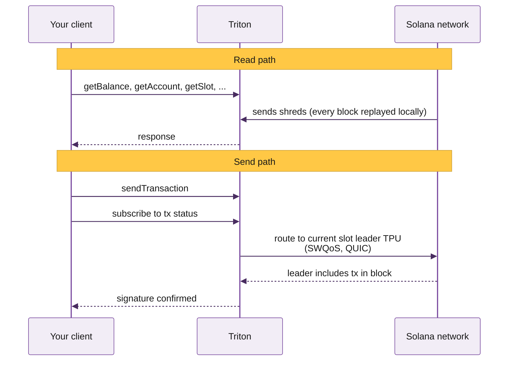

import CustomerLogoMarquee from '/snippets/customer-logo-marquee.mdx'
import FooterLinks from '/snippets/footer-links.mdx'
import PlansAndBillingCard from '/snippets/cards/plans-and-billing.mdx'
import QuickstartCard from '/snippets/cards/quickstart.mdx'
import AccountManagementCard from '/snippets/cards/account-management.mdx'
import HowToSignUpCard from '/snippets/cards/how-to-sign-up.mdx'
import StreamGrpcCard from '/snippets/cards/walkthroughs/stream-grpc.mdx'
import TokenMetadataCard from '/snippets/cards/walkthroughs/token-metadata.mdx'
import CopyTradeCard from '/snippets/cards/walkthroughs/copy-trade.mdx'
import CalculateFeesCard from '/snippets/cards/walkthroughs/calculate-fees.mdx'
import StreamRaydiumCard from '/snippets/cards/walkthroughs/stream-raydium.mdx'
import MintTokenCard from '/snippets/cards/walkthroughs/mint-token.mdx'
import TitanPrimeCard from '/snippets/cards/walkthroughs/titan-prime.mdx'

Here you'll find everything you need to integrate with Triton's Solana infrastructure. If you're new here, start with the Quickstart for a five-minute walk-through, or jump to the common build guides for the path that matches what you're shipping.

<CustomerLogoMarquee />

## Why teams pick Triton

On Solana, your RPC provider sits in the path of every read your application makes and every transaction it sends. Your app inherits whatever reliability and latency they deliver, setting the ceiling on what you can build.

Depending on the workload, four things matter at different ratios: reliability, low latency, direct engineer support, and consistent capacity. We commit to all four without compromise. Here's how:

- **Premium bare metal across 20\+ PoPs on three continents**, GeoDNS-routed with continuous health checks, load balancing, and automatic failover.
- **Hardware tuned for the workload it serves.** Read clusters, streaming nodes, historical indexers, and TPU clients all run on machines configured for their specific role.
- **Direct engineer support.** The person who replies to your ticket is on the team that built the component you're asking about.
- **Consistent capacity.** Our shared infrastructure is purpose-built to absorb spikes across the cluster without affecting your QoS.



## Solana networks we support

Production workloads usually come last. You prototype locally, push to devnet for integration tests, then graduate to mainnet for real traffic. Triton supports every endpoint type on both networks:

- **Mainnet**: production traffic ([learn more](https://solana.com/docs/references/clusters#mainnet-beta))
- **Devnet**: free, for development and integration tests ([learn more](https://solana.com/docs/references/clusters#devnet))

| Network | HTTPS<br />RPC | Web<br />Sockets | Yellowstone<br />gRPC | Fumarole | Steamboat<br />indexed | Hydrant<br />archive |
| --- | :-: | :-: | :-: | :-: | :-: | :-: |
| Solana mainnet | ✓ | ✓ | ✓ | ✓ | ✓ | ✓ |
| Solana devnet | ✓ | ✓ | ✓ | ✗ | v1 only | ✓ |

## Triton stack overview

For most workloads, shared is the right answer. Solana's read layer has split into purpose-built components, which makes geographic distribution and per-component scaling the dominant factors for both low latency and spike absorption.

The exception is gRPC streaming. Dragon's Mouth connects directly to Geyser, and a dedicated node gives you full bandwidth and CPU, flat costs on streaming bandwidth, and absolute minimal latency when colocated.

<div className="stack-map not-prose">
  <div className="stack-pillars">
    <div className="stack-pillar stack-pillar-shared">
      <div className="stack-pillar-title">Shared infrastructure</div>

      <div className="stack-branches">
        <div className="stack-branch">
          <div className="stack-branch-title">Reading state</div>
          <a className="stack-leaf" href="/solana/reading-state/standard-rpc">Standard RPC</a>
          <a className="stack-leaf" href="/solana/reading-state/steamboat-indexed-accounts">Steamboat</a>
          <a className="stack-leaf" href="/solana/reading-state/metaplex-das-api">DAS API</a>
          <a className="stack-leaf" href="/solana/reading-state/zk-compression-photon">ZK Compression</a>
          <a className="stack-leaf" href="/solana/reading-state/account-sync">Account Sync</a>
        </div>

        <div className="stack-branch">
          <div className="stack-branch-title">Streaming</div>
          <a className="stack-leaf" href="/solana/streaming/dragons-mouth-g-rpc">Dragon's Mouth gRPC</a>
          <a className="stack-leaf" href="/solana/streaming/deshred-transactions">Deshred transactions</a>
          <a className="stack-leaf" href="/solana/streaming/whirligig-websockets">Whirligig</a>
          <a className="stack-leaf" href="/solana/streaming/fumarole-persistent-streams">Fumarole</a>
          <a className="stack-leaf" href="/pyth/pyth-hermes">Hermes</a>
          <a className="stack-leaf" href="/pyth/overview">Pythnet</a>
        </div>

        <div className="stack-branch">
          <div className="stack-branch-title">History</div>
          <a className="stack-leaf" href="/solana/history/hydrant">Hydrant</a>
          <a className="stack-leaf" href="/solana/streaming/old-faithful-streams">Old Faithful</a>
          <a className="stack-leaf" href="/solana/streaming/old-faithful-streams">Faithful Streams</a>
        </div>

        <div className="stack-branch">
          <div className="stack-branch-title">Sending txs</div>
          <a className="stack-leaf" href="/solana/sending-transactions/jet-sender">Yellowstone Jet</a>
          <a className="stack-leaf" href="/solana/sending-transactions/priority-fees-api">Priority Fees API</a>
          <a className="stack-leaf" href="/solana/sending-transactions/metis-swap-api">Metis</a>
          <a className="stack-leaf" href="/solana/sending-transactions/titan-swap-api">Titan Prime</a>
          <a className="stack-leaf" href="/solana/sending-transactions/jito-bundles">Jito Bundles</a>
        </div>
      </div>
    </div>

    <div className="stack-pillar stack-pillar-other">
      <div className="stack-pillar-title">Other services</div>

      <div className="stack-branches stack-branches-single">
        <div className="stack-branch">
          <a className="stack-leaf" href="/solana/dedicated-nodes/overview">Dedicated gRPC node</a>
          <a className="stack-leaf" href="/solana/validators/introduction">White-label validator</a>
          <a className="stack-leaf" href="/solana/validators/introduction">Private trusted validator</a>
        </div>
      </div>
    </div>
  </div>
</div>
## For AI agents

Triton's docs are built for humans and AI agents alike. The single-file index lives at:

```text llms.txt
https://docs.triton.one/llms.txt
```

Drop that URL into your agent's context (Claude Code, Cursor, Codex) for full Triton coverage in one fetch. Per-product `llms.txt` files are also available under each section, e.g. `/solana/streaming/dragons-mouth/llms.txt`.

A native Triton MCP server is **coming soon**, with direct access to RPC queries, gRPC streams, and account management.

## RPC playground

Every Solana app starts with an RPC call. Try the most common ones live, right here in the docs. Choose a task on the left and click **Run on mainnet**.

<div className="triton-try not-prose" data-triton-try>
  <div className="triton-try-tabs">
    <button type="button" className="triton-try-tab active" data-task="balance">Wallet balance</button>
    <button type="button" className="triton-try-tab" data-task="accountInfo">getAccountInfo for a token mint</button>
    <button type="button" className="triton-try-tab" data-task="history">Address history</button>
    <button type="button" className="triton-try-tab" data-task="fees">Priority fee (with percentiles)</button>
    <button type="button" className="triton-try-tab" data-task="sendTx">Send a transaction</button>
    <button type="button" className="triton-try-tab" data-task="streamAccounts">Stream account changes</button>
  </div>

  <div className="triton-try-body">
    <div className="triton-try-code" data-code>Loading...</div>

    <div className="triton-try-actions">
      <button type="button" className="triton-try-run" data-run>Run on mainnet</button>

      <span className="triton-try-status" data-status />
    </div>

    <div className="triton-try-output" data-output />
  </div>
</div>

## Common builds

The most-asked builder paths. Each card jumps to a working walkthrough with code.

<CardGroup cols={2}>
  <StreamGrpcCard />

  <TokenMetadataCard />

  <CopyTradeCard />

  <CalculateFeesCard />

  <StreamRaydiumCard />

  <MintTokenCard />

  <TitanPrimeCard />
</CardGroup>

---

## What's next?

New to Triton? Four steps from here to a production endpoint.

<CardGroup cols={2}>
  <AccountManagementCard />

  <PlansAndBillingCard />

  <QuickstartCard />

  <HowToSignUpCard />
</CardGroup>

---

<FooterLinks />
