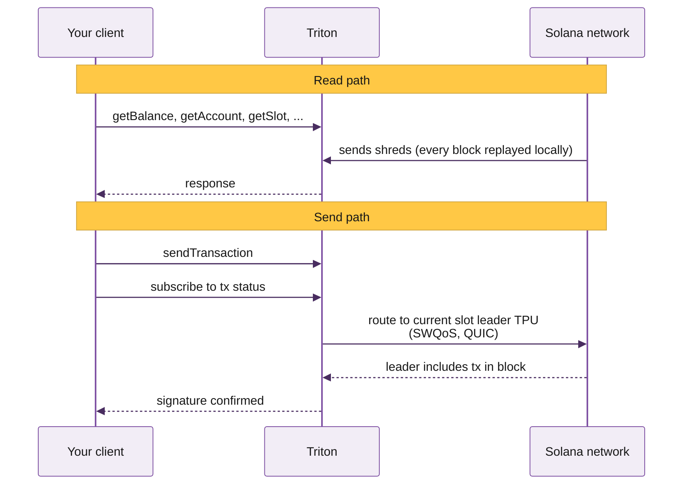

Triton One runs premium, globally distributed bare-metal infrastructure for Solana's most demanding teams. We've been on the network since testnet as one of its original validators, and we author and maintain the low-level tooling the rest of the ecosystem relies on, including Project Yellowstone, the Old Faithful archive, and major contributions to the Metaplex DAS API.

These docs cover the full stack: reads, streaming, history, trading APIs, and validator services. Teams like Solana Foundation, Jupiter, Phantom, Orca, Solflare, Squads, Jito Labs, Marinade, Arcium, Binance, Raydium, Meteora and many more all run on Triton.

<div className="logo-marquee not-prose">
  <div className="logo-marquee-track logo-track-left">
    
    
    
    
    
    
    
    
    
    
    
    
    
    
    
    {/* duplicate for seamless loop */}
    
    
    
    
    
    
    
    
    
    
    
    
    
    
    
  </div>

  <div className="logo-marquee-track logo-track-right">
    
    
    
    
    
    
    
    
    
    
    
    
    
    
    
    {/* duplicate for seamless loop */}
    
    
    
    
    
    
    
    
    
    
    
    
    
    
    
  </div>
</div>

## Why teams pick Triton

Solana has no public mempool. Reads come from your RPC's local copy of the ledger, kept current by replaying every block the network produces. Sends forward from your RPC directly to the current slot leader's TPU pipeline, and the quality of that connection sets your landing rate.



Where your RPC sits, and what stake-weighted access it has, directly shapes your landing rate, your fill prices, and how fresh the data your indexer reads is. Triton is built for this:

- **We run every node ourselves on bare-metal hardware.** No reselling, no shared cloud tenancy, no surprise quotas.
- **We've been a Solana validator since testnet** and we author the streaming layer the rest of the network runs on, Yellowstone gRPC.
- **Reads, streams, history, and validator services live on the same infrastructure.** Hydrant gives you the full ledger from genesis with millisecond responses, no replay window.

## Solana networks we support

All three networks, served from 20+ regions via GeoDNS. Devnet and testnet for testing; mainnet for production.

<div className="hug-table not-prose">

| Network | HTTPS<br/>RPC | Web<br/>Sockets | Yellowstone<br/>gRPC | Steamboat<br/>indexed | Historical<br/>archive |
|---|:---:|:---:|:---:|:---:|:---:|
| Solana mainnet | yes | yes | yes | yes | yes |
| Solana devnet | yes | yes | yes | yes | yes |
| Solana testnet | yes | yes | yes | yes | yes |

</div>

## The Triton stack

Shared infrastructure powers most workloads. Dedicated nodes and validator services sit alongside for teams that need them. Click any product to jump to its page.

<div className="stack-map not-prose">

  <div className="stack-pillars">

    <div className="stack-pillar stack-pillar-shared">
      <div className="stack-pillar-title">Shared infrastructure</div>
      <div className="stack-branches">

        <div className="stack-branch">
          <div className="stack-branch-title">Reading state</div>
          <a className="stack-leaf" href="/solana/reading-state/standard-rpc">Standard RPC</a>
          <a className="stack-leaf" href="/solana/streaming/steamboat/overview">Steamboat</a>
          <a className="stack-leaf" href="/solana/digital-assets/das-api/overview">DAS API</a>
          <a className="stack-leaf" href="/solana/digital-assets/zk-compression/overview">ZK Compression</a>
          <a className="stack-leaf" href="/solana/reading-state/account-sync">Account Sync</a>
        </div>

        <div className="stack-branch">
          <div className="stack-branch-title">Streaming</div>
          <a className="stack-leaf" href="/solana/streaming/dragons-mouth/overview">Dragon's Mouth gRPC</a>
          <a className="stack-leaf" href="/solana/streaming/whirligig/overview">Whirligig</a>
          <a className="stack-leaf" href="/solana/streaming/fumarole/overview">Fumarole</a>
          <a className="stack-leaf" href="/solana/streaming/hermes/overview">Hermes</a>
          <a className="stack-leaf" href="/solana/streaming/pythnet/overview">Pythnet</a>
        </div>

        <div className="stack-branch">
          <div className="stack-branch-title">History</div>
          <a className="stack-leaf" href="/solana/history/hydrant/overview">Hydrant</a>
          <a className="stack-leaf" href="/solana/history/old-faithful/overview">Old Faithful</a>
          <a className="stack-leaf" href="/solana/history/faithful-streams/overview">Faithful Streams</a>
        </div>

        <div className="stack-branch">
          <div className="stack-branch-title">Sending txs</div>
          <a className="stack-leaf" href="/solana/sending-transactions/yellowstone-jet/overview">Yellowstone Jet</a>
          <a className="stack-leaf" href="/solana/sending-transactions/priority-fees/overview">Priority Fees API</a>
          <a className="stack-leaf" href="/solana/trading-apis/metis/overview">Metis</a>
          <a className="stack-leaf" href="/solana/trading-apis/titan-prime/overview">Titan Prime</a>
          <a className="stack-leaf" href="/solana/sending-transactions/jito-bundles/overview">Jito Bundles</a>
        </div>

      </div>
    </div>

    <div className="stack-pillar stack-pillar-other">
      <div className="stack-pillar-title">Other services</div>
      <div className="stack-branches stack-branches-single">
        <div className="stack-branch">
          <a className="stack-leaf" href="/solana/reading-state/dedicated-grpc">Dedicated gRPC node</a>
          <a className="stack-leaf" href="/solana/validators/white-label/overview">White-label validator</a>
          <a className="stack-leaf" href="/solana/validators/private-trusted/overview">Private trusted validator</a>
        </div>
      </div>
    </div>

  </div>
</div>

## Start here

New to Triton? These four pages cover the basics.

<CardGroup cols={2}>
  <Card title="Set up your account" icon="user-plus" href="/solana/get-started/account-management/set-up-your-account-and-add-users">
    Create a workspace and invite your team.
  </Card>

  <Card title="Quickstart" icon="zap" href="/solana/get-started/quickstart">
    Make your first API request in five minutes.
  </Card>

  <Card title="Plans and billing" icon="credit-card" href="/solana/get-started/plans-and-billing">
    Pricing, dedicated tiers, how credits work.
  </Card>

  <Card title="Rate and connection limits" icon="gauge" href="/solana/get-started/rate-and-connection-limits">
    Per-product limits, quotas, how to scale up.
  </Card>
</CardGroup>

## Common builds

The most-asked builder paths. Each card jumps to a working walkthrough with code.

<CardGroup cols={3}>
  <Card title="Stream Solana with gRPC" icon="radio" href="/solana/streaming/dragons-mouth/quickstart">
    Subscribe to accounts, transactions, blocks via gRPC.
  </Card>

  <Card title="Backfill historical data" icon="history" href="/solana/history/hydrant/overview">
    Query the ledger from genesis with millisecond responses.
  </Card>

  <Card title="Send transactions reliably" icon="send" href="/solana/sending-transactions/quickstart">
    SWQoS routing, priority fees, Jupiter swap routing.
  </Card>

  <Card title="Build a wallet or NFT app" icon="image" href="/solana/digital-assets/das-api/overview">
    DAS API for NFTs, cNFTs, SPL, Token-2022 assets.
  </Card>

  <Card title="Run a private validator" icon="shield" href="/solana/validators/overview">
    White-label or private trusted validators on request.
  </Card>

  <Card title="Index custom programs" icon="database" href="/solana/streaming/steamboat/overview">
    Custom indexes built from your existing gRPC stream.
  </Card>
</CardGroup>

## For AI agents

Triton's docs are built for humans and AI agents alike. The single-file index lives at:

```text llms.txt
https://docs.triton.one/llms.txt
```

Drop that URL into your agent's context (Claude Code, Cursor, Codex) for full Triton coverage in one fetch. Per-product `llms.txt` files are also available under each section, e.g. `/solana/streaming/dragons-mouth/llms.txt`.

A native Triton MCP server is **coming soon**, with direct access to RPC queries, gRPC streams, and account management.

## Get an endpoint

<CardGroup cols={2}>
  <Card title="Get an endpoint" icon="rocket" href="https://customers.triton.one/onboarding">
    Standard RPC or dedicated gRPC in minutes. Pay as you go.
  </Card>

  <Card title="Log in" icon="log-in" href="https://customers.triton.one/users/sign-in">
    Manage endpoints, top up credits, invite your team.
  </Card>
</CardGroup>

---

<div className="footer-links not-prose">

<p><Icon icon="life-buoy" /> Need help? Click the chat icon in the bottom right of your [customer dashboard](https://customers.triton.one)</p>

<p><Icon icon="user-cog" /> Manage endpoints, billing, team: [Customer portal](https://customers.triton.one)</p>

<p><Icon icon="briefcase" /> Sales questions? [Contact sales](https://triton.one/contact)</p>

<p><Icon icon="sparkles" /> AI agent? [Read llms.txt](/llms.txt)</p>

<p><Icon icon="rss" /> Follow updates: [Blog](https://blog.triton.one) · [X](https://x.com/triton_one) · [YouTube](https://www.youtube.com/@triton_one_ltd) · [Telegram](https://t.me/tritonone) · [GitHub](https://github.com/rpcpool)</p>

</div>
