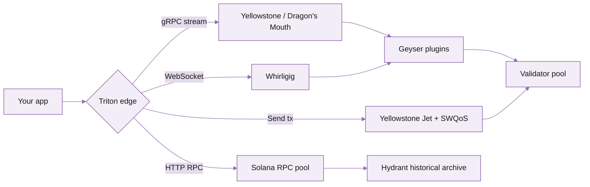

Triton operates the largest independent RPC infrastructure on Solana. We run validators, edge routers, gRPC streamers, and the underlying Geyser plugins that most of the ecosystem builds on. This section walks you from "I want a Solana endpoint" to "my production app is live".

## Where to start

<Columns cols={2}>
  <Card title="Quickstart" icon="rocket" href="/solana/get-started/quickstart">
    From signup to your first `getSlot` call in five minutes. Curl, JavaScript, Python, Rust.
  </Card>
  <Card title="API reference" icon="code" href="/solana-api/api-overview">
    Every JSON-RPC, WebSocket, gRPC, and DAS method we expose. Live playground on every page.
  </Card>
  <Card title="Plans and billing" icon="credit-card" href="/solana/get-started/plans-and-billing">
    PAYG, committed, and dedicated tiers. What you pay, what you get, how to scale.
  </Card>
  <Card title="Streaming data" icon="radio" href="/solana/streaming/overview">
    Yellowstone gRPC, Whirligig WebSockets, Fumarole reliable streams. Real-time and resumable.
  </Card>
</Columns>

## What's in this section

Get started is structured around a typical integration journey. Pick the entry point that matches where you are.

<Columns cols={3}>
  <Card title="New to Solana RPC?" icon="lightbulb" href="/solana/get-started/quickstart">
    Start with the Quickstart, then read [Plans and billing](/solana/get-started/plans-and-billing).
  </Card>
  <Card title="Migrating from another provider?" icon="arrow-right-left" href="/solana/get-started/rate-and-connection-limits">
    Read [Rate and connection limits](/solana/get-started/rate-and-connection-limits) first to plan capacity.
  </Card>
  <Card title="Running production traffic?" icon="server" href="/solana/dedicated-nodes/overview">
    See [Dedicated nodes](/solana/dedicated-nodes/overview) and [Streaming data](/solana/streaming/overview).
  </Card>
</Columns>

## How Triton fits together



- **Standard JSON-RPC** for one-off reads and most application traffic.
- **WebSocket** for browser-side subscriptions (account, signature, logs).
- **gRPC streaming** for backend systems that need intra-slot updates.
- **Jet + SWQoS** for transaction sending with stake-weighted priority.
- **Hydrant** for historical queries beyond the recent ledger.

## Choose the right product for the job

| Need | Use | Where |
|---|---|---|
| Single read (`getAccountInfo`, `getSlot`, etc.) | Standard RPC | [API reference](/solana-api/api-overview) |
| Subscribe to an account/signature/log from a browser | Whirligig WebSocket | [Whirligig WebSockets](/solana/streaming/whirligig/overview) |
| Backend stream with intra-slot updates | Yellowstone gRPC (Dragon's Mouth) | [Dragon's Mouth gRPC](/solana/streaming/dragons-mouth/overview) |
| Resumable stream with backfill (analytics, accounting) | Fumarole | [Fumarole reliable streams](/solana/streaming/fumarole/overview) |
| Send transactions to leaders directly | Yellowstone Jet (SWQoS) | [Yellowstone Jet](/solana/sending-transactions/jet-sender) |
| Block / transaction history beyond recent slots | Hydrant | [Historical data](/solana/history/overview) |
| Indexed account reads at API speed | Steamboat | [Steamboat indexed accounts](/solana/reading-state/steamboat-indexed-accounts) |
| Token assets, NFTs, compressed NFTs | DAS API | [DAS API](/solana-api/das/getAsset) |

## Endpoint format

Triton endpoints share a common URL shape. You'll see this everywhere in this section.

```
HTTPS:     https://<your-app>.mainnet.rpcpool.com
WebSocket: wss://<your-app>.mainnet.rpcpool.com
With token (backend only):
           https://<your-app>.mainnet.rpcpool.com/<your-secret-token>
```

<Warning>
Never embed a secret token in frontend code. Use [public endpoints with origin allowlists](/solana/get-started/account-management/auth-and-security-best-practices) for browser apps; keep tokens on your backend.
</Warning>

## Help and support

<Columns cols={2}>
  <Card title="Reach out to support" icon="life-buoy" href="/solana/get-started/account-management/reach-out-to-support">
    Slack channel, email, or Telegram -- pick what works for you.
  </Card>
  <Card title="Status and incidents" icon="activity" href="https://status.triton.one">
    Live infrastructure status, scheduled maintenance, recent incidents.
  </Card>
</Columns>
