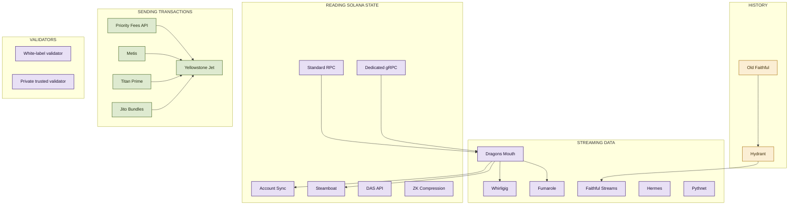

Triton One runs premium, globally distributed bare-metal infrastructure for Solana's most demanding teams. We've been on the network since testnet as one of its original validators, and we author and maintain much of the low-level tooling the ecosystem now relies on, including Project Yellowstone, the Old Faithful archive, and major contributions to the Metaplex DAS API.

These docs cover the full stack: reads, streaming, historical data, trading APIs and validator services. Teams like Solana Foundation, Jupiter, Phantom, Orca, Solflare, Squads, Arcium, Jito Labs, Marinade and Binance all run on Triton.

  
  
  
  
  
  
  
  
  
  

<CardGroup cols={2}>
  <Card title="Get an endpoint" icon="rocket" href="https://customers.triton.one/onboarding">
    Standard RPC or dedicated gRPC in minutes. Pay as you go.
  </Card>

  <Card title="Log in" icon="log-in" href="https://customers.triton.one/users/sign-in">
    Manage endpoints, top up credits, invite your team.
  </Card>
</CardGroup>

## Start here

If you're new, four places to begin.

<CardGroup cols={2}>
  <Card title="Set up your account" icon="user-plus" href="/solana/get-started/account-management/set-up-your-account-and-add-users">
    Create a workspace and invite your team.
  </Card>

  <Card title="Quickstart" icon="zap" href="/solana/get-started/quickstart">
    Make your first API request in five minutes.
  </Card>

  <Card title="Plans and billing" icon="credit-card" href="/solana/get-started/plans-and-billing">
    Pricing, dedicated tiers, how credits work.
  </Card>

  <Card title="Rate and connection limits" icon="gauge" href="/solana/get-started/rate-and-connection-limits">
    Per-product limits, quotas, how to scale up.
  </Card>
</CardGroup>

## Guides for building on-chain

The most-asked walkthroughs for production builders.

<CardGroup cols={3}>
  <Card title="Stream Solana with gRPC" icon="zap" href="/solana/streaming/dragons-mouth/quickstart">
    Subscribe to accounts, transactions, blocks via gRPC.
  </Card>

  <Card title="Backfill historical data" icon="history" href="/solana/history/hydrant/overview">
    Query the ledger from genesis with millisecond responses.
  </Card>

  <Card title="Send transactions reliably" icon="send" href="/solana/sending-transactions/quickstart">
    SWQoS routing, priority fees, Jupiter swap routing.
  </Card>

  <Card title="Build a wallet or NFT app" icon="image" href="/solana/digital-assets/das-api/overview">
    DAS API for NFTs, cNFTs, SPL, Token-2022 assets.
  </Card>

  <Card title="Run a private validator" icon="server" href="/solana/validators/overview">
    White-label or private trusted validators on request.
  </Card>

  <Card title="Index custom programs" icon="database" href="/solana/streaming/steamboat/overview">
    Custom indexes built from your existing gRPC stream.
  </Card>
</CardGroup>

## LLM-ready

Triton's docs are built for AI agents as well as humans.

<CardGroup cols={2}>
  <Card title="llms.txt index" icon="sparkles" href="/llms.txt">
    Single-file map of every page. One fetch bootstraps your agent.
  </Card>

  <Card title="Triton MCP server" icon="plug" href="/agents/mcp">
    Coming soon. MCP access to RPC, gRPC, account management.
  </Card>
</CardGroup>

<Tip>
  Working with Claude Code, Cursor or Codex? Drop our `llms.txt` URL into your agent's context to give it full Triton coverage in one fetch. Per-product `llms.txt` files are also available under each section, e.g. `/solana/streaming/dragons-mouth/llms.txt`.
</Tip>

## Triton product map

Each product has its own deep dive in the sidebar. This is how the surface fits together.

<Note>
  Mintlify's Mermaid renderer disables clickable nodes in diagrams (mermaid.js security mode). Use the sidebar or the cards above to navigate to specific products.
</Note>

---

<Icon icon="life-buoy" /> Need help? [Contact support](https://triton.one/contact).

<Icon icon="user-cog" /> Already a customer? [Customer portal](https://customers.triton.one).

<Icon icon="circle-help" /> Sales questions? [Contact sales](https://triton.one/contact).

<Icon icon="sparkles" /> AI agent? [Read llms.txt](/llms.txt).

<Icon icon="rss" /> Follow updates: [Blog](https://blog.triton.one) · [X](https://twitter.com/triton_one) · [YouTube](https://www.youtube.com/@triton_one) · [Telegram](https://t.me/tritonone) · [GitHub](https://github.com/rpcpool).

