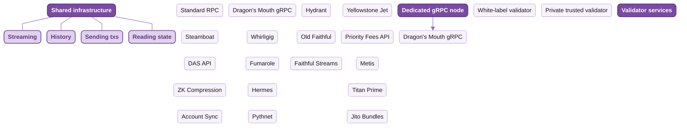

Triton One runs premium, globally distributed bare-metal infrastructure for Solana's most demanding teams. We've been on the network since testnet as one of its original validators, and we author and maintain much of the low-level tooling the ecosystem now relies on, including Project Yellowstone, the Old Faithful archive, and major contributions to the Metaplex DAS API.

These docs cover the full stack: reads, streaming, historical data, trading APIs and validator services. Teams like Solana Foundation, Jupiter, Phantom, Orca, Solflare, Jito Labs, Marinade, Squads, Arcium, Binance, Raydium, Meteora and many more all run on Triton.

<div className="logo-marquee not-prose">
  <div className="logo-marquee-track logo-track-left">
    
    
    
    
    
    
    
    
    
    
    
    
    
    
    
    {/* duplicate for seamless loop */}
    
    
    
    
    
    
    
    
    
    
    
    
    
    
    
  </div>

  <div className="logo-marquee-track logo-track-right">
    
    
    
    
    
    
    
    
    
    
    
    
    
    
    
    {/* duplicate for seamless loop */}
    
    
    
    
    
    
    
    
    
    
    
    
    
    
    
  </div>
</div>

## Why RPC choice matters

Solana has no public mempool. Transactions forward through your RPC straight into the current slot leader's TPU pipeline, so where your RPC sits and how it's connected directly affects your landing rate, your fill prices, and how fresh the data your indexer reads is.

Triton runs bare-metal nodes we operate ourselves, not infrastructure we resell. Reads come from validators we've operated since testnet. Transactions submit via direct SWQoS routing through Yellowstone Jet. Historical queries hit Hydrant, our 400+ TB ledger with no replay window. The streaming layer the rest of the network runs on, Yellowstone gRPC, is ours.

## Networks supported

<div className="hug-table not-prose">

| Network | HTTPS<br/>RPC | Web<br/>Sockets | Yellowstone<br/>gRPC | Steamboat<br/>indexed | Historical<br/>archive |
|---|:---:|:---:|:---:|:---:|:---:|
| Solana mainnet | yes | yes | yes | yes | yes |
| Solana devnet | yes | yes | yes | yes | yes |
| Solana testnet | yes | yes | yes | yes | yes |

</div>

All three networks served from 20+ global regions via GeoDNS. Devnet and testnet for testing, mainnet for production.

## Start here

If you're new, four places to begin.

<CardGroup cols={2}>
  <Card title="Set up your account" icon="user-plus" href="/solana/get-started/account-management/set-up-your-account-and-add-users">
    Create a workspace and invite your team.
  </Card>

  <Card title="Quickstart" icon="zap" href="/solana/get-started/quickstart">
    Make your first API request in five minutes.
  </Card>

  <Card title="Plans and billing" icon="credit-card" href="/solana/get-started/plans-and-billing">
    Pricing, dedicated tiers, how credits work.
  </Card>

  <Card title="Rate and connection limits" icon="gauge" href="/solana/get-started/rate-and-connection-limits">
    Per-product limits, quotas, how to scale up.
  </Card>
</CardGroup>

## LLM-ready

Triton's docs are built for AI agents as well as humans. The single-file index lives at:

```text llms.txt
https://docs.triton.one/llms.txt
```

Drop that URL into your agent's context (Claude Code, Cursor, Codex) for full Triton coverage in one fetch. Per-product `llms.txt` files are also available under each section, e.g. `/solana/streaming/dragons-mouth/llms.txt`.

A native Triton MCP server is **coming soon**, with direct access to RPC queries, gRPC streams and account management.

## Triton product map

How the surface fits together. Shared infrastructure powers most workloads; dedicated tiers and validator services sit alongside for teams that need them. Click any product to jump to its page.



## Guides for building on-chain

The most-asked walkthroughs for production builders.

<CardGroup cols={3}>
  <Card title="Stream Solana with gRPC" icon="radio" href="/solana/streaming/dragons-mouth/quickstart">
    Subscribe to accounts, transactions, blocks via gRPC.
  </Card>

  <Card title="Backfill historical data" icon="history" href="/solana/history/hydrant/overview">
    Query the ledger from genesis with millisecond responses.
  </Card>

  <Card title="Send transactions reliably" icon="send" href="/solana/sending-transactions/quickstart">
    SWQoS routing, priority fees, Jupiter swap routing.
  </Card>

  <Card title="Build a wallet or NFT app" icon="image" href="/solana/digital-assets/das-api/overview">
    DAS API for NFTs, cNFTs, SPL, Token-2022 assets.
  </Card>

  <Card title="Run a private validator" icon="shield" href="/solana/validators/overview">
    White-label or private trusted validators on request.
  </Card>

  <Card title="Index custom programs" icon="database" href="/solana/streaming/steamboat/overview">
    Custom indexes built from your existing gRPC stream.
  </Card>
</CardGroup>

## Get started

<CardGroup cols={2}>
  <Card title="Get an endpoint" icon="rocket" href="https://customers.triton.one/onboarding">
    Standard RPC or dedicated gRPC in minutes. Pay as you go.
  </Card>

  <Card title="Log in" icon="log-in" href="https://customers.triton.one/users/sign-in">
    Manage endpoints, top up credits, invite your team.
  </Card>
</CardGroup>

---

<div className="footer-links not-prose">

<p><Icon icon="life-buoy" /> Need help? Click the chat icon in the bottom right of your [customer dashboard](https://customers.triton.one)</p>

<p><Icon icon="user-cog" /> Manage endpoints, billing, team: [Customer portal](https://customers.triton.one)</p>

<p><Icon icon="briefcase" /> Sales questions? [Contact sales](https://triton.one/contact)</p>

<p><Icon icon="sparkles" /> AI agent? [Read llms.txt](/llms.txt)</p>

<p><Icon icon="rss" /> Follow updates: [Blog](https://blog.triton.one) · [X](https://twitter.com/triton_one) · [YouTube](https://www.youtube.com/@triton_one_ltd) · [Telegram](https://t.me/tritonone) · [GitHub](https://github.com/rpcpool)</p>

</div>
